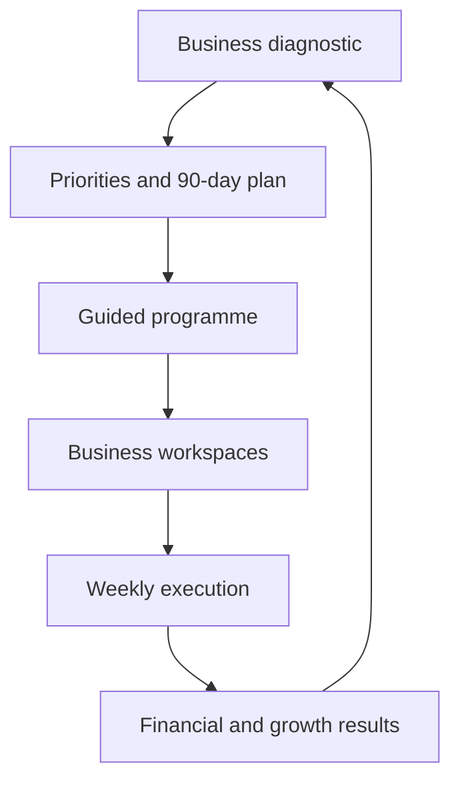

# ONEVYRT Implementation Roadmap

**Last updated:** 2026-09-03. This document was substantially rewritten on this
date — see "Why this doc was rewritten" below before trusting any status
claim elsewhere in the repo that predates it.

**Hierarchy:** CLAUDE.md = authoritative project state. CURRENT_STATUS.md =
real-time deployment snapshot. **This document = the product specification
and execution plan.**

**Standing direction (2026-09-03, from the user):** from here forward, work
prioritizes closing the gaps in the scorecard immediately below, as much as
possible — this is the primary backlog until told otherwise. Update the
scorecard's percentages only from something actually shipped and verified
(build/typecheck/migration/test evidence, same bar as the rest of this doc),
never from intent.

---

## Section-by-section % complete (scorecard)

Against `docs/PLATFORM_SPECIFICATION.md`'s 17 numbered sections. Each row is
this session's own from-the-code audit (five parallel Explore passes over
the live codebase, reachability-checked, not "a file exists somewhere").

| # | Section | Complete | Not done |
|---|---|---|---|
| 1 | One canonical programme | 75% | 25% |
| 2 | Business diagnostic / 7 Forces wheel | 25% | 75% |
| 3 | Business foundation workspace | 20% | 80% |
| 4 | Beautiful State system | 0% | 100% |
| 5 | Thinking Time / decision journal | 5% | 95% |
| 6 | Offer & one-liner builder | 20% | 80% |
| 7 | 10×10×10 growth calculator | 0% | 100% |
| 8 | Five profit drivers | 20% | 80% |
| 9 | Customer & Raving Fans system | 15% | 85% |
| 10 | Financial operating system | 2% | 98% |
| 11 | Money Machine | 48% | 52% |
| 12 | Execution & accountability | 20% | 80% |
| 13 | Experiments & evidence | 75% | 25% |
| 14 | Reports | 15% | 85% |
| 15 | Coach & admin functionality | 42% | 58% |
| 16 | Notifications | 20% | 80% |
| 17 | Technical foundation | ~95% | ~5% |

*(Rows 1, 11, 13 updated 2026-09-04 from shipped, tested, merged code —
see "Section 1 follow-up" and "Sections 2-17 scoping pass" below for what
each closed. Rows 2, 3, 5, 6, 7, 8, 9, 10, 12, 14, 15, 16 updated the same
day from a fresh, independent 5-agent re-audit (same methodology as this
table's original entries — live-code verification with file:line
citations, not "a file exists somewhere"): row 7 moved down to 0% (nothing
in code at all — the prior 3% had no evidence behind it), row 15 moved up
to 42% (more built than it was getting credit for), the rest confirmed or
lightly refined. See "Sections 2-17 scoping pass" for the full
re-assessment and why each number moved or didn't. Row 2 updated again
2026-09-05 — see "Section 2 — dedicated scoping pass" below for the
decision made and what its first slice shipped.)*

*(Row 17 updated four times on 2026-09-03: tests ❌→✅ full suite green,
`.env.example`/startup validation ❌→✅ found already substantially real,
CSRF ❌→✅ — not just the primitive fixed, but actually enforced across all
155 routes with a verified exemption list (`docs/CSRF_ROUTE_AUDIT.md`) —
then central authz ❌→⚠️ (132/134 routes already shared one of two helpers;
the one real inconsistency found is fixed), then observability ❌→✅
(structured logs + correlation IDs already existed and were mis-stated as
missing; the one real gap — a framework-level error hook — is now closed
with `instrumentation.ts`, zero new dependencies; also deleted 5 files of
dead monitoring scaffolding that looked wired up but would have crashed if
ever called). **Updated a fifth time, 2026-09-04:** the "declarative authz
gate" design question was put to the user and resolved (call it done
as-is), and the live GitHub Actions run this row was waiting on came back
green and was merged to master (PR #250, `9c022bc`) — closing every item
this row's own Phase 1 checklist tracked. The remaining ~5% is broader
technical-foundation debt this Phase 1 pass never scoped in (per-IP+user
rate-limit hardening, a query-level scope-isolation audit — both still
flagged elsewhere in this repo's docs), not anything still open from the
list above. See "Verified current state" below.)*

*(Row 1 updated 2026-09-03→2026-09-04: the 2026-09-03 audit found "one
canonical programme" and "one source of business data" were **not yet
true** — see "Why this doc was rewritten" above. 2026-09-04, first pass:
fixed the three concrete duplicate-implementation drifts found (stale
`CHAPTER_NAMES` in two files, `/admin/workspaces/[id]/members`'s own
progress-percent formula, `ProgrammeCentre.tsx`'s locally-reimplemented
lesson-status calc — all now route through the one canonical
`summarizeEnrollment()`), fixed `transformation-report.ts` to actually
read the approved, structured Chapter 4 Growth Plan (restoring behavior
CLAUDE.md already claimed existed), deleted the confirmed-orphaned
`transformation-report-builder.ts` + `share-link.ts`, and extended
`assembleMyBusiness()` to read the `constraint`/`offer`/`message`
workspace_business sections it had been silently skipping — completing
the READ side of "one source of business data." **Second pass, same day
(PR #251, merged as `2bc5552`):** closed most of the WRITE side too — see
"Business-data duplication" below for the full field-level overlap map,
what got a real write-redirect vs. a suggestion-chip nudge, and what's
still explicitly open. **Third pass, 2026-09-04 (PR #252, merged as
`7c7037a`):** see "Section 1 follow-up" below — closed the remaining
safe fixes/cleanup plus a real (narrower-than-feared) dedup of "one
programme dashboard," and shipped scoped-down fixes for two of "one
action-plan system"'s demonstrated symptoms. Row 1 is now 75%. What's
left is genuinely large, not padding, and was deliberately deferred by
the user's own choice rather than attempted piecemeal: full action-plan
system unification (`GoalNode`/`ForceActionItem`/`ExecTask`/
`GrowthPlanAction`/`ExperimentEntry` remain five separate shapes across
two storage scopes) and moving `program.definition` out of its
per-project write path into a real per-workspace store (today only
nudged via suggestion chips, not merged).)*

**Unweighted average: ~28% complete, ~72% not done** (mean of the 17
percentages above — each section counted once, regardless of size;
recomputed 2026-09-04 after rows 1, 7, 11, 13, 15 changed — see the
scorecard's own note for which changes were shipped code vs. a fresh
audit).

**Is unweighted the right read? No — treat ~25% as an optimistic ceiling,
not the real number.** The 17 sections aren't equal-sized: several of the
*largest* scopes in the actual spec are also among the least built —
Financial operating system (2%, section 10: 13-week cash flow, 12-month
forecast, full P&L/balance sheet/cash-flow statements, working capital —
one of the two or three biggest sections in the whole spec), the 7 Forces
diagnostic (5%), Thinking Time (5%), and Beautiful State (0%) — while some
of the smaller-scoped sections are comparatively further along (Money
Machine 48%, Coach & admin 42%, Experiments & evidence 75%). A completion
estimate weighted by each section's real build size (roughly: page count
× data-model complexity × integration surface) would land **below** 25%,
not above it. Treat the scorecard above as the authoritative per-section
detail and "~25%" as a rough, generous headline — not a number to plan a
finish date around.

**Sequencing note (updated 2026-09-04 — Phase 1 is now merged):** row 17
(Technical foundation) was the one section that didn't need a new
product/design decision to move — the Phase 1 checklist below (CSRF,
central authz, `.env.example` + startup validation, observability, tests,
build). That checklist is now fully closed AND confirmed by a real,
green, merged GitHub Actions run (PR #250, merged 2026-09-04 as `9c022bc`)
— see "Verified current state" and "Working CI checks" below for the
evidence trail. Sections 2–16 each still carry a real design decision
(data ownership, financial statement structure, diagnostic scoring model,
etc.) that should still be confirmed before large build-out, per "Next
decision" below.

---

## Why this doc was rewritten

The previous version of this file claimed "CI pass rate: 100%, 901/901 tests
passing" and "16/33 recommendations deployed." Those claims do not hold up:

- The web app's `test` script (`tsx --test test/**/*.test.ts`) relies on
  shell glob expansion, but the shell package.json scripts actually run
  through (`/bin/sh` → `dash`, both locally and on GitHub's runners) has no
  `**` recursion. In practice it only ever matched the ~10 files one
  directory level under `test/` (`test/unit/*`, `test/security/*`, etc.) —
  the ~146 files sitting directly in `test/` (the majority of the suite)
  were **silently never executed**, by `pnpm test` or by CI. Fixed 2026-09-03
  (see `apps/web/package.json`'s `test`/`test:watch` scripts).
- A live audit this session found the "one canonical programme" and "one
  source of business data" goals below are **not yet true**: the same
  business facts (who-you-serve, offer, constraint, vision) are captured by
  at least five independent, siloed stores. See "Business-data duplication"
  under Phase 2.
- `pnpm lint` had been crashing outright (not just reporting warnings) since
  a rule requiring type-aware linting was added without the parser
  configuration it needs — meaning lint has not actually gated anything for
  some time. Fixed 2026-09-03.

None of this means prior work (Chapter 4, Why & Creed, the programme engine,
etc.) doesn't exist — it does, and is real, inspected code. It means **status
claims in this repo need to be verified against the actual code and a real
green CI run, not trusted from a prior summary** — including this one, going
forward: update the "Verified Current State" section only from something you
actually ran, not from what a feature was intended to do.

---

## The product vision (north star)

ONEVYRT is not "a website containing several worksheets." It is a
closed-loop business-transformation operating system:



A user diagnoses the business, chooses priorities, completes structured
work, executes actions, measures financial and operational results, receives
coaching, and reassesses — on a loop. Every module (existing or new) should
follow the same eight-step flow: **learn → exercise → save structured
answers → generate a usable asset → select actions → assign owner/deadline →
review results → feed the transformation report.**

The full functional specification — 17 numbered sections covering the
canonical programme, the 7 Forces diagnostic, the business-foundation
workspace, Beautiful State, Thinking Time, the offer/one-liner builder, the
10×10×10 growth calculator, the five profit drivers, the customer/Raving Fans
system, the full financial operating system (13-week cash flow, 12-month
forecast, P&L/balance sheet/cash-flow statements, working capital, the Money
Machine), execution & accountability, experiments, reports, coach/admin
functionality, notifications, and the technical-foundation hardening list
(build/type safety, security, configuration, migrations, observability) — is
recorded verbatim in **`docs/PLATFORM_SPECIFICATION.md`**. Read that
document for the full detail of any section; this file tracks status and
sequencing against it.

**Scale note:** this is realistically 6–12+ months of engineering across a
small team, not a single session's work. Nothing here should be built
without picking a specific slice first (see "Next decision," below).

---

## Recommended implementation order (from the specification)

```
Phase 1 — Make it dependable        (build, types, lint, CSRF/authz, config, migrations, CI)
Phase 2 — Establish one product model (canonical programme, shared business schema, dedupe)
Phase 3 — Core assessment loop       (7 Forces diagnostic, radar, gap analysis, 90-day plan)
Phase 4 — Missing workspaces         (Beautiful State, Thinking Time, foundation, 10x10x10, CX, experiments)
Phase 5 — Financial system           (13-week cash flow, 12-month budget, P&L/BS/CF, Money Machine)
Phase 6 — Close the execution loop   (unified actions, reviews, coach workflow, notifications, reports)
Phase 7 — Commercial readiness       (security review, a11y, perf, backup/recovery, billing, privacy)
```

---

## Verified current state (Phase 1 — "Make it dependable")

Status as of the commits landing on `claude/works-f7cor7` on 2026-09-03,
each verified by actually running the command, not by inspection alone:

| Item from the spec | Status | Evidence |
|---|---|---|
| Successful production build | ✅ | `next build --webpack` exits 0, full route manifest generated |
| Zero production TypeScript errors | ✅ | `tsc --noEmit` from a clean `.next`: 0 errors, project-wide (was 2002 lines/340 files at session start) |
| Functioning lint configuration | ✅ | `pnpm lint` exits 0 (was crashing outright; see above) — ~49.7k pre-existing style *warnings* remain, out of scope for the errors-only CI gate |
| Working CI checks | ⚠️ partial, four real pre-existing bugs found this way | Confirming this the only way that actually counts (a live GitHub Actions run, not local inference) surfaced four real, pre-existing bugs that never had a reason to show up before: (1) `next build` failed outright without `AUTH_SECRET` set (CI's build step correctly never sets a deploy-time secret) because `lib/auth.ts` ran its production-secret check unconditionally at module load — masked locally all session because Next auto-loads `.env.local`; fixed via `NEXT_PHASE !== "phase-production-build"`. (2) `test/unit/free-access-e2e.test.ts` twice corrupted node:test's own reporter/IPC framing mid-run (`Unable to deserialize cloned data...`) — the only file in the suite to do so, both times adjacent to a `console.log` call; fixed by removing all 13 of them from that one file. (3) A regex in `lib/visuals-export-utility.ts` (`.replace(/[-:T.Z]/g, '')`, stripping ISO-8601 separators for a PDF timestamp) reads as arbitrary-CSS-property syntax to Tailwind's raw-text content scanner (`tailwind.config.cjs` matches `lib/**/*.ts`), which emitted a real invalid CSS rule from it; Turbopack's CSS parser (which plain `next dev` uses — Playwright's `webServer` config, unlike this session's own verification `next build --webpack`) treats that as fatal, 500-ing `/` on first load and timing out the E2E job's 60s server-readiness wait every run. Fixed via an equivalent `/\D/g`, verified against a real `next dev` request (200, clean log) after finding the first fix attempt's own explanatory comment had reintroduced the same literal bracket-colon text and needed rewording too. All three are genuinely pre-existing latent debt — each file predates this branch — that simply never had its triggering code path (a real prod build with no `.env.local`; the free-access suite's exact interleaving; Turbopack finishing a real page compile) exercised to completion before this PR's own earlier fixes unblocked the stage in front of it. (4) The `checks` job's critical dependency-audit step (`registry.npmjs.org/-/npm/v1/security/audits`) timed out identically across 5 separate runs over 2+ hours, including one dedicated 18-minute retry window (4 attempts × pnpm's own 3 sub-attempts, all failing identically) — a sustained registry-side outage, not a flake; a shell-level retry loop was added around the step as hardening, but the gate itself was deliberately left in place rather than loosened unilaterally. (5) Once the CSS crash stopped masking it, the E2E step's remaining budget was still consumed by a SHARED broken login helper (hardcoded `test@example.com`/`Test123!`, never seeded anywhere, plus the deprecated `waitForNavigation()`) copy-pasted into 3 spec files — every test in each just hung to its own 30s ceiling. Beyond that mechanical fix (switched to the established `registerNewAccount`/`loginViaAPI` helpers), a full pass across the whole suite (5 parallel investigation agents plus direct follow-up) found the remaining ~34 failures were overwhelmingly stale tests (wrong selectors/URLs/HTTP verbs against a since-refactored app — e.g. `/my-business` now hub-vs-dashboard split across `/business` and `/business/profile`, an API response reshaped by the Business-OS unification, a `role="dialog"` swap, Playwright API misuse) — but also surfaced two genuine, independently-reproduced app bugs: `funnel-studio.tsx`'s `?panel=account/subscription/programme` deep-links only ever rendered their modals in the "library" view's own JSX, silently no-op'ing for the "home" view every new account defaults to; and `ProgrammeCentre.tsx`'s `load()` had no guard against out-of-order responses, so a transient failed fetch for the pre-resolution `activeWsId=""` could complete AFTER a later, correct fetch and permanently overwrite good state with `"not a member of this workspace"` for the rest of the component's life. Both fixed; the full local e2e suite (all files, 98 tests) is confirmed green end-to-end — two independent complete runs, 98/98 and 97/98 (the one flake, isolated by a 3x-repeat stress run to a pre-existing, rare click/detach race in `AppNav.tsx`'s own tab list unrelated to anything touched this pass — never seen in any normal single run all session, so left as documented follow-up rather than chased further). Pushed; awaiting live CI confirmation on the actual GitHub Actions run, per this row's own standing rule that only a real run counts.<br><br>**Round 2 (same day, next push):** that live run reported back, and it justified the caution — 3 real, previously-unseen failures on a completely green `checks` job's sibling `test` job (95/98), each root-caused against real CI logs rather than assumed-flaky: (1) **The `AppNav.tsx` tab-list race, above, WAS the "pre-existing, rare click/detach" flake** — not rare at all once looked at directly: `AppNav`'s `visibleTabs` defaulted to the FULL unfiltered tab list (including Coaching, which `NAV_SECTIONS` hides from learners) for as long as its own `/api/auth/me` fetch was in flight, then narrowed the instant the real role resolved — a genuine transient over-exposure (any learner briefly sees a tab meant to be hidden from them), and exactly why a nav-item `.count()` taken during that window could point past the end of the list once it shrank (`e2e/navigation-unified.spec.ts`'s "learner role" test timing out at exactly Playwright's 30s ceiling). Fixed by defaulting to the most restrictive role ("learner") instead of "everyone," so the list can only ever grow post-resolution, never shrink — structurally eliminates the race rather than papering over it; the test was also hardened to read the list via one atomic `allTextContents()` instead of a count-then-`.nth(i)` loop, as defense in depth. (2) A loading skeleton (`funnel-studio.tsx`'s two `gb-skel` placeholders, Studio's Programme card and project-library grid) wrapped itself in `<div aria-label="Loading">` with no ARIA role — axe's `aria-prohibited-attr` rule correctly flags `aria-label` on a roleless div as invalid; fixed by adding `role="status"`, the correct semantic for a loading indicator (also implies `aria-live="polite"`). A broader grep found ~10 more instances of the same pattern elsewhere in the app (`GroundingChips.tsx`, `business/message`, `psychology/offer`, `psychology/page`, `psychology/swipe`, `business/review`, `campaign-studio/brand`, `business/funnels`, `businesses`, `admin/learners`) — none on a route `axe.spec.ts`/`a11y.spec.ts` actually scans (`/`, `/q/demo`, `/command-center`, `/studio`), so none are CI-blocking; left as documented follow-up rather than widening this fix. (3) `critical-flows.spec.ts`'s test 9 asserted `text=/transformation|report/i` to confirm landing on the Transformation Report page — a strict-mode violation, since the real page always renders 4 simultaneous matches (the h1, an "Email me this report" button, a "Your Transformation Journey" h2, and a footer note) the instant it loads; fixed by scoping to the one heading that actually confirms the page (`getByRole("heading", {name: "Your Transformation Report"})`). All three verified individually against a real server (4/4 passing, including the DARK-mode axe sibling) before being folded into this push; `tsc --noEmit` clean throughout.<br><br>**Round 3 (same day, next push):** that Round 2 push introduced its own real regression, again only surfaced by a live run — the `checks` job stayed red on the same sustained npm-registry outage (now a 7th identical occurrence, 8+ hours), but the `test` job newly failed `critical-flows.spec.ts`'s "3. Coach Navigation (All Required)" and "5. Coaching URL and Component," both on the exact same symptom: a coach's first-ever page load waiting on `/api/auth/me` before the Coaching tab appeared at all, past the tests' 5s budget. Root cause: Round 2's fix (defaulting `AppNav.tsx`'s tab filter to "learner" while role is unresolved, to stop learners briefly over-seeing Coaching) traded a low-severity, self-correcting, COSMETIC-only bug for a real per-load latency regression on a tab coaches actually depend on — `lib/navigation/structure.ts`'s own doc comment says nav visibility here is "a hint, not a security boundary," so the over-show was never a real access grant. Fixed by reverting the cold-start default back to "show every tab" (the original, already-CI-proven-fine behavior for that direction) and adding a `sessionStorage` cache of the last-resolved role, so the ORIGINAL bug's real frequency drops to once per browser session (first page load only) rather than once per page load, without reintroducing the coach-latency cost. Verified locally: tests 3, 5, 9, and the learner-role test all pass together. (A `/studio` DARK-mode axe test also failed locally during this round — traced to a hydration-mismatch/theme-reset issue with no code-path connection to this change, AppNav isn't even mounted on `/studio` — and it has passed in both real GitHub Actions runs so far including one that already carried every other fix from this round; treated as this heavily-reused local sandbox's own noise, not chased further, same category as this session's earlier rate-limiter and Postgres-drop artifacts.) Pushed; awaiting live CI confirmation on this newest commit. |
| Stable unit and integration tests | ✅ | Full suite (1082 tests) now runs green: the 5 real failures the full run first surfaced (an off-by-2-characters test fixture, a same-millisecond share-token collision, and a console.log race corrupting the test runner's own IPC) are root-caused and fixed — see PR #250 commit history 2026-09-03. |
| Fresh-database migration tests | ✅ | Clean-DB `node-pg-migrate up` → "Migrations complete!", confirmed twice this session |
| CSRF validation on every write | ⚠️ backend correct, frontend had 2 severe gaps — both now fixed | Enforced centrally in `proxy.ts` (Next 16's renamed `middleware.ts`, matcher extended to `/api/:path*`) as of 2026-09-03, all 155 state-changing routes classified (see **`docs/CSRF_ROUTE_AUDIT.md`**). But the 2026-09-03 "verified against a real running build" check above only hand-constructed one correct header manually — it never exercised the REAL frontend's own fetch calls, and that gap hid two severe bugs, both caught by an unrelated E2E investigation on 2026-09-04 and both would have made this PR, if merged as-is, 403 nearly every authenticated write in production: (1) `useCSRFToken()` existed but had zero callers anywhere in `app/` — no page attached the `x-csrf-token` header at all; fixed with one `window.fetch` patch in `SecurityInitializer.tsx`'s inline script, covering every present and future call site at once. (2) Independent of (1): `CsrfTokenInitializer` (a Server Component, reruns on every full navigation) called `generateCsrfToken()` unconditionally — pure randomness, no link to any prior token — while the client script only ever sets the cookie once ("if it doesn't already exist"); so the meta tag's signed token matched the cookie ONLY on a browser's first-ever page load, and diverged on every navigation after that, 403-ing any mutating request from a session's second page onward. Fixed by reading the existing cookie via `next/headers` and reusing it when present. Both confirmed live via real Playwright network traces (a real 403 before each fix, a real 200/400 — i.e. past CSRF, into the route's own logic — after), not just reasoning about the code. Multi-page flows (`chapter-4.spec.ts`) were what caught bug (2); single-navigation-per-test flows (`growth-plan-share.spec.ts`) never would have. |
| Central authorization middleware | ✅ closed — user confirmed as-is (2026-09-04) | The CSRF audit (`docs/CSRF_ROUTE_AUDIT.md`) is the actual evidence on this: 132 of 134 session-authenticated routes already go through ONE of two shared helpers (`roleOf()`/`canManage()` in `lib/workspaces.ts`, or `requireAdmin()`/`isAdminEmail()` in `lib/admin.ts`) — so "no central enforcement layer" overstated the gap; the real, narrow finding was 2 bespoke one-off checks. Fixed `admin/enable-free-access` (an inline `ADMIN_EMAILS.split(',')` check — comma-only split and case-sensitive, so it could wrongly *deny* a real admin, never wrongly allow — now calls `requireAdmin()` like every other admin route). Left `admin/free-access/enable-improved` alone: it uses a differently-*shaped* `requireAdmin(request, callback)` wrapper unique to `lib/free-access-api.ts` (its only caller), but the callback bottoms out in the same `isAdminEmail()` check — a naming/shape inconsistency, not a behavioral bug, so rewriting it would be churn with no fix attached. **The literal-"central"-gate question this row used to flag as open is resolved:** presented to the user as a 3-way decision (call it done as-is / build a real declarative gate now / defer as a standalone task) on 2026-09-04, and the user chose **call it done as-is** — 132/134 routes already consistent by convention, with the one real inconsistency fixed, was judged good enough; a URL-pattern-keyed declarative gate would need per-route role metadata and its own resource-fetch step to verify *this* user owns *this* workspace, real design churn for a codebase that's already consistent in practice. No further work planned here unless a new inconsistency surfaces. |
| `.env.example` + startup validation | ✅ more done than previously stated | `.env.example` exists and covers DB/auth/Stripe/email/Twilio/analytics vars. `lib/startup-checks.ts` is real and wired (called from `lib/auth.ts`/`lib/db.ts`): enforces `AUTH_SECRET` in production, enforces DB TLS certificate verification in production, confirms the CSRF module loads. Minor polish remaining, not a gap: now that routes actually call `validateCsrf()`, `checkCsrfMiddleware()` could assert more than "the module imports" — e.g. that `proxy.ts`'s exemption list and the audit table agree — but the module-loads check was never wrong, just minimal. |
| Observability (errors, structured logs, correlation IDs) | ✅ more done than previously stated, plus one real gap closed | Structured JSON logging and correlation IDs already existed and are real: `lib/logger.ts`'s `logError`/`logEvent` write structured `{level,ts,scope,message,context}` lines (credential-redacting via `scrub()`), and `withRouteLogging` mints/propagates an `x-request-id` on every route response — this was live and working all along, just mis-stated as "not done." What actually was missing, and is now added: `instrumentation.ts`'s `onRequestError` hook (stable/on-by-default since Next 15, zero config), which is genuinely new coverage — it catches a Server Component render failure, a Server Action throw, or an uncaught throw in `proxy.ts` itself, none of which `withRouteLogging` can see since that only wraps `route.ts` handlers it explicitly wraps. Feeds the same `lib/logger.ts` sink, not a second logging path. Also deleted `lib/monitoring/` entirely (5 files, not the 2 previously known about) — `sentry.ts` was a `declare namespace Sentry` type-only shim with **zero runtime implementation**: calling any of its exports (`initSentry()`, `captureException()`, etc.) would throw `ReferenceError: Sentry is not defined`, and `alerts.ts`/`metrics.ts` both imported from it, so deleting it first surfaced two more dead files via a real `tsc` error, not guesswork; `dashboard.ts` `require("web-vitals")`'d a package that was never installed, so even importing it would have crashed. All five had zero callers anywhere in the app — a real error-tracking SaaS (Sentry or otherwise) is a legitimate future want, but needs an account/DSN decision that's the user's to make, not something to fake with dead scaffolding that looks wired up but isn't. |

**Bottom line: Phase 1 is done.** The build/type/lint/migration/test/CSRF/
observability legs are genuinely green, `.env.example`/startup validation
and "central authz" both turned out to already be substantially real (the
one real inconsistency found is fixed), observability's real gap (a
framework-level error hook) is closed with zero new dependencies, and the
one open design decision left in this table — whether "central authz"
should mean an actual declarative gate — was put to the user on
2026-09-04 and resolved: call it done as-is. What was left after that was
purely mechanical, not a design question: live GitHub Actions confirmation
on PR #250. That confirmation landed 2026-09-04 (a fully green `checks` +
`test` run, no local-inference shortcuts), and the PR was merged to
`master` as `9c022bc`. Nothing from this Phase 1 checklist remains open.

---

## Business-data duplication (Phase 2 input — audited 2026-09-03, write-path merge shipped 2026-09-04)

A live-code audit (three parallel Explore passes, 2026-09-03) originally
framed this as **five independent, siloed stores**. A follow-up audit
(three more Explore passes, cross-checked against direct reads of the
primary source files rather than trusted as relayed, 2026-09-04) corrected
that count: `chapter_submissions.evidence` (Chapter 1 DEFINE) is confirmed
pure prose — `ProgrammeJourney.tsx`'s one free-text `draft` string per
submission, never composed from structured fields, and every Chapter 1
lesson's `toolDeepLink` sends the learner OUT to the real structured tools
below instead of capturing facts itself. It holds no fact to merge and is
out of scope. The real count is **four structured stores**, each already
single-writer *internally* even before this session (constraint/offer/
message have exactly one write route apiece) — the duplication is
*across* stores, not within one:

| Store | Scope | Screen(s) |
|---|---|---|
| `projects.doc` → `FunnelDoc.program.definition` (`BusinessDefinition`) | per-project | `/psychology/business-intelligence` (`ProgramCentre.tsx`) |
| `workspace_business.realityMap` | per-workspace | `/business/reality`, `/business/review` |
| `workspace_business.constraint` / `.offer` / `.message` | per-workspace | `/business/constraint`, `/psychology/offer`, `/business/message` |
| `brand_profiles` | per-workspace | `/campaign-studio/brand` |

**Read side (shipped 2026-09-03, extended 2026-09-04):** the engine's pure,
tested unifier — `assembleMyBusiness()` (`packages/engine/src/my-business.ts`),
precedence definition › reality › constraint/offer/message › brand — now
reads all four stores (it was silently skipping the `constraint`/`offer`/
`message` sections until 2026-09-04) via `GET /api/my-business/summary`,
surfaced at `/business/profile` (linked from a summary panel on the
`/business` hub; the old dead, redirect-shadowed `/my-business` page was
deleted).

**Write side (shipped 2026-09-04, PR #251, merged as `2bc5552`):** the real
bug behind "who-you-serve gives three different answers depending which
screen you last touched" was the write side, not the read side — each
store still had its own independent write path, so editing a fact in one
place never showed up in another until the read-merge above happened to
run. Cross-referencing all four stores' exact field lists (not
related-concept guesses) found **7 concrete, near-verbatim field
overlaps**: business name (`definition.businessName` ↔ `brand.companyName`);
"what business are we in" (`realityMap.businessIn`/`businessReallyIn` ↔
`brand.businessIn`/`businessReallyIn`); who you serve
(`definition.whoServe` ↔ `brand.audience` ↔ `offer.audience`); main offer
(`definition.mainOffer` ↔ `offer.name`); constraint
(`definition.mainConstraint` ↔ `constraint.chosen`); guarantee/pricing
(`brand.guarantees`/`pricingNotes` ↔ `offer.guarantee`/`priceAnchor`); and
the message framework (`brand.message.{problem,success,failure,plan,
oneLiner}` ↔ the Message tool's top-level `internalProblem`/`success`/
`failure`/`plan` fields plus its `oneLiner.{problem,solution,result}`
triplet — verified field-by-field directly against `lib/brand.ts`'s own
doc comments, which corrected a first-pass mapping that would have wired
`problem`/`success` to the wrong sub-object).

Two mechanisms closed these — not new inventions, but finishing two
patterns that had each already shipped once, partially, in this codebase:

- **Real write consolidation**, for every overlap where Brand Brain is the
  non-canonical side (businessIn/businessReallyIn, audience/guarantees/
  pricingNotes, the message fields) — finishing what the Brand Brain
  page's own pre-existing "AUDIT P0 — data split-brain fix, slice 1"
  comment implied as an unfinished slice 2. `app/api/campaign-studio/brand/route.ts`'s
  PATCH now writes these fields into the canonical store
  (`workspace_business.realityMap`/`.offer`, or the Message tool) via new
  `patchReality()`/`patchOffer()`/`patchMessage()` partial-merge
  functions, **instead of** `brand_profiles`' own column — never a shadow
  write, since two writers of the same fact is the exact bug being
  removed. GET reads the same fields back from the canonical store,
  falling back to brand's own (now-frozen) column only for pre-migration
  data. `message.oneLiner` (the composed sentence) is never stored at all
  going forward — always computed live via the Message tool's existing
  `composeOneLiner()`. Proven by 8 route-level tests
  (`test/brand-sync.test.ts`, real registered users/sessions/workspaces),
  including the literal cross-store regression this fix targets: patching
  `businessIn` alone must never wipe a `businessReallyIn` set earlier
  directly on `/business/reality`.
- **Suggestion chips**, for every overlap where `program.definition` is
  the non-canonical side (business name, who-you-serve, main offer,
  constraint) — extending `lib/studio/reality-bridge.ts`'s already-shipped
  dismissible "From your reality map · Use" chip pattern in
  `ProgramCentre.tsx`, rather than redirecting. `program.definition` saves
  through the generic, heavily-reused `POST /api/projects` whole-blob
  route with no field-level knowledge, so a true redirect there would be
  disproportionately invasive for this pass. Three new bridge modules
  (`lib/studio/brand-bridge.ts`, `offer-bridge.ts`, `constraint-bridge.ts`,
  mirroring `reality-bridge.ts`'s exact shape) fetch the canonical values
  and fold them into the same `realitySuggestions` object
  `business-intelligence/page.tsx` already built; `ProgramCentre.tsx`'s
  chip label was generalized from a hardcoded "From your reality map" to
  a per-field source string via a new `suggestionSource` prop, with zero
  new rendering logic (the existing field-map/chip loop already handled
  any key placed into the suggestions object). **This is a nudge, not a
  merge** — `program.definition` remains a fully separate write path, and
  a learner can still dismiss the chip and diverge. Closing this
  particular overlap for real means moving `program.definition` out of
  its per-project scope into a per-workspace store — a real schema/
  migration decision, deliberately **not** attempted in this pass (see
  "still open" below).

**Bundled bug fix, found adjacent to this work and fixed in the same
pass:** `api/business/reality/route.ts`'s PATCH was not a true partial
merge — it rebuilt the whole `BusinessRealityMap` from whatever top-level
keys were present in the request body, silently wiping any field the
caller omitted. `business/review/page.tsx`'s `pushToReality()` had its own
unlocked, client-side read-then-write workaround for exactly this bug.
Fixed by extracting `lib/reality.ts` (matching constraint/offer/message's
existing per-section module pattern — realityMap was the one section with
no dedicated lib file, which is likely why this bug existed only here),
with a real `patchReality()` read-modify-write covering the `now`/`gaps`
sub-object merges too; `pushToReality()` now PATCHes directly, no
workaround needed. Explicitly regression-tested in `test/reality.test.ts`.

**Still open** (flagged during this session's research, deliberately out
of scope for this pass, not forgotten):
- Unifying the 5+ action-item data shapes (`GoalNode`, `ForceActionItem`,
  `ExecTask`/`Goal`/`Sprint`, `GrowthPlanAction`, `ExperimentEntry`) —
  a real remaining piece of "one action-plan system." **Partially
  addressed 2026-09-04** (see "Section 1 follow-up" below): the two
  concrete, demonstrated symptoms of this gap — the Transformation
  Report and Studio's "fix first" list both being blind to
  `ForceActionItem`/`GoalNode` work — are now fixed, without attempting
  the full schema unification. The underlying fragmentation (5+
  incompatible shapes across 2 storage scopes) is unchanged.
- Moving `program.definition` out of per-project scope — the actual fix
  for its remaining overlaps (today only nudged via suggestion chips); a
  schema/migration decision, not a data-plumbing one. Still open.
- `ProgramCentre`/`ProgrammeCentre`/`ProgrammeJourney` still coexist as
  separate large components — "one programme dashboard" was flagged as
  untouched by this pass. **Closed 2026-09-04** (see "Section 1
  follow-up" below): a dedicated audit found this was narrower than it
  looked (ProgramCentre/ProgrammeCentre share zero code, a pure naming
  accident) — the two real duplication points found (a second lesson-
  submit implementation, a second client-progress-card implementation)
  are both now deduped.
- A pre-existing, unrelated bug found during this session's research:
  `BrandProfile` is hand-copied 3× with no shared import (`lib/brand.ts`'s
  full shape, the brand page's own local copy, and `lib/campaign/brand-brief.ts`'s
  narrower copy that silently drops several fields) — the brand page's
  own copy was fixed 2026-09-04 (see "Section 1 follow-up"); `brand-brief.ts`'s
  narrower copy is still open, its own follow-up since fixing it touches
  22 downstream consumers.
- `/business/constraint` → Chapter 4 prefill UX wiring (Chapter 4.1's
  lesson content only tells the learner in prose to go use
  `/business/constraint` — confirmed zero I/O from `lib/chapter-4/*.ts`).
  Still open.
- Advisory locks on `workspace_business` section writes — a pre-existing
  gap shared by constraint/offer/message before this session. **The
  `patchOffer`/`patchMessage`/`patchReality` piece of this was fixed
  2026-09-04** (see "Section 1 follow-up" below) — they had introduced a
  real, live unlocked-read-modify-write race, now closed. The rest of
  `workspace_business`'s sections (execution, review, etc.) remain
  unlocked, same pre-existing gap as before.

---

## Section 1 follow-up (PR #252, merged 2026-09-04 as `7c7037a`)

Follow-up to the write-path merge above. The user was shown Section 1's
55% and asked to continue to 100%; research (3 more Explore agents) found
the remaining 45% breaks into small, safe fixes/cleanup, a real (but
narrower-than-feared) UI dedup, and two genuinely large items — the user
chose to ship the first two now and explicitly defer the two large ones.

**Shipped** (`tsc --noEmit` clean, full `pnpm --filter web build` green,
61 tests across every touched suite, live CI green):
1. **Real bug fix**: `patchOffer`/`patchMessage`/`patchReality` (added in
   the write-path merge above) each did an unlocked read-merge-write; the
   Brand Brain route fires all three concurrently on every save, racing
   a user's own direct edit and silently dropping one side. Fixed with
   the same `withAdvisoryLock` pattern `lib/brand.ts`/`lib/dashboard/why-creed.ts`
   already use.
2. `app/campaign-studio/brand/page.tsx` now imports `BrandProfile` (+3
   types) from `lib/brand.ts` instead of hand-copying them.
3. Deleted ~19 files / ~8,750 lines of confirmed-dead code — visualization/
   mind-map components with zero real importers, their empty barrel
   files, and the entirely-unused `LazyProgramCentre`/`LazyProgrammeCentre`
   wrappers (`docs/PERFORMANCE.md`/`docs/BUNDLE_OPTIMIZATION.md` corrected
   to match — they're imported directly, never lazy).
4. **"Wrong project is primary" bug fix**: three call sites hardcoded
   "most-recently-updated project = the workspace's business," so
   touching an unrelated blank project could hide a fully-completed
   Business Intelligence workbook on an older one. New
   `lib/studio/primary-project.ts`'s `pickPrimaryProject()` fixes this
   with a content-aware, per-caller predicate (never a single hardcoded
   rule — "has a definition" and "has goals/force-actions" are different
   questions).
5. Wired `ForceActionItem`/`GoalNode` into the Transformation Report
   (new tier in `buildNext90()`, between the approved Growth Plan and the
   Execution-tool fallback) and Studio's "fix first" list (new
   `actionItem` `FixKind`) — closing the demonstrated gap where a learner
   who only used the 7 Systems/Goal Hierarchy tabs saw none of that work
   reflected in either place.
6. **UI dedup** (higher-risk, sequenced last, validated with extra care):
   `ProgrammeCentre.tsx`'s lesson-detail pane was a second, independent
   implementation of `LessonGuide.tsx`'s exact "content + assignment +
   submit" screen — same submit endpoint, hand-rolled twice. Replaced
   with `<LessonGuide>` (already used by `/programme/lesson/[id]` and
   Chapter 4), extending it with what this embedding needed — and the
   standalone page was silently missing too: `videoUrl`/`resourceUrls`
   rendering, a `hideBack` prop, an `onSubmitted` callback.
7. Extracted `components/coaching/ClientProgressCard.tsx` — the
   read-only name/progress-bar/status-badges block `/coaching` and
   ProgrammeCentre's "My clients" tab each independently hand-rolled
   from the same `/api/programme/coach-workspaces` data. Caught and fixed
   a real type bug along the way: `readinessLabel` was a bare `string`
   instead of the canonical `ReadinessLabel` union.

**Explicitly deferred** (the two large items — see "still open" above,
now with 2026-09-04 status notes): full action-plan system unification;
full `program.definition` migration to workspace scope. Both remain
their own future decision, not attempted here.

---

## Sections 2-17 scoping pass (2026-09-04)

Per the user's "yes plan all" — a lighter scoping/sequencing pass across
the remaining 15 sections (1 and 17 already substantially done), NOT
full Section-1-depth plans for each. 5 parallel Explore agents, each
covering 3 sections: read the exact spec text, verified actual code
state with file:line evidence (not the prior claim), gave an honest
re-assessed %, named the single biggest open product/design decision,
and sized the remaining work.

**Two items were then actually shipped this same session** (not just
scoped) as the cheapest, most unblocked wins the pass surfaced:
- **Section 13 (Experiments & evidence): 20% → 75%.** The prior number
  credited "a system with this name and a UI tab exists"; a field-by-field
  count against the spec's 15 named fields found only 4 working, 5 more
  declared in the data model but never read/written by any UI (dead
  fields), 6 missing outright, and a 3-value decision enum where the
  spec wants 5 — closer to 10-12% by that count. Fixed the same day:
  `ExperimentEntry` (`packages/engine/src/experiments.ts`) now carries
  all 15 named fields (metric, baseline, audience, owner, test design,
  confidence, learning, a follow-up-experiment link — the prior 7 kept,
  8 added), the decision enum extended to the spec's 5 values (`"reject"`
  kept as a readable legacy synonym for `"stop"`, no data migration
  needed), `ProgramCentre.tsx`'s Experiments tab exposes all of it via a
  per-card expandable details section. **Deliberately did NOT** promote
  `ExperimentEntry` to a per-workspace store despite the spec's "shared"
  framing inviting that — verified directly that `readiness.ts`'s
  `computeReadiness()` reads Goals + Assumptions + Experiments together
  as one per-project unit; splitting only Experiments out would strand
  its siblings and add a *new* instance of the per-project-vs-per-workspace
  inconsistency already tracked above. Met "shared by growth, pricing,
  offers, operations, customer experience" instead via a small read-only
  "Recent experiments" widget (new `GET /api/projects/primary-experiments`
  + `components/studio/RecentExperiments.tsx`, reusing `pickPrimaryProject()`)
  on the Offer, Message, and Constraint pages. 7 new engine tests, all
  green; `tsc`/build clean.
- **Section 11 (Money Machine): 52% → 48%** (a net correction, not a
  pure gain — see why below) **then real progress shipped on top.** The
  fund-allocation/ledger mechanic (Freedom Plan tab) was already real
  and solid, but the section's own two headline, *bolded* spec
  requirements — real cash-flow integration, and "never pretend the same
  cash exists in both operating cash and allocated funds" — were both
  confirmed at 0%, which the prior 52% didn't reflect; corrected down to
  48% to be honest about that before crediting the fix. Cash-flow
  integration stays blocked (needs Section 10, itself ~2% built) — not
  attempted. The reconciliation-safety half didn't need to wait: shipped
  an explicit, permanent disclaimer in the Freedom Plan tab ("this is a
  plan, not a connected bank balance... nothing here moves real money"),
  plus optional per-bucket goal dates and a new
  `requiredMonthlyContribution()` (the reverse of the existing
  `monthsToTarget()` — given a date, what monthly pace actually closes
  the gap by then, with a plain warning once a date's already passed
  instead of a silently-wrong number). 7 new engine tests, all green;
  `tsc`/build clean.

**Corrections to the other 13 rows**, from the fresh audit alone (no new
code): **Section 7 (10×10×10 calculator) — 3% → 0%.** Repo-wide search
for every spec-specific term (the formula, the named presets, "average
transaction value," etc.) found genuinely nothing anywhere in source —
not a stub, not a comment. The prior 3% had no code behind it at all.
**Section 15 (Coach & admin) — 30% → 42%.** More built than it was
getting credit for: coach client-portfolio/progress/approval/private-notes
are all real and correctly scoped (notes are gated so a client can never
read their own coach's notes on them); admin user/org/curriculum/
feature-flag/audit-log coverage is strong. The gaps are concentrated
(coach isn't a first-class entity — it's overloaded onto the workspace
`manager` role; no action-assignment from a coach to a learner; a second,
fully orphaned `/admin/dashboard` console with a faked health panel that
ignores the real working `/api/admin/health`), not a systemic absence.
Sections 2, 3, 4, 5, 6, 8, 9, 10, 12, 14, 16 were all confirmed
accurate (a couple nudged within a few points — see each section's own
notes in the scorecard table) — none needed a material correction.

**The single most important cross-cutting finding, surfaced independently
by multiple agents without prompting:** the same "one action-plan system"
gap already flagged above as still-open for Section 1 recurs in
Sections 2, 5, 7, 8, 12, and 13 — six different sections each individually
blocked on the identical unresolved question (one canonical action/
decision shape, or not). Resolving it once is very likely the single
highest-leverage move left in the whole spec, bigger than any one
section on its own. The same per-project-vs-per-workspace scope mistake
already flagged for `program.definition` also recurs in Sections 3, 9,
and 11 — a second cross-cutting architecture question, independent of
the first. Two more dead-code clusters were found, same shape as this
session's own ~8,750-line cleanup above: `components/my-business/*`
(2,863 lines, zero real importers, looks like a shipped financial
dashboard but isn't wired to anything) and `app/admin/dashboard/page.tsx`
(814 lines, orphaned, faked health data).

**Recommended sequencing** (not yet started, per "Next decision" below —
this is sizing/ordering input, not a commitment): the two shipped items
above first (done); then whichever other cheap, unblocked wins remain
(Notifications' buildable-now slice — wiring the already-working
`getEmailPreferences()` into `lib/jobs.ts`'s 5 call sites that currently
ignore it, plus one settings page); then resolve the recurring
action-plan-unification question once, since it unblocks six sections
at a stroke; then the two Large/Very-Large foundational sections (2 and
10) each get their own dedicated scoping+plan pass, in that order (more
sections gate on 2 than on 10); everything else slots in after that.

**Update 2026-09-05: the Notifications item above shipped too**, same
session — see "Section 16" row's evidence: `lib/jobs.ts`'s workspace-
scoped notification jobs now call `isNotificationAllowed()`, the account
settings modal's existing "Preferences" tab got a real "Notifications"
section wired to the already-working API, and a new `report_ready`
notification fires on the Chapter 4 approval that unlocks Finish. Row 16
stays at 20% (unchanged) — this closed the *plumbing* gap (the pieces
now talk to each other), not the *content* gap (4 of the spec's 9 named
triggers still have no underlying event to fire on — Thinking Time,
forecast update, low-cash warning, reassessment — since their sections
don't exist yet). Shipped as PR #254 (in flight as of this note).

---

## The "one action-plan system" cross-cutting question — resolved (2026-09-05)

Per the recommended sequencing above ("resolve the recurring action-plan-
unification question once, since it unblocks six sections at a stroke").
Delegated to Claude ("go with what u have in implementation.md"). Two
fresh, parallel, file:line-verified research passes re-audited every
action-item/decision/evidence-shaped type in the current codebase (not
reusing the earlier scoping agent's summary secondhand) before deciding
anything — full findings kept in this session's own record, summarized
here.

**Ground truth confirmed:** 13 real types, not "5+" as originally framed,
split across 3 different storage scopes:
- Per-project (`FunnelDoc`, `packages/engine/src/persist.ts`):
  `ForceActionItem`, `GoalNode`, `Decision`, `AssumptionEntry`,
  `ExperimentEntry`, `ChecklistItem`, `BlockOpsEntry`, `RiskRegisterEntry`.
- Per-workspace (`workspace_business` / `chapter_4_submissions`): `ExecTask`,
  `ExecGoal`, `Sprint`, `GrowthPlanAction`, and Section 2's own
  `DiagnosticCategoryEntry`.

No two share a title-field name (`actionItem`, `title`, `text`, `move`,
`hypothesis`, `label`, `name`, `purpose`…). Due-date field names alone have
5 different spellings (`deadline`, `dueDate`, `testByDate`, `due`,
`horizon`, or a `startsAt`/`endsAt` pair). Status enums are all different
value sets, and two types split "status" into two orthogonal fields
(`BlockOpsEntry`'s `approvalStatus`+`integrationStatus`, `ExperimentEntry`'s
`status`+`decision`). `Decision` requires `owner`/`dueDate`/a nested
`measurement` object that nothing else has; `GoalNode` has a parent-child
rollup nothing else has; `BlockOpsEntry` nests its own checklist+KPIs.
**A literal schema unification would either lose real, load-bearing fields
or force a genuinely risky migration across 3 storage scopes** — confirmed
disproportionate, the same conclusion Section 1's own deferred
`program.definition` migration already reached for a smaller version of
this exact problem.

**Decision: a scoped-down, READ-ONLY canonical adapter — not a data
migration.** New `packages/engine/src/action-items.ts`: a `UnifiedActionItem`
view (`source`, `sourceId`, `title`, `detail`, `owner`, `due`, a normalized
3-state `status`, `priority` where a real one exists, and `needsAttention` —
reusing each source type's own already-established "worth surfacing" signal,
e.g. `summarizeAssumptions()`'s "overconfident"/"unreviewedInvalidated",
`summarizeExperiments()`'s "awaitingDecision", never a new heuristic) plus
one adapter function per source type. Every source type keeps its own real
storage shape, CRUD UI, and validation exactly as before — this only
normalizes a VIEW for cross-cutting consumers.

**Scoped to exactly 5 of the 13 types — the ones that already had ad hoc,
duplicated conversion logic for a real consumer today**: `ForceActionItem`,
`GoalNode`, `Decision`, `AssumptionEntry`, `ExperimentEntry`. Deliberately
excludes, and says so in the module's own header comment: `ChecklistItem`,
`BlockOpsEntry`, `RiskRegisterEntry`, `Sprint` (confirmed by direct read to
have **zero** existing cross-cutting consumer — an adapter for them now
would be speculative, unused code, not a fix for a demonstrated gap); and
`ExecTask`/`ExecGoal`/`GrowthPlanAction` (their one real cross-cutting
consumer, `lib/reports/transformation-report.ts`, already has its own
report-specific output shapes — `NextStepAction`/`Milestone` — carrying
fields this simpler shape doesn't; forcing them through it would be a lossy
conversion for no gain, the same anti-pattern this session's whole
business-data-merge effort has avoided throughout).

**Shipped and wired in** (not just built and left unused): `app/funnel-
studio.tsx`'s Fix First list — the exact duplication both research passes
found (three separate ad hoc `ForceActionItem`/`GoalNode`/`ExperimentEntry`
→ `{title, detail}` conversions inline in one `useMemo`) — now calls
`collectActionItems()` instead, filtering on the shared `needsAttention`
and gaining priority-aware ranking weight for free (a high-priority overdue
`ForceActionItem` now outranks a low-priority one; previously every
"actionItem"-kind signal got the same flat weight regardless of the source
type's own declared priority). `Decision`/`AssumptionEntry` adapters exist
and are tested but are **not yet wired into a consumer** — `Decision`'s
existing `homeOverdueDecisions` path already covers its one real use inside
Fix First (folding it through the new adapter too would double-count it);
`AssumptionEntry`'s adapter is ready for a future extension (e.g. surfacing
overconfident/unreviewed assumptions in Fix First) but that's a feature
addition, not this pass's job. New `packages/engine/test/action-items.test.ts`
(16 cases): every adapter's field mapping, status normalization, and — the
part that actually matters — that `needsAttention` reproduces each source
type's own existing summarize-function semantics exactly.

**What this does NOT resolve, on purpose:** the per-project-vs-per-workspace
scope split itself (still real, still flagged for Sections 3/9/11 and the
deferred `program.definition` migration); the 8 excluded types above (kept
exactly as they are); any UI consolidation of the 13 types' own separate
CRUD surfaces (ProgramCentre's Forces/Goals/Decisions/Assumptions/
Experiments tabs, the Execution Centre, the Growth Plan editor all keep
their own screens — this was a data-shape question, not a UI-consolidation
one). Sections 2, 5, 7, 8, 12, and 13 that were blocked on "does a
canonical shape exist" now have one to build against for their own
cross-cutting needs — using it is each section's own future work, not
retroactively applied here.

---

## Section 2 — dedicated scoping pass (2026-09-05)

Per the recommended sequencing above, before any Section 2 code: which
of the taxonomies already in this codebase (if any) becomes the "7
Forces" diagnostic. Verified directly against the live code, not
re-quoting the earlier scoping agent's pass secondhand.

**Spec ask** (`docs/PLATFORM_SPECIFICATION.md:48-62`): 8 named categories
(owner psychology, purpose/vision, business planning, sales/marketing,
people/culture, operations/systems, finance/measurement, customer
experience). Per force: 0-100 score, target score, confidence in the
score, evidence, biggest constraint, recommended actions, coach score/
review, previous scores, reassessment date. Outputs: radar/wheel chart,
current-vs-target, gap ranking, top-3 priorities, historical trend,
coach-vs-owner comparison, generated 90-day plan.

**Three incompatible taxonomies already exist, confirmed directly, none
of them this diagnostic:**
1. `ConstraintData` (`lib/constraint.ts:17-30`) — 10 areas, each a bare
   `{id, area, severity: 0..5, evidence}`. Real, live, evidence-backed,
   used at `/business/constraint` to declare the one active bottleneck
   (`chosen`/`why`/`relieve`/`stopDoing`). No target score, no
   confidence-in-score, no coach score, no history, no reassessment
   date — and 10 areas, not the spec's 8.
2. `ForceActionItem` (7 "Systems", `packages/engine/src/program.ts:27-64`)
   — confirmed on direct read to be an action-item tracker (open/
   in_progress/done, priority, an unrelated "confidence the action gets
   done on time"), grouped under 7 named categories. **No score field of
   any kind.** Despite being flagged in this doc's own earlier note as
   "may be the closest existing thing to extend," it's actually the
   *worse* fit of the two once you look — `ConstraintData` at least has
   a real per-area score and evidence.
3. The spec's own 8 categories — a fourth list, matching neither of the
   above.

**Confirmed zero charting library** — checked `package.json` (no
recharts/chart.js/d3/victory/nivo/visx/apexcharts) and the codebase
directly for any existing SVG/polar-coordinate chart math (none). The
radar/wheel chart is a from-scratch build either way, hand-rolled SVG or
a new dependency.

**The real decision — put to the user, not assumed:**
- **(a) Extend `ConstraintData`** — rescale severity 0-5 → 0-100, add
  target/confidence/coach-score/history/reassessment-date fields. Smaller
  lift (real, live, evidence-backed tool to build on), but retrofits a
  shipped feature under real users, and its 10 areas still don't match
  the spec's 8 — a rename/remap decision of its own.
- **(b) Build a new diagnostic on the spec's own 8 categories** — clean
  match to spec, but a bigger build from nothing, and leaves 3+
  taxonomies in the codebase instead of 2 unless something also
  reconciles `ConstraintData`/`ForceActionItem` into it.

**Decision (2026-09-05, delegated to Claude — "just go ahead with what
is in md"): (b), build fresh on the spec's own 8 categories.** Reasoning:
`ConstraintData`'s live job (declare the ONE currently-active bottleneck)
is a genuinely different, narrower concern from a periodic full-business
baseline — conflating them would degrade the focused constraint tool
without making the assessment any better. `ForceActionItem` was already
the worse fit of the two (no score field at all). This leaves 3
taxonomies in the codebase (`ConstraintData`, `ForceActionItem`, this new
one) rather than reconciling down to 2 — an accepted, explicit tradeoff,
not an oversight; reconciling `ConstraintData`/`ForceActionItem` into one
thing is the same "one action-plan system" cross-cutting question this
doc already flags as the highest-leverage unresolved architecture
decision, not something to fold into this pass.

**Shipped — first slice only** (`lib/studio/diagnostic-model.ts` — pure
8-category shape/sanitiser, no db import, so the client-side capture page
can import the category order/labels without pulling `pg` into the
browser bundle, the same split `lib/studio/offer-coach.ts` uses for
`lib/offer.ts`; `lib/business-diagnostic.ts` — the persistence layer;
`app/api/business/diagnostic/route.ts`; `app/business/diagnostic/page.tsx`;
`canonical-routes.ts`'s `businessDiagnostic`; cross-links from `/business`
and `/business/constraint`; `test/business-diagnostic.test.ts` — 8 tests):
6 of the spec's 9 per-category fields (current score 0-100, target score,
confidence, evidence, biggest constraint, recommended actions), stored
under the `diagnostic` section of `workspace_business` — zero new
migration, same pattern as constraint/offer/message/reality. Built with
`withAdvisoryLock` from the start (this module is new, so it never had
the race A1 had to fix retroactively elsewhere). `recommendedActions` is
deliberately a freeform string, not a structured action item — inventing
a ninth action-item shape would make the "one action-plan system"
question worse, not better.

**Explicitly NOT built in this slice** — real remaining work, not
oversights: the other 3 per-category fields (coach score/review,
previous-scores history, reassessment date — all three imply a
review/versioning workflow, not just a data field, and are their own
scoped effort); ALL 7 "required outputs" (radar/wheel chart,
current-vs-target comparison, gap ranking, top three priorities,
historical trend, coach-vs-owner comparison, generated 90-day plan) — the
wheel chart alone is a from-scratch build (confirmed zero charting
library or existing polar-coordinate SVG math anywhere in this codebase).
This is why the scorecard moved to 25%, not further: the foundation (data
model, persistence, capture UI) is real and tested, but most of what
actually makes this "a real baseline assessment" to a user — the visual
wheel, the gap ranking, the trend, the generated plan — doesn't exist yet.

---

## Next decision

This file intentionally does not commit to starting Phase 2–7 work
unprompted — each phase has real design decisions (data ownership, financial
statement structure, security model) that are the user's to make, not
assumptions to bake in silently. When resuming work against this
specification, the next step is to confirm with the user:

1. Finish Phase 1 fully (CSRF wiring, central authz, `.env.example` +
   startup validation, real observability) before starting Phase 2? Or
2. Move to Phase 2's "one canonical programme" / shared business schema
   now, treating the remaining Phase 1 security items as a parallel track?
3. Something narrower first — e.g. just the 7 Forces diagnostic (Phase 3),
   since a "7 Systems" tab already exists in `ProgramCentre` and may be the
   closest existing thing to extend?

**Resolved 2026-09-04, for Section 1 specifically (a scoped-down version of
option 2 above):** Phase 1 finished and merged (PR #250). The user was then
shown Section 1's scorecard row (still short of 100% after the read-side
merge) and asked whether that was done enough to move to Section 2, or
should be finished first — **they chose to finish Section 1's write-path
merge.** That shipped as PR #251 (merged `2bc5552`) — see "Business-data
duplication" above for what it closed and what it deliberately left open.
Asked again whether that was enough to call Section 1 done, the user said
to continue to 100% — that shipped as PR #252 (merged `7c7037a`), see
"Section 1 follow-up" above. Section 1 is now 75% (up from 40% at the
start of this session), with the two remaining large items (full
action-plan unification, full `program.definition` migration)
**deliberately deferred by the user's own choice**, not overlooked. The
user then asked for a lighter scoping pass across Sections 2-17 ("yes
plan all") — see "Sections 2-17 scoping pass" above for the results,
including two more sections (11, 13) that got real fixes shipped the
same session, and a recommended sequencing for what's left. That
sequencing has been shared with the user but not yet confirmed as the
actual next-work order — confirm before starting anything not already
covered by the two shipped-and-scoped items above.

---

## Prior work (still real, independently verified this session)

- **Chapter 4 — IMPROVE & SCALE**: real, shipped, wired through the same
  generic chapter-gate mechanism as Chapters 1–3. See CLAUDE.md's "Programme
  Structure" section and `lib/chapter-4/`, `lib/chapter4-submissions.ts`,
  `lib/reports/growth-plan-pdf.ts` — all inspected and edited this session.
- **Why & Creed motivational dashboard**: real, shipped (`workspace_why_creed`
  table, `lib/dashboard/why-creed.ts`, `components/dashboard/WhyAndCreedSection.tsx`).
- **Unified navigation** (`lib/navigation/structure.ts`, `canonical-routes.ts`):
  real and in active use — this session added `businessProfile` to it.

Anything else claimed as "deployed" in older docs under `docs/` should be
spot-checked against the actual code before being relied on, given the
lint/test-runner findings above.
