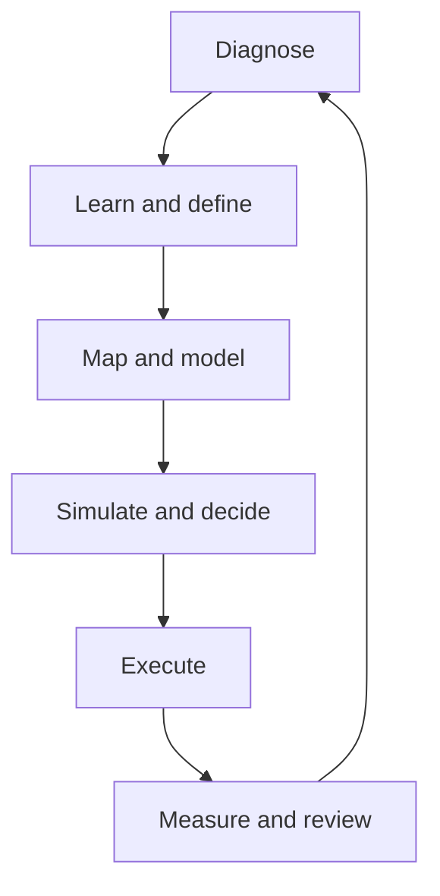

## Master specification

The complete product, architecture, migration and implementation requirements are documented in:

This document is the specification itself.

All developers and AI coding agents must read this specification before changing the application.

Read the complete master specification before making changes.

Use Sonnet as the primary implementation model.

Do not attempt to build the whole application in one request. Begin with Phase 0:

inspect the repository, create the parity ledger, identify contradictions and

produce the architecture decision records.

After Phase 0, implement one small, complete vertical slice at a time. Preserve

valuable existing behavior, calculations, data and content, but do not reproduce

the legacy Python injector or generated architecture.

Before every change:

1. Identify the relevant specification requirements.

2. Identify affected legacy parity items.

3. Explain the proposed files and architecture.

4. State any assumptions or unresolved decisions.

5. Wait if the decision affects financial formulas, migration, privacy,

   permissions, tenant isolation or destructive data changes.

After every change:

1. Run formatting and linting.

2. Run strict type checking.

3. Run relevant tests.

4. Run the production build.

5. Report exactly what passed and failed.

6. Update parity status and documentation.

7. Stop before beginning the next phase.

ssh -i "$env:USERPROFILE.ssh\\id_ed25519_bluehost" root@100.98.30.40

## APPLE CSS

A “MacBook Pro-style” design is not simply black backgrounds, rounded corners and gradients. The real concept is precision, restraint and focus: remove visual noise, make one element dominant, use excellent spacing, and reveal detail gradually.

Apple’s current MacBook Pro presentation uses strong contrast, large product imagery, short statements and carefully controlled motion. The physical product reinforces the same language: a thin aluminium enclosure, large dark display, rounded screen corners, narrow bezels, a black keyboard area and very few visible details. Current models are offered in Space Black and Silver, with 14.2-inch and 16.2-inch Liquid Retina XDR displays. Apple MacBook Pro and technical specifications.

1. The central design idea

The design should communicate:

- Professional

- Powerful

- Accurate

- Expensive

- Calm

- Technically advanced

- Easy to understand

The page should never feel crowded. Apple normally gives each important idea enough room to become the centre of attention.

A normal website might show:

- Heading

- Paragraph

- Four buttons

- Six cards

- Several icons

- Background decoration

An Apple-inspired section would show:

- One short heading

- One supporting sentence

- One primary action

- One dominant visual

That reduction is one of the most important parts of the style.

2. Visual hierarchy

Apple-inspired pages usually have four text levels.

Eyebrow

A small label introducing the section:

MacBook Pro Performance Display Battery life

It is normally semibold and may use a muted grey or an accent colour.

Hero headline

Very large, short and emotionally direct:

Built for the impossible. Power at full speed. A display without limits.

Avoid long sentences in the headline.

Supporting statement

A wider explanation, normally one or two lines:

Advanced performance for demanding creative and professional work.Technical detail

Specifications, footnotes and explanations are visually quieter.

The user should see content in this order:

Meaning → Product → Benefit → Evidence → Technical detail

Not:

Technical detail → More technical detail → Product benefit3. Colour system

The website should use a very limited palette.

:root { /* Page surfaces */ --page-light: #f5f5f7; --surface-light: #ffffff; --page-dark: #000000; --surface-dark: #161617; --surface-elevated: #1d1d1f; /* Text */ --text-light-primary: #1d1d1f; --text-light-secondary: #6e6e73; --text-dark-primary: #f5f5f7; --text-dark-secondary: #a1a1a6; /* Controls */ --accent: #0071e3; --accent-hover: #0077ed; --border-light: rgba(0, 0, 0, 0.10); --border-dark: rgba(255, 255, 255, 0.14); /* Highlight gradients */ --pro-gradient: linear-gradient( 90deg, #f5f5f7 0%, #a7b5c8 28%, #ffffff 50%, #967cff 72%, #ff8a62 100% ); }

Important rules:

- Avoid pure white text everywhere. Use softer #f5f5f7.

- Use grey to create hierarchy—not dozens of font sizes.

- Use blue mainly for actions and links.

- Use gradients only for key messages.

- Most sections should remain neutral.

- Do not assign every card a different colour.

4. Typography

Apple uses its own San Francisco type system. For an original web project, use a system-font stack rather than illegally distributing Apple’s font files.

html { font-family: -apple-system, BlinkMacSystemFont, "Segoe UI", Roboto, Helvetica, Arial, sans-serif; color: var(--text-light-primary); background: var(--page-light); text-rendering: optimizeLegibility; -webkit-font-smoothing: antialiased; }

The important qualities are:

- Tight headings

- Clean letterforms

- High font weight for headlines

- Comfortable line height for paragraphs

- Short line lengths

- Fluid responsive scaling

.display-title { margin: 0; max-width: 1100px; font-size: clamp(3rem, 8vw, 7.5rem); font-weight: 700; line-height: 0.94; letter-spacing: -0.055em; } .section-title { margin: 0; max-width: 900px; font-size: clamp(2.4rem, 5.5vw, 5rem); font-weight: 700; line-height: 1; letter-spacing: -0.045em; } .card-title { margin: 0; font-size: clamp(1.5rem, 2.2vw, 2.25rem); font-weight: 650; line-height: 1.08; letter-spacing: -0.03em; } .intro-copy { max-width: 760px; font-size: clamp(1.2rem, 2vw, 1.75rem); font-weight: 500; line-height: 1.35; letter-spacing: -0.02em; color: var(--text-dark-secondary); } .eyebrow { margin-bottom: 20px; font-size: 1.05rem; font-weight: 650; line-height: 1.2; letter-spacing: -0.01em; }

A common mistake is making text large without tightening the line height and letter spacing. Large Apple-style headings should feel like one deliberately constructed shape.

5. Spacing system

Apple-inspired layouts use significantly more vertical space than normal application interfaces.

:root { --space-1: 8px; --space-2: 12px; --space-3: 16px; --space-4: 24px; --space-5: 32px; --space-6: 48px; --space-7: 64px; --space-8: 96px; --space-9: 128px; --space-10: 180px; --content-width: 1200px; --reading-width: 760px; --page-padding: clamp(20px, 5vw, 72px); }

Section spacing:

.section { padding: clamp(88px, 12vw, 180px) var(--page-padding); } .section__inner { width: min(100%, var(--content-width)); margin-inline: auto; }

The empty space is not wasted space. It separates ideas and makes the product appear more important.

6. Page structure

A strong MacBook Pro-inspired product page could use this sequence:

1. Minimal navigation

2. Product name and purchase action

3. Full-screen hero

4. Large product image

5. Short introductory statement

6. Feature overview

7. Performance section

8. Display section

9. Battery or efficiency section

10. Connectivity section

11. Product comparison

12. Technical specifications

13. Final purchase action

Each section should have one purpose.

<main> <section class="hero"></section> <section class="product-intro"></section> <section class="feature-grid"></section> <section class="performance"></section> <section class="display-story"></section> <section class="specifications"></section> </main>7. Navigation

The navigation is compact, translucent and secondary to the product.

.site-header { position: sticky; top: 0; z-index: 100; height: 48px; background: rgba(250, 250, 252, 0.82); border-bottom: 1px solid rgba(0, 0, 0, 0.08); backdrop-filter: saturate(180%) blur(20px); -webkit-backdrop-filter: saturate(180%) blur(20px); } .site-header__inner { width: min(calc(100% - 40px), 1024px); height: 100%; margin-inline: auto; display: flex; align-items: center; justify-content: space-between; } .product-name { font-size: 1.25rem; font-weight: 600; letter-spacing: -0.02em; }

Do not add a huge shadow under the navigation. A faint border and background blur are enough.

8. Hero section

The hero should feel cinematic, not like a standard website banner.

.hero { min-height: calc(100svh - 48px); padding: 100px var(--page-padding) 40px; display: grid; place-items: center; overflow: hidden; text-align: center; color: var(--text-dark-primary); background: radial-gradient( circle at 50% 55%, #24242a 0%, #0c0c0e 38%, #000000 74% ); } .hero__content { width: min(100%, 1250px); } .hero__eyebrow { margin-bottom: 18px; color: #b8b8bd; } .hero__title { margin: 0 auto; max-width: 1050px; font-size: clamp(3.5rem, 9vw, 8.5rem); line-height: 0.92; letter-spacing: -0.06em; } .hero__description { max-width: 720px; margin: 32px auto 0; color: var(--text-dark-secondary); font-size: clamp(1.15rem, 2vw, 1.6rem); line-height: 1.4; } .hero__actions { margin-top: 36px; display: flex; justify-content: center; align-items: center; gap: 26px; flex-wrap: wrap; }

The product image should normally be wider than the text and may partially leave the viewport.

.hero__product { width: min(1250px, 115vw); margin-top: clamp(50px, 8vw, 110px); transform: translateX(-50%); position: relative; left: 50%; filter: drop-shadow(0 60px 70px rgba(0, 0, 0, 0.55)); }9. Buttons and links

Apple-style buttons are simple and clearly prioritised.

.button { min-height: 44px; padding: 11px 22px; display: inline-flex; align-items: center; justify-content: center; border: 0; border-radius: 999px; font: inherit; font-weight: 500; text-decoration: none; cursor: pointer; transition: background-color 180ms ease, color 180ms ease, transform 180ms ease; } .button--primary { color: #ffffff; background: var(--accent); } .button--primary:hover { background: var(--accent-hover); } .button--primary:active { transform: scale(0.97); } .text-link { color: #2997ff; font-size: 1.1rem; text-decoration: none; } .text-link::after { content: "›"; margin-left: 0.35em; } .text-link:hover { text-decoration: underline; }

There should normally be only one filled primary button within an action group.

10. Cards and “bento” layout

Modern Apple-style feature pages often use large modular panels. However, the cards should not all be equal.

.feature-grid { display: grid; grid-template-columns: repeat(12, minmax(0, 1fr)); gap: 24px; } .feature-card { position: relative; min-height: 460px; padding: clamp(28px, 4vw, 56px); overflow: hidden; border-radius: 32px; background: var(--surface-dark); color: var(--text-dark-primary); } .feature-card--wide { grid-column: span 8; } .feature-card--small { grid-column: span 4; } .feature-card--full { grid-column: 1 / -1; } .feature-card__copy { position: relative; z-index: 2; max-width: 560px; } .feature-card__visual { position: absolute; inset: auto 0 0; width: 100%; height: 65%; object-fit: cover; }

Good layout composition:

- One large card

- Two smaller supporting cards

- Different card heights

- Strong visual variation

- Consistent internal spacing

- Minimal borders

Bad composition:

- Twelve identical cards

- Every card with an icon, heading, paragraph and button

- Strong shadows around every component

- Different gradient on every card

Responsive version:

@media (max-width: 800px) { .feature-card--wide, .feature-card--small, .feature-card--full { grid-column: 1 / -1; } .feature-card { min-height: 400px; border-radius: 24px; } }11. Creating a MacBook Pro body with CSS

If by “MacBook Pro design” you mean drawing the laptop itself with CSS, divide it into:

- Display enclosure

- Screen

- Camera notch

- Hinge

- Aluminium base

- Keyboard area

- Trackpad

- Front lip

<div class="macbook"> <div class="macbook__display"> <div class="macbook__screen"> <div class="macbook__notch"></div>  </div> </div> <div class="macbook__hinge"></div> <div class="macbook__base"> <div class="macbook__keyboard"></div> <div class="macbook__trackpad"></div> </div> </div>.macbook { --metal-light: #747478; --metal-mid: #404044; --metal-dark: #1f1f22; width: min(920px, 92vw); margin-inline: auto; perspective: 1600px; } .macbook__display { position: relative; width: 78%; aspect-ratio: 1.55; margin-inline: auto; padding: 10px; border-radius: 24px 24px 12px 12px; background: linear-gradient( 145deg, #6d6d71 0%, #323236 30%, #151518 70%, #58585c 100% ); box-shadow: inset 0 0 0 1px rgba(255, 255, 255, 0.13), 0 35px 80px rgba(0, 0, 0, 0.55); } .macbook__screen { position: relative; width: 100%; height: 100%; overflow: hidden; border-radius: 17px 17px 7px 7px; background: #050505; } .macbook__screen img { width: 100%; height: 100%; display: block; object-fit: cover; } .macbook__notch { position: absolute; z-index: 3; top: 0; left: 50%; width: 16%; height: 18px; transform: translateX(-50%); border-radius: 0 0 10px 10px; background: #050505; } .macbook__hinge { width: 32%; height: 8px; margin: -2px auto 0; border-radius: 3px; background: linear-gradient(90deg, #202024, #68686d, #202024); } .macbook__base { position: relative; width: 100%; aspect-ratio: 3.7; margin-top: -1px; transform: rotateX(69deg); transform-origin: top; border-radius: 8px 8px 24px 24px; background: linear-gradient( 160deg, var(--metal-light), var(--metal-mid) 45%, var(--metal-dark) ); box-shadow: inset 0 1px rgba(255, 255, 255, 0.22), 0 45px 70px rgba(0, 0, 0, 0.5); } .macbook__keyboard { position: absolute; top: 11%; left: 8%; width: 84%; height: 44%; border-radius: 7px; opacity: 0.9; background: repeating-linear-gradient( 90deg, #111 0 5.2%, transparent 5.2% 5.8% ), repeating-linear-gradient( 0deg, #111 0 21%, transparent 21% 25% ); } .macbook__trackpad { position: absolute; bottom: 7%; left: 50%; width: 36%; height: 32%; transform: translateX(-50%); border: 1px solid rgba(20, 20, 22, 0.42); border-radius: 8px; background: rgba(255, 255, 255, 0.025); }

This creates the impression of a MacBook, but a high-quality product presentation should use a professionally rendered original product image or 3D model. CSS alone will normally look like an illustration rather than a photograph.

12. Glass and aluminium effects

The key is subtlety.

Glass

.glass-panel { background: rgba(30, 30, 32, 0.68); border: 1px solid rgba(255, 255, 255, 0.13); box-shadow: 0 30px 80px rgba(0, 0, 0, 0.3), inset 0 1px rgba(255, 255, 255, 0.08); backdrop-filter: blur(24px) saturate(135%); -webkit-backdrop-filter: blur(24px) saturate(135%); }Aluminium

.aluminium { background: linear-gradient( 145deg, #8b8b8f 0%, #555559 25%, #303034 58%, #6e6e72 100% ); }

Avoid obvious striped metallic gradients. The surface should have slow, soft changes in brightness.

13. Product lighting

A premium product should not be lit equally from every direction.

Use:

- A soft rim light around the outline

- A subtle highlight across the aluminium

- A deep shadow beneath the product

- A faint coloured glow behind the screen

- Strong black levels around the display

.product-stage { position: relative; isolation: isolate; } .product-stage::before { content: ""; position: absolute; z-index: -1; inset: 15% 10%; background: radial-gradient( ellipse, rgba(93, 113, 255, 0.24), transparent 67% ); filter: blur(70px); } .product-stage::after { content: ""; position: absolute; z-index: -1; left: 15%; right: 15%; bottom: -5%; height: 16%; border-radius: 50%; background: rgba(0, 0, 0, 0.75); filter: blur(35px); }14. Gradient text

Use gradient text only for the major message.

.gradient-text { color: transparent; background: linear-gradient( 90deg, #ffffff 5%, #9fb6d5 34%, #b28cff 62%, #ff976f 92% ); background-clip: text; -webkit-background-clip: text; }

For accessibility, retain readable fallback colour:

.gradient-text { color: #f5f5f7; } @supports (background-clip: text) { .gradient-text { color: transparent; } }15. Motion concept

The motion should communicate physical weight and precision.

Use:

- Slow scale changes

- Smooth opacity transitions

- Product rotation of only a few degrees

- Scroll-linked reveals

- Sticky product stages

- Masked image transitions

- Gentle parallax

- Numbers counting upward only when useful

Avoid:

- Bouncing cards

- Constant floating

- Spinning icons

- Fast zooms

- Different animation styles in every section

Basic reveal:

.reveal { opacity: 0; transform: translateY(36px); transition: opacity 800ms cubic-bezier(0.22, 1, 0.36, 1), transform 800ms cubic-bezier(0.22, 1, 0.36, 1); } .reveal.is-visible { opacity: 1; transform: translateY(0); }

Staggered children:

.reveal-group > * { opacity: 0; transform: translateY(24px); transition: opacity 700ms ease, transform 700ms cubic-bezier(0.22, 1, 0.36, 1); } .reveal-group.is-visible > * { opacity: 1; transform: translateY(0); } .reveal-group.is-visible > :nth-child(2) { transition-delay: 100ms; } .reveal-group.is-visible > :nth-child(3) { transition-delay: 200ms; }

Accessibility:

@media (prefers-reduced-motion: reduce) { *, *::before, *::after { scroll-behavior: auto !important; animation-duration: 0.01ms !important; animation-iteration-count: 1 !important; transition-duration: 0.01ms !important; } }16. Sticky storytelling

A MacBook feature can remain fixed while descriptions change beside it.

.story { display: grid; grid-template-columns: minmax(0, 1.35fr) minmax(300px, 0.65fr); gap: clamp(40px, 8vw, 120px); align-items: start; } .story__product { position: sticky; top: 110px; height: calc(100vh - 150px); display: grid; place-items: center; } .story__steps { display: grid; gap: 50vh; padding-block: 25vh; } .story__step { min-height: 240px; }

On mobile, disable the sticky layout:

@media (max-width: 800px) { .story { display: block; } .story__product { position: relative; top: auto; height: auto; margin-bottom: 70px; } .story__steps { gap: 90px; padding-block: 0; } }17. Specification presentation

Large figures should become visual landmarks.

<div class="metric"> <span class="metric__prefix">Up to</span> <strong class="metric__value">24</strong> <span class="metric__unit">hours</span> <p class="metric__label">battery life</p> </div>.metric { display: grid; align-content: start; } .metric__prefix, .metric__unit, .metric__label { color: var(--text-dark-secondary); } .metric__value { font-size: clamp(4rem, 10vw, 9rem); font-weight: 700; line-height: 0.88; letter-7spacing: -0.065em; } .metric__unit { margin-top: 10px; font-size: clamp(1.4rem, 3vw, 2.4rem); font-weight: 600; }

Do not put every specification in a bordered table. Promote the most important figures and place complete technical information lower down.

18. Responsive behaviour

The mobile version should be recomposed—not merely reduced.

Desktop:

- Large cinematic imagery

- Split layouts

- Sticky sections

- Oversized typography

- Multi-column feature grids

Mobile:

- Single-column content

- Shorter section heights

- Reduced animation

- Product image allowed to overflow horizontally

- Buttons large enough to tap

- Heading broken at intentional points

@media (max-width: 600px) { .section { padding-block: 80px; } .hero { min-height: auto; padding-top: 76px; } .hero__actions { gap: 18px; } .feature-card { padding: 28px; } }

Use clamp() wherever possible so the design scales continuously rather than jumping between several awkward breakpoints.

19. Small details that create the premium feeling

The difference is often in the final 10%:

- Text aligns to a consistent grid.

- Image edges are extremely clean.

- Shadows are broad and soft.

- Borders use low-opacity colours.

- Headings have controlled line breaks.

- Icons use matching stroke widths.

- Buttons use consistent heights.

- Hover movement is only one to three pixels.

- Corners use a limited radius system.

- Images remain sharp on high-density displays.

- Content does not jump while loading.

- Each section has a clear beginning and end.

- Decorative effects never compete with the product.

Suggested radius system:

:root { --radius-control: 999px; --radius-small: 12px; --radius-medium: 20px; --radius-large: 32px; --radius-feature: 44px; }

Suggested shadow system:

:root { --shadow-small: 0 4px 18px rgba(0, 0, 0, 0.08); --shadow-card: 0 24px 60px rgba(0, 0, 0, 0.16); --shadow-product: 0 60px 120px rgba(0, 0, 0, 0.45); }20. What usually ruins this style

Avoid these mistakes:

- Excessive glassmorphism

- Too many gradients

- Huge border radiuses on every object

- Heavy black shadows

- Text over busy imagery without enough contrast

- Five different font weights in one card

- Long marketing paragraphs

- Equal visual importance for everything

- Animations that delay access to content

- Tiny grey text

- Fixed heights that cut off mobile content

- Copying Apple logos or proprietary assets

- Attempting to make every section dramatic

The finished experience should feel quiet but powerful. The user should immediately know where to look, what the product does and what action to take. The “MacBook Pro feeling” comes from disciplined hierarchy and presentation—not from any single CSS effect.

# ONEVYRT Deep Product, Learning, Coaching, AI and Implementation Master Specification

**Document purpose:** binding product, learning-design, software-architecture, AI-orchestration, migration and acceptance contract for rebuilding ONEVYRT correctly while preserving the useful mechanics of the supplied application.

**Evidence inspected:** the complete supplied ONEVYRT archive; its application routes, API handlers, components, deterministic engine, migrations, tests, code-generation history and product documentation; and the complete supplied business, funnel, traffic, leadership, communication, psychology, performance, finance and workbook archive. The source archive is used for concept discovery only. Protected wording, branded diagrams and substantial passages must not be copied. All teaching copy, figures, metaphors and exercises shipped by ONEVYRT must be original, licensed, or supplied by the product owner with documented rights.

**Primary decision:** preserve capabilities and proven calculations, not the current file structure. The new system is a TypeScript-first modular product. Python must not generate, inject, rewrite or version-control application source. Claude Sonnet 5 is an AI provider behind a model-neutral gateway, never the owner of business truth.

## 0. Non-negotiable interpretation

ONEVYRT is not merely a course, funnel builder, financial calculator, coaching portal or AI chat. It is a guided business-transformation operating system. It must move a user through one repeated evidence loop:

1. **Regulate and orient:** establish attention, psychological readiness, purpose and the question being solved.
2. **Understand:** teach one concept in plain language and explain why it matters.
3. **See:** show a diagram, sketch, worked figure, metaphor and counterexample.
4. **Reflect:** connect the concept to the user's actual business and beliefs.
5. **Model:** turn the reflection into structured business records, numbers, nodes, assumptions and scenarios.
6. **Decide:** compare choices, expose trade-offs and record a decision.
7. **Implement:** produce owned actions, dates, checklists, experiments and evidence requirements.
8. **Coach:** request or receive feedback, revise and pass an explicit gate where appropriate.
9. **Measure:** compare forecast with actual result and distinguish fact from estimate.
10. **Learn:** retain the result, update confidence, revise the model and choose the next action.

Every major feature must participate in this loop. A lesson that produces no durable asset or action is incomplete. A calculator that does not explain assumptions is incomplete. An AI response that cannot be reviewed, traced or safely applied is incomplete. A coaching comment that is disconnected from an output or action is incomplete.

## 1. Deep audit conclusions

### 1.1 What the current product already contains and must not be lost

The inspected repository contains 67 page routes, 207 API route handlers, 182 React component files, 334 exported deterministic-engine declarations, 87 migration files and 233 test/spec files. Its capability surface includes authentication, MFA, sessions, workspaces, roles, curriculum, enrolment, programme progression, coaching, submissions, business definitions, diagnostics, Seven Forces, psychology material, business intelligence, offers, messages, funnel canvases, simulations, scenarios, sensitivity, risk, constraints, break-even, profit drivers, Money Machine, leads, qualification, booking, payments, campaigns, creative assets, segments, broadcasts, community, reports, sharing, notifications, billing, entitlements, referrals, audit, data management, webhooks, API keys, analytics, workflows and administration.

The repository also shows the central structural problem: valuable behaviour is spread across competing journeys, very large React files, duplicated UI systems, thin and thick API handlers, legacy experiences, generated snapshots and a 94-file Python code-generation layer. The rebuild must inventory and test the behaviour, then express it through bounded domains and one canonical journey.

### 1.2 What the supplied learning archive adds

The learning archive adds a broad concept library across these families:

- founder state, physiology, focus, identity, certainty, habits, rituals, anchors and pattern interruption;
- problem solving, decision quality, thinking time, questions, metaphors, reframing and belief change;
- energy practices and sustainable performance;
- purpose-driven planning, outcomes, reasons, action plans, procrastination and stress;
- rapport, observation, agreement, precision, reality bridging and ethical communication;
- leadership mandates, feedback, correction, influence, culture, talent multiplication and standards;
- business mapping, innovation, customer value, offers, sales, marketing, culture and implementation;
- cash flow, financial statements, drivers, forecasts, assumptions and owner-level financial thinking;
- dream customers, traffic sources, owned audiences, channel strategy and follow-up;
- value ladders, funnel stages, lead funnels, offers, stories, belief, presentations and conversion;
- 10×10×10 and other driver-based growth planning;
- questions and thinking disciplines designed to reduce avoidable mistakes.

These are not to become a pile of disconnected videos or copied worksheets. They become an original ONEVYRT concept graph, lesson system, business ontology, exercise library and coaching rubric.

### 1.3 The major redesign

The old information architecture is route-led. The new one is outcome-led. The learner sees five stable destinations: **Today, Learn, Build, Execute, Review**. Coaching is visible contextually and through a dedicated inbox; account and administration remain separate. Every lesson opens the relevant business asset directly. Every business asset shows its originating lesson, assumptions, actions, evidence and coaching history. The user never has to remember which of several old dashboards contains the truth.

## 2. Canonical product architecture

### 2.1 Experience layers

| Layer   | Responsibility                                                          | Never responsible for                            |
| ------- | ----------------------------------------------------------------------- | ------------------------------------------------ |
| Today   | Next best action, readiness, warnings, commitments, upcoming coaching   | Full modelling UI                                |
| Learn   | Original lessons, examples, checks, reflection prompts                  | Duplicated business records                      |
| Build   | Business map, offer, customer, finance, team, systems and visual studio | Curriculum progression rules                     |
| Execute | Goals, actions, experiments, checklists, owners and blockers            | Inventing source-of-truth numbers                |
| Review  | Actuals, variance, evidence, decisions, retrospectives and reports      | Silent AI mutation                               |
| Coach   | Feedback, questions, approvals, sessions, assignments                   | Access beyond assigned scope                     |
| Admin   | Curriculum, cohorts, permissions, operations, audit and health          | Learner-private state without explicit privilege |

### 2.2 Bounded domains

Use packages for `identity`, `tenancy`, `curriculum`, `learning`, `business-core`, `psychology`, `customer`, `offer`, `canvas`, `simulation`, `finance`, `execution`, `experiments`, `coaching`, `acquisition`, `campaigns`, `community`, `reports`, `notifications`, `billing`, `integrations`, `ai`, `analytics`, `governance` and `ui`. Each domain has pure types/rules, application use cases, repositories/adapters, contracts and tests. React pages compose use cases; they do not contain financial formulas or progression logic.

### 2.3 Canonical entities

All outputs reference stable IDs rather than copying prose. The core graph is:

`Workspace → Business → Vision → Outcome → Metric → Assumption → Model → Decision → Action → Experiment → Evidence → Review`.

Learning attaches through `ProgrammeVersion → LessonVersion → ExerciseVersion → LearnerAttempt → OutputLink`. Coaching attaches through `Submission → Review → Comment/Annotation → ChangeRequest → Approval`. Visual explanations attach through `VisualArtifact → VisualElement → SourceLink → AccessibilityDescription`. AI attaches through `AIRequest → ContextManifest → CandidateArtifact/Operation → Validation → UserDecision → AppliedChange`.

## 3. The learning system

### 3.1 Lesson contract

Every lesson is versioned and contains:

- a one-sentence outcome and prerequisite readiness;
- an opening question tied to the learner's current business;
- a concise concept explanation and explicit “why this matters”;
- an original visual explanation selected from the visual grammar below;
- one positive example, one counterexample and one boundary case;
- a worked numerical example where the concept affects money or capacity;
- a metaphor with an explicit mapping table and a warning about where it breaks;
- a comprehension check that tests transfer, not memorisation;
- a guided reflection and confidence rating;
- a structured build activity that creates or updates a canonical asset;
- an implementation action with owner, deadline and evidence;
- optional coach gate and rubric;
- a review date, actual result and revise/continue/stop decision;
- accessibility alternatives, sources, rights metadata and version history.

### 3.2 Lesson modes

Support `guided`, `workshop`, `case-study`, `calculation-lab`, `state-practice`, `coach-led`, `team-session` and `review`. Mode changes pacing and UI but not the evidence loop. Users may pause safely, resume at the exact block, see saved state and export their own outputs.

### 3.3 Concept graph

Store original concepts as nodes with `name`, `plainDefinition`, `why`, `prerequisites`, `relatedConcepts`, `commonMistakes`, `businessApplications`, `metrics`, `visualPatterns`, `exerciseTemplates`, `coachRubrics`, `sourceProvenance` and `rightsStatus`. This lets the same core idea appear consistently in a lesson, coach view, AI explanation and report without copying lesson text into four places.

### 3.4 Master curriculum

The recommended programme is:

1. **Orientation and owner truth:** goals, business stage, data quality, owner/operator reality and baseline.
2. **State and decision readiness:** attention, energy, story, identity, certainty, stress, habits and rituals—with clear non-clinical boundaries.
3. **Business definition and purpose:** customer, problem, promise, value, positioning, vision and owner role.
4. **Business map and Seven Forces:** current reality, innovation, marketing, sales, finance, operations/people and customer culture.
5. **Customer and market:** segments, pains, desired outcomes, journey, dream-customer research and ethical evidence gathering.
6. **Offer and message:** value, mechanism, proof, objection handling, risk reversal, message variants and testing.
7. **Acquisition and funnel:** traffic categories, channel hypotheses, lead capture, qualification, follow-up and conversion map.
8. **Numbers and economics:** unit economics, break-even, contribution, cash, capacity, 10×10×10, profit drivers and sensitivity.
9. **Delivery and Raving Fans:** promises, standards, customer experience, recovery, retention and referral.
10. **People, communication and culture:** roles, outcomes, feedback, leadership, meetings, accountability and team capacity.
11. **Execution system:** constraints, priorities, 90-day plan, experiments, weekly commitments, evidence and review.
12. **Scale, resilience and owner freedom:** systems, delegation, risk, scenarios, governance and operating cadence.

Completion is based on accepted outputs and evidence, not time watched.

## 4. Visual explanation, sketches, figures and metaphors

### 4.1 Three distinct visual systems

Do not confuse these systems:

1. **Structured business canvas:** React Flow nodes and typed edges are authoritative model data and feed calculations.
2. **Explanation figures:** deterministic SVG/HTML charts and diagrams are generated from known data or authored templates.
3. **Freehand sketchbook:** Excalidraw supports rough thinking, annotation and coach collaboration but is not automatically financial truth.

An image-generation model may create decorative or illustrative assets, but must never generate an authoritative numerical chart. Calculated figures are rendered from validated data. Every visual has a text/table equivalent.

### 4.2 Visual grammar

Implement reusable primitives for flow, ladder, bridge, flywheel, loop, pipeline, tree, matrix, spectrum, balance, iceberg, mountain, map, timeline, before/after, system boundary, stock-and-flow, funnel, Sankey-like movement, waterfall, unit-economics equation, sensitivity tornado, scenario band, cash runway, capacity gauge and evidence-confidence badge.

Each primitive accepts a typed schema; renders SVG/HTML; supports print, dark mode and reduced motion; exposes a semantic description; and records the data and lesson version used. Avoid arbitrary infographic generation when a structured primitive fits.

### 4.3 Metaphor engine

A metaphor is a teaching aid, not a claim. Store `sourceDomain`, `targetConcept`, `mappingPairs`, `usefulFor`, `limitations`, `prompt`, `visualTemplate`, `learnerRestatement` and `coachQuestion`. The AI may propose metaphors based on the learner's industry and experience, but must show the mapping and limitations. Users can reject culturally unsuitable or confusing metaphors. Never use a metaphor as evidence for a financial decision.

### 4.4 Sketch workflow

Users can create a sketch from a lesson, business asset, coaching conversation or blank page. They can draw, type, connect, group, annotate and import an image. AI can explain a selected sketch, propose labels, identify ambiguity, or propose a structured conversion. Conversion always shows a preview mapping each sketch element to a typed node/edge; unrecognised objects remain annotations; the user confirms. Store original sketch, conversion version, author and links.

### 4.5 AI-generated lesson figures

Sonnet 5 receives a compact lesson concept manifest and returns a validated `FigurePlan`, not raw executable code. The plan selects an approved primitive, provides labels, mapping, accessibility narrative and rationale. The server validates allowed types, length, unsafe claims and data references. A deterministic renderer produces the figure. A human curriculum editor approves figures before publishing. Personalised ephemeral figures may be shown to a learner but are labelled AI-generated and are never promoted into curriculum automatically.

## 5. Claude Sonnet 5 architecture

Anthropic currently describes Claude Sonnet 5 as its speed/intelligence balance and enables adaptive thinking by default (see [Anthropic model overview](https://docs.anthropic.com/en/docs/about-claude/models/overview) and [Sonnet 5 changes](https://docs.anthropic.com/en/docs/about-claude/models/whats-new-sonnet-5)). Treat that as a provider detail behind an `AIModelGateway`; discover deployed model IDs through configuration, never hardcode a marketing name across the product. Reserve provider-specific settings for the adapter and maintain fallback behaviour.

### 5.1 AI capability classes

- **Explain:** explain a concept, calculation, visual, warning or variance using cited application context.
- **Question:** ask one high-value diagnostic or coaching question at a time.
- **Draft:** create editable lesson summaries, messages, offers, action plans and reports.
- **Transform:** turn narrative into proposed structured data or a `FigurePlan`.
- **Compare:** compare scenarios, options, drafts or actual-versus-plan.
- **Critique:** identify missing evidence, contradictions, weak assumptions and implementation gaps.
- **Coach:** facilitate reflection without impersonating a clinician, accountant, lawyer or authorised human coach.

### 5.2 Context assembly

Never dump the entire database or book archive into a prompt. A policy-controlled context assembler selects the minimum records permitted for the task: learner goal, current lesson, relevant business record, explicit calculations, recent decisions and coach-visible notes. Every request stores a manifest of IDs, versions, data classifications and redactions. Private coach notes, secrets and data from another workspace are excluded by construction.

### 5.3 Typed outputs and safe mutation

All AI outputs use versioned Zod/JSON schemas. Proposed writes include operation type, target ID, expected version, values, rationale, evidence IDs, confidence and warnings. The server authorises and validates; the UI shows a diff; the user confirms material changes; application services write transactionally; audit records capture the decision. AI can never directly change actual financials, billing, membership, permissions, legal acceptance, published curriculum, sent communications or deletion state.

### 5.4 Evaluation

Maintain golden evaluations for factual grounding, calculation fidelity, schema validity, appropriate uncertainty, no cross-tenant leakage, metaphor usefulness, visual-plan validity, psychological safety and refusal of unsafe mutation. Compare model upgrades before rollout. Log tokens, latency, cost, retries and outcome without logging sensitive prompt bodies by default.

## 6. Psychology and state system

This domain supports performance reflection, not diagnosis or treatment. It captures self-reported energy, focus, stress, emotional quality, body readiness, dominant interpretation, chosen state, ritual and intended action. It supports brief grounding, breathing or focus exercises with opt-out and safety language. It must not claim causation, diagnose conditions, shame low scores or gate essential product access on emotional disclosure.

Model a state transition as `trigger → physiology/focus/language → interpretation → behaviour tendency → business impact → desired state → selected intervention → immediate action → later reflection`. Keep sensitive entries private by default. Allow users to delete or exclude them from coaching. Aggregate trends only with explicit consent and minimum sample rules.

State is integrated at decision points: before a high-impact decision, the product can ask readiness and offer a short reset; after the decision it records assumptions and review date. It must never use state data to manipulate a purchase or sales outcome.

## 7. Numbers and business understanding

Every number carries value, unit, currency if relevant, period, source type, source date, confidence, owner and formula trace. Source types are `actual-imported`, `actual-entered`, `estimate-user`, `estimate-ai`, `benchmark`, `derived` and `scenario-override`. The UI visibly distinguishes them.

The numerical curriculum and engine cover unit economics, contribution margin, conversion, customer acquisition cost, lifetime value assumptions, retention, churn, refunds, capacity, throughput, break-even, working capital, cash runway, 13-week cash flow, 12-month forecast, statements, debt, assets, taxes as configurable planning inputs, scenario ranges, sensitivity, constraints, profit drivers and forecast accuracy. Financial statements must reconcile. Advice carries jurisdiction/professional-review boundaries.

Every calculation view contains: plain-language meaning; formula; worked example; user inputs; source/confidence; result; “what changes this”; sensitivity; common error; action implication; and actual-versus-plan review. AI explains only the deterministic result supplied by the engine.

## 8. Coaching system

Coaching is structured around outputs and decisions. A learner submits a versioned artifact with a question, confidence, evidence and desired feedback. A coach reviews against a rubric, annotates a specific field/figure/node, asks questions, records private notes separately, requests changes or approves. Changes create a new version and preserve history.

Coach dashboards prioritise risk and leverage rather than raw activity: stalled progression, overdue actions, low-confidence high-impact assumptions, unreconciled numbers, repeated plan misses, upcoming decisions and unanswered submissions. Coaches can create assignments and actions only within their scope. Learners can see why something was flagged. Automated coaching suggestions remain drafts.

## 9. Implementation and operating system

Actions are first-class records with outcome, reason, owner, start/due dates, priority, status, metric, baseline, target, evidence, dependencies, blockers, source lesson/decision and review. Checklists are templates instantiated into owned records. Experiments include hypothesis, smallest test, audience, cost/time cap, success/failure threshold, result and adopt/iterate/stop decision.

The Today screen chooses one dominant next action using transparent rules: mandatory safety/account issue; blocking programme gate; due coaching change; overdue high-priority commitment; scheduled review; current lesson continuation; next recommended build task. Users can inspect why it was selected and choose another without losing state.

## 10. Detailed delivery order

1. Freeze the legacy archive and produce signed inventories and behaviour/parity IDs.
2. Establish strict TypeScript monorepo, CI, design tokens, observability and PostgreSQL migrations.
3. Implement identity, MFA, tenancy, permissions, audit and data classification.
4. Create canonical business, metric, assumption, decision, action, evidence and version models.
5. Build curriculum authoring/versioning and the universal lesson renderer.
6. Build Today/Learn/Build/Execute/Review shells and canonical progression.
7. Port diagnostic, business definition and Seven Forces with parity tests.
8. Build visual primitive library, accessibility equivalents and editorial preview.
9. Build structured React Flow canvas, versioning, commands, autosave and migration.
10. Port deterministic simulation/finance engines using golden fixtures before refactoring formulas.
11. Add Excalidraw sketchbook and explicit sketch-to-structure conversion.
12. Add Sonnet 5 gateway, context manifests, typed tools, preview/diff and evaluations.
13. Build psychology/state, thinking-time and decision-journal experiences with safety/privacy review.
14. Build offer, message, customer, traffic, funnel, acquisition and campaign capabilities.
15. Build execution, experiments, reviews and Today prioritisation.
16. Build coaching, rubrics, submissions, annotations, cohorts and sessions.
17. Build finance, Money Machine, reports and reconciliation.
18. Build community, billing, entitlements, referrals, APIs, webhooks and administration.
19. Rehearse deterministic migration, reconcile every count and run representative journeys.
20. Cut over with rollback; retire legacy compatibility only after measured parity.

Every phase requires security tests, accessibility checks, domain tests, migration tests, analytics events, operational runbooks and traceability updates. “Page exists” is never an exit criterion.

## 11. Acceptance test matrix for the integrated vision

- A new owner can register, create a business, complete a baseline and receive one explainable next action.
- A lesson can teach with text, figure, metaphor, worked number and sketch; the learner can use keyboard/screen reader alternatives.
- A reflection becomes one canonical business asset rather than duplicated lesson answers.
- A user can describe a funnel; Sonnet returns a preview; the server validates it; confirmation creates typed nodes; the deterministic engine simulates it.
- A sketch remains a sketch until explicit conversion; conversion is reversible and versioned.
- Every reported number exposes formula, period, source and confidence and reconciles where required.
- A coach can annotate an exact version, request a change and verify the revision without seeing private state notes.
- An experiment connects a lesson hypothesis to an action, measurement and review decision.
- An AI failure leaves the product usable, preserves drafts and cannot corrupt canonical data.
- Cross-workspace, prompt-injection, IDOR, webhook replay, stale-write, concurrency and privilege-escalation tests fail safely.
- The migration maps all legacy users, workspaces, progression, canvases, actions, reports and required history or records an approved retirement decision.

---

## Part II — Complete greenfield capability and architecture baseline

The following baseline remains binding. Where Part I is more specific, Part I controls.

## 1. Binding instruction to the AI developer

Build ONEVYRT as a business transformation operating system. Preserve every valuable user capability identified in this specification, but do not reproduce the existing source structure. Do not use Python scripts to generate, inject, rewrite or version-control the application source. Write and maintain the TypeScript application directly.

Treat this document as the product and architecture contract. When a requirement is unclear, follow this priority order:

1. Protect user data, security and tenant isolation.
2. Preserve the intended business outcome and existing user data.
3. Maintain one canonical learner journey and one source of truth.
4. Prefer the smallest understandable implementation.
5. Keep domain calculations deterministic and separate from presentation and AI-generated prose.
6. Record unresolved product decisions explicitly; never silently invent financially or legally important rules.

The rebuild is not accepted merely because pages exist. It is accepted when the end-to-end journeys work, calculations are proven, permissions are enforced on the server, data migrates correctly, reports reconcile, and accessibility and performance gates pass.

## 2. Product definition

ONEVYRT helps an owner or leadership team understand the current business, define the desired future, map how value and money flow, identify constraints, test changes, choose the highest-leverage actions, execute those actions and measure the actual result.

The closed loop is:



### 2.1 Product promise

At any moment, ONEVYRT must answer five questions:

1. Where is the business now?
2. Where does the owner want it to go?
3. What is preventing that result?
4. What action should happen next, who owns it and by when?
5. Did the action create the expected financial, customer or operating result?

### 2.2 Product principles

- One canonical programme, progress calculation, business record, action system and reporting model.
- Guided before advanced: new users receive a clear next action rather than a wall of tools.
- Canvas-centred: the business map is the visual centre, but it follows the initial definition and diagnostic.
- Evidence before confident advice: distinguish facts, user estimates, imported actuals, benchmarks and AI suggestions.
- Explainable calculations: every number shows formula, inputs, units, period and assumptions.
- Actions survive lesson completion and remain visible until resolved.
- AI proposes validated operations; it does not directly mutate critical financial or business data.
- Progressive disclosure: simple default screens with expert detail available on demand.
- Mobile supports review and lightweight editing; desktop provides the full modelling canvas.
- Original ONEVYRT language and content only; do not copy protected third-party course material.

## 3. Recommended greenfield technology

| Concern           | Decision                                                   | Reason                                                                          |
| ----------------- | ---------------------------------------------------------- | ------------------------------------------------------------------------------- |
| Language          | TypeScript                                                 | One language across UI, API, validation and business engine                     |
| Web shell         | Next.js App Router + React                                 | Routing, server rendering, API boundary and deployment maturity                 |
| Monorepo          | pnpm workspaces                                            | Shared typed packages without copied source                                     |
| UI                | Tailwind CSS plus accessible headless primitives           | Consistency without embedding huge CSS strings in components                    |
| Structured canvas | React Flow (`@xyflow/react`)                               | Node-and-edge business maps, custom handles, selection and viewport controls    |
| Free drawing      | Excalidraw, lazy-loaded                                    | Pen sketches, annotations, boxes and arrows; isolated from the structured model |
| Forms             | React Hook Form + Zod                                      | Typed input, reusable validation and accessible errors                          |
| Server API        | Next.js route handlers calling application services        | Thin transport layer with reusable use cases                                    |
| Database          | PostgreSQL                                                 | Transactions, relational integrity, JSON support and reporting                  |
| Database layer    | Drizzle ORM and SQL migrations                             | Typed schema with visible SQL and controlled migrations                         |
| Jobs              | Dedicated TypeScript worker and durable queue              | Email, reports, webhooks, scheduled reviews and retries outside web requests    |
| Cache/rate limits | Redis-compatible managed service                           | Shared limits, idempotency and short-lived cache                                |
| Files             | S3-compatible object storage                               | Reports, evidence, avatars and imports                                          |
| Tests             | Vitest + Playwright                                        | Fast domain tests and browser-level journey verification                        |
| Observability     | OpenTelemetry-compatible logs/traces plus error monitoring | Correlated debugging without leaking private data                               |

Python may be used only for an isolated data-science or import utility when it provides a clear advantage. It must not generate application source.

## 4. User roles and permission model

| Role                 | Core permissions                                                                                                     |
| -------------------- | -------------------------------------------------------------------------------------------------------------------- |
| Learner              | Manage own business workspace, complete programme, build models, execute actions, view assigned coaching             |
| Workspace owner      | All workspace data, billing, members, integrations, exports and deletion                                             |
| Workspace manager    | Manage most workspace content and members subject to owner-only restrictions                                         |
| Editor               | Create and edit business content but cannot manage billing, ownership or destructive account settings                |
| Viewer               | Read-only access to permitted workspace information                                                                  |
| Coach                | View explicitly assigned clients/cohorts, comment, request changes, approve gates and create coaching actions        |
| Administrator        | Platform operations, curriculum, entitlements, moderation, audit and system health                                   |
| Support impersonator | Time-limited, audited support session requiring explicit privilege; cannot expose secrets or alter billing ownership |

Every permission is enforced by a central server authorization layer. Hiding a button is never authorization. Every query must include the active workspace boundary, and tests must attempt cross-workspace access.

## 5. Canonical information architecture

The learner navigation contains exactly five primary destinations:

1. **Home** — what to do next.
2. **Programme** — the guided transformation journey.
3. **My Business** — the living outputs, canvas, numbers and actions.
4. **Coaching** — feedback, submissions and sessions.
5. **Resources** — optional templates, examples and glossary.

Account, billing, security and preferences belong in the profile menu. Coach and Admin applications have separate permission-protected navigation.

### 5.1 Home

Display one dominant continuation action, current chapter and lesson, overall progress, required next action, latest coaching feedback, upcoming session, overdue commitments, relevant warning and most recent completed output. Never display competing programme entry points.

### 5.2 Programme

Render the programme map from curriculum and enrollment data. Do not maintain a second hardcoded map. Every standard lesson follows:

1. Understand — teaching content and examples.
2. Reflect — questions about the user's situation.
3. Build — structured exercise producing a reusable asset.
4. Apply — action linked to the business.
5. Submit or complete — evidence, review and progression gate.

### 5.3 My Business

My Business is not another course. It is the persistent business operating workspace containing current reality, identity, strategy, offers, canvas, model, constraints, scenarios, decisions, actions, customers, money and reports.

### 5.4 Coaching

Provide learner messages, feedback requests, chapter submissions, approvals, changes requested, session schedule, coach-created actions and visible/private notes with explicit separation.

### 5.5 Resources

Provide templates, funnel explanations, glossary, examples and optional learning material. Resources never block progression.

## 6. Complete functional requirements

### 6.1 Registration, authentication and account security

- Register using verified email and secure password requirements.
- Login, logout and obtain current session.
- Forgot-password and expiring single-use reset tokens.
- Change password and change email with re-verification.
- Optional TOTP two-factor authentication: setup, confirmation, recovery handling, login challenge and disable with reauthentication.
- List active sessions and revoke an individual session or all other sessions.
- Upload/crop avatar with type, dimension and size validation.
- Download a complete user-data export.
- Delete account through a deliberate confirmation and retention workflow.
- Support audited administrator impersonation with prominent indication and immediate stop action.
- Apply secure, HttpOnly, SameSite cookies; rotate session identifiers after privilege changes.
- Rate-limit registration, login, password reset, OTP and verification operations.

### 6.2 Organisations and workspaces

- Create, list, rename, archive, restore and safely delete workspaces.
- Switch active workspace without mixing cached data.
- Invite members; accept, expire, cancel and resend invitations.
- Assign owner, manager, editor and viewer roles.
- Transfer ownership using reauthentication and a two-person confirmation where practical.
- Record immutable membership and ownership audit entries.
- Store workspace currency, timezone, locale, financial year start and notification defaults.
- Support entitlements, plan limits and free-access overrides with an explanation and expiry.
- Display workspace activity and material changes.

### 6.3 Onboarding and business foundation

Capture business name, description, founder/owners, industry, geography, customer segments, problems, products/services, revenue model, prices, differentiation, lifecycle stage, team, strategic goals, current constraints, data confidence and sources.

Capture deeper questions: why the business started, why it exists now, what business it is truly in, what success changes, evidence that change is possible, founder strengths, work to stop doing, missing capabilities, exit/succession intent and lifecycle of founder/business/industry.

Generate one authoritative business definition, founder-role statement, positioning summary, three-year vision, one-year goals, 90-day milestones and immediate large/small actions. All modules reference these records by ID instead of copying their text.

### 6.4 Diagnostic and Seven Forces

Assess owner psychology, vision/planning, sales/marketing, people/culture, operations/systems, finance/measurement and customer experience. For each force store current score 0–100, target, confidence, evidence, constraint, coach score, recommendations and reassessment date.

Render an accessible radar chart plus an equivalent table. Produce gap ranking, top-three priorities, historical trend, owner-versus-coach comparison and draft 90-day plan. A score without evidence must be marked as self-reported.

The seven detailed workspaces are:

1. Current reality and business map.
2. Strategic innovation: products, service and delivery.
3. Marketing and product promises.
4. Sales mastery systems.
5. Financial and legal anticipation.
6. Optimisation: people, culture, process and execution.
7. Raving Fans and customer culture.

Each force supports principles, findings, actions, estimated value, deadline, owner, status, priority, confidence, risk, linked canvas node and linked KPI.

### 6.5 Beautiful State and founder performance

Capture current emotional/physical state, repeating story, trigger, meaning, resulting behaviour, cost, desired state, replacement meaning, physical/language/focus reset and immediate action. Include guided best/difficult experience reflection, personal standards and morning/pre-work/recovery/end-of-day rituals.

Daily check-ins store energy, focus, emotional quality, stress, physical condition, dominant story, chosen state and one intentional action. Trends may show correlation with action completion and business results, but must not claim causation.

### 6.6 Thinking Time and decision journal

Workflow: choose question, optionally start timer, record context and assumptions, explore alternatives, identify missing evidence, document risks, decide, define action, assign owner/deadline, schedule review, record actual result and decide continue/change/stop.

Supply question libraries for strategy, money, customers, sales, team, operations, risk and founder effectiveness. Link decisions to assumptions, experiments, canvas nodes, KPIs and actions.

### 6.7 Offer, positioning and message system

Capture ideal customer, problem, emotional consequence, desired outcome, product/service, delivery method, unique mechanism, proof, objections, risk reversal, guarantee and call to action.

Generate editable variants for one-liner, short pitch, headline, social bio, networking introduction, sales opening and email introduction. Store version, channel, dates, leads, responses, conversions, evidence and declared winner. AI-generated copy is always editable and identified as a draft.

### 6.8 Structured business canvas

Use React Flow as the authoritative structured map. Supported node families:

- Traffic: organic, paid, referral, partner, outbound and offline sources.
- Audience/segment.
- Funnel step: landing page, opt-in, webinar, appointment, sales call, sales page, checkout, confirmation and custom step.
- Offer: core product, upsell, downsell, subscription, bundle and service.
- Decision/split with yes/no or conditional branches.
- Delivery/process stage.
- Team/role/capacity.
- Customer experience/touchpoint.
- Cost/resource.
- Annotation and group/container.

Canvas interactions: drag/drop library, connect valid ports, multi-select, keyboard movement, copy/paste, duplicate, undo/redo, delete confirmation, zoom, pan, minimap, fit view, snap/grid, alignment guides, grouping, layers, search, focus selected, read-only sharing, version history, autosave state, conflict recovery and import/export.

Each node has identity, type, label, position, dimensions, status, tags, notes, assumptions, period, currency, owner and typed configuration. Edges include source/target handles, condition, share/weight, order and line type. Invalid cycles or disconnected required paths receive an explainable validation error.

### 6.9 Freehand sketch mode

Provide a separately persisted, lazy-loaded Excalidraw surface for rough ideas, pen input, arrows, boxes, text and image annotation. Sketch objects are not silently treated as financial model nodes. Users explicitly convert a selected sketch item into a structured node or link a sketch to a canvas/business record.

### 6.10 Funnel and business simulation

The deterministic domain engine must:

- validate graphs and produce a stable topological order;
- calculate traffic through steps and conditional branches;
- calculate buyers, revenue, variable cost, ad spend, gross profit and margin;
- support recurring value, retention, churn, refunds, capacity and time periods;
- preserve monetary values as integer minor units or a documented decimal strategy;
- support multiple currencies without adding unlike currencies;
- compare plan with actuals;
- expose formula traces so results are explainable;
- reject impossible or ambiguous configurations with useful messages.

### 6.11 Scenarios, sensitivity, risk and goal solver

Create immutable base, likely, best, worst and custom scenarios. Users may override selected assumptions without modifying the baseline. Compare totals and per-node deltas. Sensitivity identifies which editable inputs most affect the chosen outcome.

Risk analysis includes break-even, fragile assumptions, confidence, scenario range and constraint violations. Goal solver accepts target metric/value, permitted levers and bounds, then proposes a feasible combination or explains why no solution fits. Never present a solver result without the required changes and assumptions.

### 6.12 Growth models

Implement both models without double-counting:

- 10×10×10: customers × average transaction value × purchase frequency.
- Five profit drivers: leads, sales-process effectiveness, conversion, transaction value and follow-up/retention/referrals.

For every driver store baseline, target, actual, period, source, experiment, owner and review frequency. Show individual and compounding effects, contribution, sensitivity, largest opportunity and draft next experiment.

### 6.13 Customers and Raving Fans

Model customer segments, needs, pains, desired outcomes, journey stages, promises, expected/actual experience, failure points, recovery actions, service standards, response time, complaints, satisfaction/NPS, retention, repeat purchase and referral.

The Raving Fans score must show component measures, weights, data dates and missing-data warnings. Generate promise-delivery gaps, pain-point ranking, recovery actions and retention/referral trends.

### 6.14 Financial operating system

Provide a rolling 13-week cash forecast with opening cash, receipts by category, payroll, suppliers, rent, marketing, taxes, debt, capex, owner distributions, other payments, financing and closing cash. Support actual versus forecast, minimum cash threshold, warnings, scenario versions, category editing, notes and CSV/XLSX import/export.

Provide a 12-month budget/forecast, profit-and-loss statement, balance sheet, cash-flow statement, AR/AP/inventory and cash-conversion cycle, fixed assets/depreciation, loans/interest/principal, equity/retained earnings and funding requirements.

Enforce reconciliation: closing cash agrees with the balance sheet; opening plus movement equals closing; loan principal changes liability; depreciation affects P\&L and asset value but not cash; transfers are not counted as expenditure and income simultaneously. Show revenue growth, margins, runway, break-even, liquidity ratios, debt-service coverage, working-capital days and forecast accuracy with plain-language explanations.

### 6.15 Money Machine

Support Freedom, Security, Growth and Dream funds; configurable allocation percentages; deposit/withdrawal rules; targets; transactions; forecast balances and goal dates. Validate allocation totals. A transfer either reconciles to financial cash accounts or is visibly planning-only.

### 6.16 Leads, qualification, booking and acquisition

- Capture contacts/leads with consent source, lifecycle stage, owner and tags.
- Configure qualification questions, conditions, scoring, gates and qualified/nurture/unqualified routes.
- Publish a public qualification funnel by slug.
- Start and verify email/SMS verification where configured.
- Display availability and accept bookings idempotently.
- Accept payment through a hosted provider flow; never handle raw card data.
- Record lead events, funnel events, source/UTM and daily aggregates.
- Export leads with permission and audit logging.
- Respect unsubscribe and channel opt-out globally.

### 6.17 Campaign studio

Brand profile: brand identity, voice, colours, typography, logo/assets, audience, positioning, proof, forbidden claims and channel rules.

Connections: configure external platforms through server-side OAuth or protected secrets; test connection, show scopes/status, rotate/revoke and audit usage.

Campaigns: create, edit, duplicate, archive, restore, schedule and track campaigns. Copy workspace: AI-assisted draft generation with editable variants and provenance. Creative workspace: store creative assets, format, channel, dimensions, spend and result. Segments: rule builder, preview count, contacts, archive/restore and suppression. Broadcasts: draft, approval, scheduling, send status, per-recipient delivery state and unsubscribe enforcement.

### 6.18 Execution, goals, actions and checklists

Every programme output can create an action with title, area, source, objective, owner, dates, priority, status, metric, baseline, target, actual, evidence, dependencies, blockers and review notes.

Support a goal hierarchy: vision → annual → quarterly → monthly KPI → project → action. Roll up status without hiding at-risk children. Provide weekly commitments, daily priorities, 90-day plan, checklists, overdue alerts, blocker escalation, coach comments, weekly review and quarter review.

### 6.19 Experiments and evidence

Store hypothesis, assumption, metric, baseline, target, design, audience, dates, budget, owner, result, confidence, evidence and decision. Decisions are adopt, iterate, retest, stop, insufficient evidence or reject. One experiment system serves pricing, marketing, offers, operations and customer experience.

### 6.20 Programme and curriculum management

Administrators create versioned programmes, stages, lessons, objectives, content blocks, exercises, outputs, prerequisites and approval gates. Publishing freezes a version for enrolled learners; edits create a new version or an explicit migration. Enrollments support self-paced, cohort and premium 1:1 delivery, access limits and safe lesson-ID remapping.

### 6.21 Coaching and cohorts

Create cohorts, assign coach, add/remove member workspaces, schedule sessions, publish announcements and set access limits. Coach dashboard includes assigned clients, progress, diagnostic deltas, upcoming reviews, overdue actions and pending submissions. Review permits approve or request changes with feedback. Private coach notes must never appear in learner exports or learner UI unless explicitly shared.

### 6.22 Community, templates and resources

Publish shared templates or creatives through moderation. Provide author profiles, comments, reactions and usage counts. Enforce visibility and ownership. Allow safe template import into a new user-owned copy. Moderate, archive and audit abusive or infringing content.

### 6.23 Reports and sharing

Generate baseline, Transformation Brief, Seven Forces plan, Five Profit Drivers, Money Machine, Raving Fans, scenario comparison, executive action, weekly, monthly management and final transformation reports.

Reports support accessible HTML, print-ready PDF, email delivery, expiring revocable share links and data-date/provenance notices. A report is generated from canonical records, not separately edited duplicate data. Financial reports include reconciliation status.

### 6.24 Notifications and reminders

Support in-app and optional email/SMS for upcoming/overdue actions, weekly reviews, Thinking Time, forecast update, low cash, coach feedback, reassessment, inactivity, report readiness and cohort sessions. Store deduplication key, delivery attempts and read time. Users control channel, frequency, quiet hours and unsubscribe preferences.

### 6.25 Billing, plans, referrals and entitlements

Support hosted checkout, subscription status, resume/cancel, default payment method through provider UI, one-time offers and Connect onboarding/status if marketplace payouts remain in scope. Webhooks require signatures, idempotent event storage and replay safety.

Entitlements are resolved centrally from plan, workspace override, free-access campaign and expiry. Referrals use unique codes, attribution, status and reward history without modifying billing from an untrusted client request.

### 6.26 Administration and platform operations

Admin capabilities: overview, users, status, lockouts, workspaces, members, owners, plans, entitlements, projects, curriculum, programme offers, cohorts, learner progress, bulk invite/email/export/reset, community moderation, feature flags, free-access campaigns, audit, webhook state, client errors and health.

All bulk and destructive operations require preview, authorization, confirmation, idempotency and an audit record. Long operations execute as jobs with visible progress and downloadable failure reports.

### 6.27 Data management and privacy

Support exports, imports with dry-run/validation, backups, retention policies, scheduled exports, deletion/anonymisation, consent records and privacy choices. Export formats are documented and versioned. Import is transactional or produces a precise partial-failure report. Restore is tested, not assumed.

### 6.28 Integrations, API keys and outbound webhooks

Workspace owners create scoped API keys displayed only once, rotate and revoke them. Outbound webhooks select event types and signed endpoint, and show redacted attempts/retries. Provide a versioned public API and OpenAPI document. Never expose provider secrets to the browser.

### 6.29 Analytics and tracking

Track product events, feature attempts, funnels, journeys and business KPIs with privacy controls. Separate product analytics from customer acquisition analytics. Use stable event definitions, deduplication and retention. Dashboards show source date and timezone; counts must be reproducible from canonical events.

## 7. AI assistant architecture

AI is a typed application capability, not an unrestricted chat box with database access.

### 7.1 AI functions

- Explain a calculation or warning in plain language.
- Ask diagnostic follow-up questions.
- Draft business definitions, positioning and message variants.
- Convert natural-language business descriptions into proposed canvas operations.
- Suggest experiments and actions grounded in current data.
- Summarise coaching submissions and reports.
- Identify missing evidence and contradictory assumptions.

### 7.2 Safe operation protocol

The model returns JSON conforming to a versioned Zod schema. The server validates authorization, IDs, units, bounds and preconditions. The UI presents a preview/diff. The user confirms material mutations. The application service applies them transactionally and records model/provider, prompt template version, user confirmation and resulting event. Financial actuals, billing, membership, deletion and published communications never change solely from an AI response.

### 7.3 AI canvas operation examples

Supported operations include createNode, updateNode, deleteNode, connectNodes, disconnectNodes, groupNodes, createScenario, addAssumption and createAction. Every operation uses stable IDs and expected record versions to prevent overwriting concurrent edits.

## 8. Data architecture

### 8.1 Rules

- UUID or ULID primary keys; UTC timestamps; workspace ID on tenant-owned records.
- Foreign keys and meaningful unique constraints.
- Optimistic version field on collaboratively edited aggregates.
- Relational columns for searchable/reportable data; JSONB only for bounded type-specific configuration.
- Money stored in integer minor units with ISO currency.
- Rates stored consistently as decimals, not a mixture of 25 and 0.25.
- Period and timezone are explicit.
- Soft deletion only where recovery/audit is required; hard deletion/anonymisation follows privacy policy.
- Append-only audit events record actor, scope, action, target, request correlation and safe diff.

### 8.2 Proposed table groups

| Domain        | Tables                                                                                                                                            |
| ------------- | ------------------------------------------------------------------------------------------------------------------------------------------------- |
| Identity      | users, user_emails, credentials, sessions, mfa_methods, recovery_codes, verification_tokens                                                       |
| Tenancy       | workspaces, workspace_members, invitations, workspace_settings, entitlements                                                                      |
| Programme     | programmes, programme_versions, stages, lessons, lesson_blocks, exercises, enrollments, lesson_progress, submissions, reviews                     |
| Business core | businesses, business_owners, business_profiles, visions, milestones, strategic_goals                                                              |
| Diagnostics   | diagnostics, diagnostic_scores, diagnostic_evidence, reassessments                                                                                |
| Founder       | state_checkins, rituals, thinking_sessions, decisions, decision_options                                                                           |
| Canvas        | canvases, canvas_versions, canvas_nodes, canvas_edges, canvas_groups, sketches, sketch_links                                                      |
| Model         | assumptions, actuals, scenarios, scenario_overrides, constraints, simulation_runs                                                                 |
| Growth        | growth_driver_baselines, growth_driver_targets, offers, offer_versions, message_variants                                                          |
| Customer      | customer_segments, journey_stages, promises, service_results, complaints, feedback_metrics                                                        |
| Finance       | accounts, forecast_versions, forecast_periods, forecast_lines, actual_transactions, assets, loans, equity_entries                                 |
| Money Machine | funds, allocation_rules, fund_transactions, fund_targets                                                                                          |
| Execution     | goals, actions, action_dependencies, checklists, checklist_items, blockers, reviews, evidence_files                                               |
| Experiments   | experiments, experiment_measurements, experiment_decisions                                                                                        |
| Acquisition   | leads, lead_events, qualification_funnels, questions, rules, bookings, funnel_events, tracking_attribution                                        |
| Campaigns     | brand_profiles, integrations, campaigns, campaign_steps, creatives, creative_spend, segments, segment_rules, contacts, broadcasts, sends, optouts |
| Coaching      | coach_assignments, cohorts, cohort_members, coaching_sessions, messages, coach_notes                                                              |
| Community     | publications, authors, comments, reactions, imports, moderation_actions                                                                           |
| Reports       | report_runs, report_artifacts, report_shares, scheduled_exports                                                                                   |
| Platform      | notifications, delivery_attempts, api_keys, webhook_endpoints, webhook_deliveries, jobs, audit_events, feature_flags, client_errors               |

## 9. API design

Use `/api/v1` for public and internal HTTP contracts where an API boundary is needed. UI server actions may call the same application services, but must not contain separate business logic.

Standard response envelope: data, meta and error object containing stable code, safe message, field errors, correlation ID and optional retryability. Validate path, query and body. Require idempotency keys for bookings, payments, imports, bulk actions and other retried writes. Use cursor pagination for large lists. Provide ETags or record versions for concurrent updates.

Route handlers perform only: authenticate → authorize → validate → invoke use case → map response. SQL, provider calls and domain calculations live outside handlers.

## 10. Repository and module structure

```text
apps/
  web/                       Next.js UI and thin HTTP adapters
  worker/                    queued and scheduled jobs
packages/
  domain/                    deterministic business rules
  application/               use cases and transaction boundaries
  database/                  Drizzle schema, migrations and repositories
  contracts/                 Zod request/event schemas
  canvas/                    node registry, commands and React Flow adapters
  ai/                        prompts, tools, validation and provenance
  ui/                        design system and accessible primitives
  integrations/              email, payment, storage and external platforms
  observability/             logging, metrics, tracing and redaction
tests/
  e2e/                       critical cross-module user journeys
docs/
  decisions/                 short architecture decision records
```

Feature folders expose a small public index. UI components aim for fewer than 250 lines; exceptions require a clear decomposition note. No component embeds thousands of lines of CSS. No active source file contains old versions; Git provides history.

## 11. Security and privacy requirements

- Central authentication and authorization with deny-by-default policies.
- CSRF protection on cookie-authenticated mutations.
- Tenant isolation tests for every repository/use case category.
- Password hashing using a current memory-hard method and secure parameters.
- Secret manager/environment variables; startup validation; no browser secrets.
- Webhook signature verification using raw request body and replay window.
- Rate limits by route risk, account and IP with safe proxy configuration.
- Content Security Policy enforced after a measured rollout; no permanent report-only posture.
- Output encoding, safe rich-text policy and file malware/type scanning.
- Audit privileged actions, exports, impersonation, role changes and deletions.
- Encrypt sensitive integration credentials and minimise retained personal data.
- Redact tokens, passwords, financial detail and message bodies from logs.
- Dependency, static analysis and secret scanning in CI.
- Backup encryption, restoration drills and recorded recovery objectives.

## 12. Accessibility, responsiveness and visual design

Meet WCAG 2.2 AA. All actions work by keyboard. Maintain visible focus, semantic headings, labelled controls, error summaries, sufficient contrast and reduced-motion support. Canvas nodes and edges have a navigable list/table alternative; drag/drop always has button and keyboard equivalents. Charts include text/table equivalents. Do not rely only on colour.

Use ONEVYRT design tokens for colour, typography, spacing, radius, elevation and motion. Build primitives once: Button, Link, Input, Select, Checkbox, Radio, Dialog, Drawer, Tabs, Table, Toast, EmptyState, ErrorState, Skeleton and ConfirmAction.

## 13. Reliability, performance and observability

- Define performance budgets for initial JavaScript, largest route chunk and core web vitals.
- Lazy-load canvas, PDF and sketch editors only on relevant routes.
- Virtualise large node, lead, audit and contact collections.
- Avoid N+1 queries; index workspace/date/status/foreign-key access paths.
- Autosave is debounced, cancellable and version-aware; show saving/saved/conflict/offline states.
- Jobs are idempotent, retry with bounded backoff and enter a dead-letter state with operator visibility.
- Structured logs include correlation, user/workspace pseudonymous IDs, route, duration and result.
- Monitor web vitals, API latency, database latency, queue delay, failure rate, email/webhook delivery and report-generation time.
- Health endpoints distinguish process health, dependency readiness and deployment version.

## 14. Testing strategy and acceptance gates

### 14.1 Test pyramid

- Domain unit tests: formulas, graph validation, money, periods, constraints, solver, progression and scoring.
- Application tests: permissions, transactions, idempotency and state transitions against a real test database.
- Contract tests: request/response/event schemas and provider adapters.
- Component tests: complex forms, canvas inspector and accessibility behaviours.
- Playwright: critical journeys across registration, programme, canvas, reports, coaching, billing and admin.
- Migration tests: empty database, production-like upgrade, rerun, failure recovery and concurrent startup.

### 14.2 Required release gates

Formatting, lint, strict typecheck, changed-package unit tests, application integration tests, tenant-isolation suite, accessibility checks, critical E2E, production build, migration test and dependency/security scan must pass. Full tests run before merge; an ordinary visual edit runs only affected checks during development.

## 15. Step-by-step implementation plan

### Phase 0 — Freeze and catalogue the legacy product

1. Mark the supplied repository as read-only baseline.
2. Export route, screen, database, engine, environment and test inventories.
3. Record live production schema and row counts without copying secrets.
4. Capture screenshots and successful critical journeys.
5. Classify every capability: preserve, consolidate, redesign, postpone or retire with approval.
6. Define parity IDs so every requirement and test can be traced.

**Exit:** signed parity matrix and recoverable backup.

### Phase 1 — Establish the clean foundation

1. Create pnpm monorepo and packages listed above.
2. Configure TypeScript strict mode, formatting, linting and import boundaries.
3. Build design tokens and core accessible components.
4. Configure environment validation, logging and correlation IDs.
5. Create PostgreSQL schema/migration system and transaction helper.
6. Establish CI with focused pull-request checks and complete merge checks.

**Exit:** deployable shell, database migration and health checks.

### Phase 2 — Identity, tenancy and permissions

Implement registration, login, sessions, reset, verification, MFA, workspace lifecycle, invitations, roles, switching and authorization policies. Add isolation and impersonation tests before business data.

**Exit:** two workspaces cannot access one another; privileged operations are audited.

### Phase 3 — Canonical business record and onboarding

Build onboarding, business foundation schema, vision/goals and source-of-truth selectors. Import the legacy business profile into this model.

**Exit:** one business record feeds every prototype module.

### Phase 4 — Curriculum and learner shell

Build versioned curriculum, enrollment, progress, lesson renderer, programme map, canonical five-item navigation and next-action Home. Implement chapter gates and safe content migrations.

**Exit:** a learner completes and resumes a lesson through one progress source.

### Phase 5 — Diagnostic and transformation planning

Implement Seven Forces diagnostic, evidence, radar/table, gaps, priorities, history and 90-day plan generation.

**Exit:** baseline report is reproducible from stored diagnostic data.

### Phase 6 — Structured canvas foundation

Implement canvas schema, node registry, React Flow surface, inspector, command layer, autosave, version conflicts, undo/redo, accessibility alternative, import/export and migration from legacy FunnelDoc.

**Exit:** create/edit/reopen/share a business map without data loss.

### Phase 7 — Deterministic model engine

Port and simplify legacy TypeScript engine behaviours: graph, simulation, money, periods, actuals, variance, break-even, constraints, scenarios, sensitivity, risk, solver and benchmarks. Add golden test fixtures comparing legacy and new results.

**Exit:** approved parity cases match or differences are explicitly corrected.

### Phase 8 — AI-assisted mapping and sketching

Add validated AI operation schemas, preview/diff/confirmation, provenance and rate/cost limits. Add optional Excalidraw sketch mode and explicit conversion/linking to structured nodes.

**Exit:** natural-language description creates only a preview until confirmed.

### Phase 9 — Offers, messages and growth drivers

Build offer/message versions, 10×10×10, five drivers, compounding display, sensitivity and linked actions/experiments.

**Exit:** no double counting and every output traces to inputs.

### Phase 10 — Customers and Raving Fans

Build journey, promises, delivery evidence, complaints/recovery, metrics and transparent score.

### Phase 11 — Finance and Money Machine

Build account/category foundations, 13-week cash, 12-month forecast, statements, working capital, assets/loans/equity, reconciliations, dashboards and allocation funds. Obtain professional accounting review before marketing outputs as accounting advice.

### Phase 12 — Execution and experiments

Build unified goals, actions, checklists, dependencies, blockers, reviews and experiments. Connect outputs from all prior modules.

### Phase 13 — Coaching and cohorts

Build assignments, portfolio, messages, submissions, review gates, sessions, announcements and privacy-separated notes.

### Phase 14 — Reports, sharing and notifications

Build report pipeline, accessible HTML, PDF, email, expiring shares, reminders, preferences, deduplication and delivery tracking.

### Phase 15 — Acquisition and campaign studio

Build leads, qualification, booking/payment, tracking, brand, integrations, campaigns, creative, segments and broadcasts. Keep this bounded from the core coaching model through application services and events.

### Phase 16 — Billing, community and public API

Build subscriptions/entitlements, provider webhooks, referrals, moderated community, scoped API keys, outbound webhooks and OpenAPI.

### Phase 17 — Administration and data governance

Build operational admin, bulk jobs, audit, feature flags, health, data export/import, retention, backup and deletion/anonymisation.

### Phase 18 — Migration rehearsal

1. Map legacy IDs to new IDs.
2. Extract legacy data read-only.
3. Transform with versioned scripts and validation reports.
4. Load into an isolated database.
5. Reconcile counts, ownership, money totals, progress and canvas simulations.
6. Run representative user acceptance journeys.
7. Rehearse rollback.
8. Repeat until deterministic.

### Phase 19 — Controlled cutover

Announce maintenance window, take final backup, stop legacy writes, run final delta migration, reconcile, smoke test, switch traffic, monitor, retain rollback window and communicate completion. Never destroy the legacy database during cutover.

### Phase 20 — Simplification after parity

After real usage confirms parity, retire redirects and obsolete compatibility adapters in controlled releases. Keep migration records and audit evidence, not duplicate application implementations.

## 16. Definition of done

ONEVYRT is rebuilt when:

- all preserve/consolidate parity requirements are accepted;
- canonical learner journeys pass on desktop and mobile;
- tenant isolation, authorization and security tests pass;
- financial reports reconcile and calculation fixtures pass;
- legacy users, workspaces, progress, canvases and essential history migrate;
- reports, notifications and background jobs are observable and retry-safe;
- WCAG 2.2 AA checks and manual keyboard review pass;
- backup restoration and rollback have been demonstrated;
- no Python injector or copied historical application exists in the active source tree;
- developers and AI agents can change one feature without processing or rewriting the whole application.

## Appendix A — Current screen inventory (67 pages)

This is a repository-derived parity checklist. Some pages are competing or legacy experiences; preserve their useful capability while consolidating navigation and data.

| Current route                                  | Observed/intended purpose                            | Greenfield treatment                                                |
| ---------------------------------------------- | ---------------------------------------------------- | ------------------------------------------------------------------- |
| /account/transformation-report                 | Account/transformation Report screen                 | Preserve capability; consolidate duplicate journeys where specified |
| /admin/analytics                               | Admin/analytics screen                               | Preserve capability; consolidate duplicate journeys where specified |
| /admin/curriculum                              | Admin/curriculum screen                              | Preserve capability; consolidate duplicate journeys where specified |
| /admin/dashboard                               | Admin/dashboard screen                               | Preserve capability; consolidate duplicate journeys where specified |
| /admin/learners                                | Admin/learners screen                                | Preserve capability; consolidate duplicate journeys where specified |
| /admin                                         | Admin screen                                         | Preserve capability; consolidate duplicate journeys where specified |
| /admin/why-creed-campaigns                     | Admin/why Creed Campaigns screen                     | Preserve capability; consolidate duplicate journeys where specified |
| /admin/workspaces/[workspaceId]/members        | Admin/workspaces/{workspaceid}/members screen        | Preserve capability; consolidate duplicate journeys where specified |
| /app                                           | Authenticated learner home and next-action dashboard | Preserve capability; consolidate duplicate journeys where specified |
| /business/constraint                           | Business/constraint screen                           | Preserve capability; consolidate duplicate journeys where specified |
| /business/diagnostic                           | Business/diagnostic screen                           | Preserve capability; consolidate duplicate journeys where specified |
| /business/drivers                              | Business/drivers screen                              | Preserve capability; consolidate duplicate journeys where specified |
| /business/execution                            | Business/execution screen                            | Preserve capability; consolidate duplicate journeys where specified |
| /business/funnels                              | Business/funnels screen                              | Preserve capability; consolidate duplicate journeys where specified |
| /business/launches                             | Business/launches screen                             | Preserve capability; consolidate duplicate journeys where specified |
| /business/leads                                | Business/leads screen                                | Preserve capability; consolidate duplicate journeys where specified |
| /business/message                              | Business/message screen                              | Preserve capability; consolidate duplicate journeys where specified |
| /business                                      | Business screen                                      | Preserve capability; consolidate duplicate journeys where specified |
| /business/profile                              | Business/profile screen                              | Preserve capability; consolidate duplicate journeys where specified |
| /business/reality                              | Business/reality screen                              | Preserve capability; consolidate duplicate journeys where specified |
| /business/review                               | Business/review screen                               | Preserve capability; consolidate duplicate journeys where specified |
| /business/segments                             | Business/segments screen                             | Preserve capability; consolidate duplicate journeys where specified |
| /businesses                                    | Businesses screen                                    | Preserve capability; consolidate duplicate journeys where specified |
| /campaign-studio/brand                         | Campaign Studio/brand screen                         | Preserve capability; consolidate duplicate journeys where specified |
| /campaign-studio/campaigns                     | Campaign Studio/campaigns screen                     | Preserve capability; consolidate duplicate journeys where specified |
| /campaign-studio/connections                   | Campaign Studio/connections screen                   | Preserve capability; consolidate duplicate journeys where specified |
| /campaign-studio/creative                      | Campaign Studio/creative screen                      | Preserve capability; consolidate duplicate journeys where specified |
| /campaign-studio/write                         | Campaign Studio/write screen                         | Preserve capability; consolidate duplicate journeys where specified |
| /coaching                                      | Learner coaching inbox, feedback and sessions        | Preserve capability; consolidate duplicate journeys where specified |
| /coaching/submissions/chapter-4/[submissionId] | Coaching/submissions/chapter 4/{submissionid} screen | Preserve capability; consolidate duplicate journeys where specified |
| /coaching/submissions/pending                  | Coaching/submissions/pending screen                  | Preserve capability; consolidate duplicate journeys where specified |
| /command-center/insights                       | Command Center/insights screen                       | Preserve capability; consolidate duplicate journeys where specified |
| /command-center                                | Cross-module operational overview                    | Preserve capability; consolidate duplicate journeys where specified |
| /community                                     | Shared templates, creatives and community activity   | Preserve capability; consolidate duplicate journeys where specified |
| /community/u/[wsId]                            | Community/u/{wsid} screen                            | Preserve capability; consolidate duplicate journeys where specified |
| /design-system/accessible-tabs-demo            | Design System/accessible Tabs Demo screen            | Preserve capability; consolidate duplicate journeys where specified |
| /dev/ui                                        | Dev/ui screen                                        | Preserve capability; consolidate duplicate journeys where specified |
| /execution                                     | Execution screen                                     | Preserve capability; consolidate duplicate journeys where specified |
| /glossary                                      | Glossary screen                                      | Preserve capability; consolidate duplicate journeys where specified |
| /numbers/break-even                            | Numbers/break Even screen                            | Preserve capability; consolidate duplicate journeys where specified |
| /numbers                                       | Numbers screen                                       | Preserve capability; consolidate duplicate journeys where specified |
| /                                              | Public landing or root redirect                      | Preserve capability; consolidate duplicate journeys where specified |
| /privacy                                       | Privacy screen                                       | Preserve capability; consolidate duplicate journeys where specified |
| /programme/chapter-4/[subchapterId]            | Programme/chapter 4/{subchapterid} screen            | Preserve capability; consolidate duplicate journeys where specified |
| /programme/chapter-4/growth-plan               | Programme/chapter 4/growth Plan screen               | Preserve capability; consolidate duplicate journeys where specified |
| /programme/chapter-4                           | Programme/chapter 4 screen                           | Preserve capability; consolidate duplicate journeys where specified |
| /programme/lesson/[lessonId]                   | Programme/lesson/{lessonid} screen                   | Preserve capability; consolidate duplicate journeys where specified |
| /programme                                     | Canonical programme map and progress                 | Preserve capability; consolidate duplicate journeys where specified |
| /psychology/business-intelligence              | Psychology/business Intelligence screen              | Preserve capability; consolidate duplicate journeys where specified |
| /psychology/content                            | Psychology/content screen                            | Preserve capability; consolidate duplicate journeys where specified |
| /psychology/golden                             | Psychology/golden screen                             | Preserve capability; consolidate duplicate journeys where specified |
| /psychology/kit                                | Psychology/kit screen                                | Preserve capability; consolidate duplicate journeys where specified |
| /psychology/offer                              | Psychology/offer screen                              | Preserve capability; consolidate duplicate journeys where specified |
| /psychology/outreach                           | Psychology/outreach screen                           | Preserve capability; consolidate duplicate journeys where specified |
| /psychology                                    | Psychology screen                                    | Preserve capability; consolidate duplicate journeys where specified |
| /psychology/presentation                       | Psychology/presentation screen                       | Preserve capability; consolidate duplicate journeys where specified |
| /psychology/sell-better                        | Psychology/sell Better screen                        | Preserve capability; consolidate duplicate journeys where specified |
| /psychology/swipe                              | Psychology/swipe screen                              | Preserve capability; consolidate duplicate journeys where specified |
| /q/[slug]                                      | Q/{slug} screen                                      | Preserve capability; consolidate duplicate journeys where specified |
| /resources/funnel-templates                    | Resources/funnel Templates screen                    | Preserve capability; consolidate duplicate journeys where specified |
| /resources/funnels-explained                   | Resources/funnels Explained screen                   | Preserve capability; consolidate duplicate journeys where specified |
| /resources                                     | Optional resource library                            | Preserve capability; consolidate duplicate journeys where specified |
| /share/growth-plan/[token]                     | Share/growth Plan/{token} screen                     | Preserve capability; consolidate duplicate journeys where specified |
| /start                                         | Onboarding and programme entry                       | Preserve capability; consolidate duplicate journeys where specified |
| /studio                                        | Primary business-system canvas and modelling studio  | Preserve capability; consolidate duplicate journeys where specified |
| /terms                                         | Terms screen                                         | Preserve capability; consolidate duplicate journeys where specified |
| /welcome                                       | New-user welcome and orientation                     | Preserve capability; consolidate duplicate journeys where specified |

## Appendix B — Current API inventory (207 handlers)

This inventory records source handlers; it does not endorse the current route granularity. In the rebuild, thin handlers may be consolidated around domain resources while preserving behaviour.

| Current route                                   | Methods found            | Domain           | Capability                                   |
| ----------------------------------------------- | ------------------------ | ---------------- | -------------------------------------------- |
| /api/account/data-management/backups            | GET, POST                | Account          | Backups Account / Data Management            |
| /api/account/data-management/exports            | GET, POST                | Account          | Exports Account / Data Management            |
| /api/account/data-management/imports            | GET, POST                | Account          | Imports Account / Data Management            |
| /api/account/data-management/retention-policies | GET, POST                | Account          | Retention Policies Account / Data Management |
| /api/account/data-management/scheduled-exports  | GET, POST                | Account          | Scheduled Exports Account / Data Management  |
| /api/account/export                             | GET                      | Account          | Export Account                               |
| /api/account/transformation-report/email        | POST                     | Account          | Email Account / Transformation Report        |
| /api/account/transformation-report              | GET                      | Account          | Transformation Report Account                |
| /api/account/transformation-report/share        | GET, POST, DELETE        | Account          | Share Account / Transformation Report        |
| /api/admin/audit                                | GET                      | Admin            | Audit Admin                                  |
| /api/admin/bulk/email                           | POST                     | Admin            | Email Admin / Bulk                           |
| /api/admin/bulk/export                          | POST                     | Admin            | Export Admin / Bulk                          |
| /api/admin/bulk/invite                          | POST                     | Admin            | Invite Admin / Bulk                          |
| /api/admin/bulk/reset-progress                  | POST                     | Admin            | Reset Progress Admin / Bulk                  |
| /api/admin/client-errors                        | GET                      | Admin            | Client Errors Admin                          |
| /api/admin/community                            | DELETE                   | Admin            | Community Admin                              |
| /api/admin/curriculum                           | GET, POST                | Admin            | Curriculum Admin                             |
| /api/admin/enable-free-access                   | POST                     | Admin            | Enable Free Access Admin                     |
| /api/admin/feature-flags                        | GET, POST, DELETE        | Admin            | Feature Flags Admin                          |
| /api/admin/free-access/disable                  | POST                     | Admin            | Disable Admin / Free Access                  |
| /api/admin/free-access/enable                   | POST                     | Admin            | Enable Admin / Free Access                   |
| /api/admin/free-access/enable-improved          | POST, OPTIONS            | Admin            | Enable Improved Admin / Free Access          |
| /api/admin/free-access/status                   | GET                      | Admin            | Status Admin / Free Access                   |
| /api/admin/health                               | GET                      | Admin            | Health Admin                                 |
| /api/admin/impersonate/[id]                     | POST                     | Admin            | {id} Admin / Impersonate                     |
| /api/admin/learners                             | GET                      | Admin            | Learners Admin                               |
| /api/admin/lockouts                             | GET, POST                | Admin            | Lockouts Admin                               |
| /api/admin/overview                             | GET                      | Admin            | Overview Admin                               |
| /api/admin/programme-offers                     | GET, POST                | Admin            | Programme Offers Admin                       |
| /api/admin/projects/[wsId]/[id]                 | GET                      | Admin            | {id} Admin / Projects / {wsid}               |
| /api/admin/settings                             | GET, POST                | Admin            | Settings Admin                               |
| /api/admin/users/[id]                           | DELETE                   | Admin            | {id} Admin / Users                           |
| /api/admin/users/[id]/status                    | POST                     | Admin            | Status Admin / Users / {id}                  |
| /api/admin/webhook-status                       | GET, POST                | Admin            | Webhook Status Admin                         |
| /api/admin/workspaces/[id]/entitlements         | GET, POST                | Admin            | Entitlements Admin / Workspaces / {id}       |
| /api/admin/workspaces/[id]/free-access          | POST                     | Admin            | Free Access Admin / Workspaces / {id}        |
| /api/admin/workspaces/[id]/members/[userId]     | DELETE                   | Admin            | {userid} Admin / Workspaces / {id} / Members |
| /api/admin/workspaces/[id]/members              | GET                      | Admin            | Members Admin / Workspaces / {id}            |
| /api/admin/workspaces/[id]/owner                | POST                     | Admin            | Owner Admin / Workspaces / {id}              |
| /api/admin/workspaces/[id]/plan                 | POST                     | Admin            | Plan Admin / Workspaces / {id}               |
| /api/admin/workspaces/[id]                      | DELETE                   | Admin            | {id} Admin / Workspaces                      |
| /api/ai/generate                                | POST, GET                | Ai               | Generate Ai                                  |
| /api/analytics/dashboard                        | GET                      | Analytics        | Dashboard Analytics                          |
| /api/analytics/feature-attempt                  | POST                     | Analytics        | Feature Attempt Analytics                    |
| /api/analytics/feature-attempts-batch           | POST                     | Analytics        | Feature Attempts Batch Analytics             |
| /api/analytics/privacy                          | GET, PUT, DELETE         | Analytics        | Privacy Analytics                            |
| /api/auth/2fa/confirm                           | POST                     | Auth             | Confirm Auth / 2fa                           |
| /api/auth/2fa/disable                           | POST                     | Auth             | Disable Auth / 2fa                           |
| /api/auth/2fa/login-verify                      | POST                     | Auth             | Login Verify Auth / 2fa                      |
| /api/auth/2fa                                   | GET                      | Auth             | 2fa Auth                                     |
| /api/auth/2fa/setup                             | POST                     | Auth             | Setup Auth / 2fa                             |
| /api/auth/avatar                                | POST, DELETE             | Auth             | Avatar Auth                                  |
| /api/auth/change-email                          | POST                     | Auth             | Change Email Auth                            |
| /api/auth/change-password                       | POST                     | Auth             | Change Password Auth                         |
| /api/auth/confirm-email-change                  | GET                      | Auth             | Confirm Email Change Auth                    |
| /api/auth/delete-account                        | POST                     | Auth             | Delete Account Auth                          |
| /api/auth/forgot-password                       | POST                     | Auth             | Forgot Password Auth                         |
| /api/auth/login                                 | POST                     | Auth             | Login Auth                                   |
| /api/auth/logout                                | POST                     | Auth             | Logout Auth                                  |
| /api/auth/me                                    | GET                      | Auth             | Me Auth                                      |
| /api/auth/register                              | POST                     | Auth             | Register Auth                                |
| /api/auth/reset-password                        | POST                     | Auth             | Reset Password Auth                          |
| /api/auth/sessions/[id]                         | DELETE                   | Auth             | {id} Auth / Sessions                         |
| /api/auth/sessions                              | GET, DELETE              | Auth             | Sessions Auth                                |
| /api/auth/stop-impersonating                    | POST                     | Auth             | Stop Impersonating Auth                      |
| /api/batch-operations/[id]                      | GET, PATCH               | Batch Operations | {id} Batch Operations                        |
| /api/batch-operations                           | GET, POST                | Batch Operations | Batch Operations operation                   |
| /api/billing/cancel                             | POST                     | Billing          | Cancel Billing                               |
| /api/billing/checkout                           | POST                     | Billing          | Checkout Billing                             |
| /api/billing/connect/start                      | POST                     | Billing          | Start Billing / Connect                      |
| /api/billing/connect/status                     | GET                      | Billing          | Status Billing / Connect                     |
| /api/billing/oto                                | GET, POST                | Billing          | Oto Billing                                  |
| /api/billing/resume                             | POST                     | Billing          | Resume Billing                               |
| /api/billing/set-default-payment-method         | POST                     | Billing          | Set Default Payment Method Billing           |
| /api/billing/setup-intent                       | POST                     | Billing          | Setup Intent Billing                         |
| /api/billing/status                             | POST                     | Billing          | Status Billing                               |
| /api/billing/subscribe                          | POST                     | Billing          | Subscribe Billing                            |
| /api/broadcasts/[id]                            | GET, DELETE              | Broadcasts       | {id} Broadcasts                              |
| /api/broadcasts                                 | GET, POST                | Broadcasts       | Broadcasts operation                         |
| /api/business/ai-connection                     | GET, PUT                 | Business         | Ai Connection Business                       |
| /api/business/brief                             | GET                      | Business         | Brief Business                               |
| /api/business/constraint                        | GET, PUT                 | Business         | Constraint Business                          |
| /api/business/diagnostic                        | GET, PATCH               | Business         | Diagnostic Business                          |
| /api/business/drivers                           | GET, PUT                 | Business         | Drivers Business                             |
| /api/business/economics                         | GET, PUT                 | Business         | Economics Business                           |
| /api/business/execution                         | GET, PUT                 | Business         | Execution Business                           |
| /api/business/funnels/analytics                 | GET, POST                | Business         | Analytics Business / Funnels                 |
| /api/business/funnels                           | GET, POST, DELETE        | Business         | Funnels Business                             |
| /api/business/golden-example                    | GET, PUT                 | Business         | Golden Example Business                      |
| /api/business/journey                           | GET, PUT                 | Business         | Journey Business                             |
| /api/business/launches                          | GET, PUT                 | Business         | Launches Business                            |
| /api/business/leads/[id]                        | GET, PATCH               | Business         | {id} Business / Leads                        |
| /api/business/leads/export                      | GET                      | Business         | Export Business / Leads                      |
| /api/business/leads                             | GET, POST                | Business         | Leads Business                               |
| /api/business/message                           | GET, PUT                 | Business         | Message Business                             |
| /api/business/offer                             | GET, PUT                 | Business         | Offer Business                               |
| /api/business/presentation                      | GET, PUT                 | Business         | Presentation Business                        |
| /api/business/reality                           | GET, PATCH               | Business         | Reality Business                             |
| /api/business/review                            | GET, PUT                 | Business         | Review Business                              |
| /api/business/streak                            | GET, PUT                 | Business         | Streak Business                              |
| /api/campaign/creatives                         | GET, POST, PATCH, DELETE | Campaign         | Creatives Campaign                           |
| /api/campaign-studio/brand                      | GET, PATCH               | Campaign Studio  | Brand Campaign Studio                        |
| /api/campaign-studio/campaigns/deleted          | GET, POST                | Campaign Studio  | Deleted Campaign Studio / Campaigns          |
| /api/campaign-studio/campaigns                  | GET, POST, PATCH, DELETE | Campaign Studio  | Campaigns Campaign Studio                    |
| /api/campaign-studio/connections                | GET, POST                | Campaign Studio  | Connections Campaign Studio                  |
| /api/campaign-studio/entitlements               | GET                      | Campaign Studio  | Entitlements Campaign Studio                 |
| /api/campaign-studio/scan-site                  | POST                     | Campaign Studio  | Scan Site Campaign Studio                    |
| /api/changelog                                  | GET                      | Changelog        | Changelog operation                          |
| /api/client-error                               | POST                     | Client Error     | Client Error operation                       |
| /api/coach/learner                              | GET                      | Coach            | Learner Coach                                |
| /api/coach/reach-out                            | POST                     | Coach            | Reach Out Coach                              |
| /api/coaching/chapter/4/review                  | GET, POST                | Coaching         | Review Coaching / Chapter / 4                |
| /api/coaching/submissions/list                  | GET                      | Coaching         | List Coaching / Submissions                  |
| /api/cohorts/[cohortId]/access-limit            | POST                     | Cohorts          | Access Limit Cohorts / {cohortid}            |
| /api/cohorts/[cohortId]/announcements           | POST                     | Cohorts          | Announcements Cohorts / {cohortid}           |
| /api/cohorts/[cohortId]/members                 | POST, DELETE             | Cohorts          | Members Cohorts / {cohortid}                 |
| /api/cohorts/[cohortId]                         | GET                      | Cohorts          | {cohortid} Cohorts                           |
| /api/cohorts/[cohortId]/sessions                | POST                     | Cohorts          | Sessions Cohorts / {cohortid}                |
| /api/cohorts                                    | GET, POST                | Cohorts          | Cohorts operation                            |
| /api/command-center                             | GET                      | Command Center   | Command Center operation                     |
| /api/command-center/why-creed                   | GET, POST                | Command Center   | Why Creed Command Center                     |
| /api/community/authors/[wsId]                   | GET                      | Community        | {wsid} Community / Authors                   |
| /api/community/comments                         | GET, POST, DELETE        | Community        | Comments Community                           |
| /api/community/creatives                        | GET, POST, PATCH, DELETE | Community        | Creatives Community                          |
| /api/community/profile                          | GET, PUT                 | Community        | Profile Community                            |
| /api/community/reactions                        | GET, POST                | Community        | Reactions Community                          |
| /api/cron/digest                                | POST                     | Cron             | Digest Cron                                  |
| /api/cron/tick                                  | POST                     | Cron             | Tick Cron                                    |
| /api/dashboard/motivation                       | GET                      | Dashboard        | Motivation Dashboard                         |
| /api/dashboard/trigger-decision-moment          | POST                     | Dashboard        | Trigger Decision Moment Dashboard            |
| /api/growth-plan/share                          | POST                     | Growth Plan      | Share Growth Plan                            |
| /api/health                                     | GET                      | Health           | Health operation                             |
| /api/insights                                   | GET                      | Insights         | Insights operation                           |
| /api/my-business/summary                        | GET                      | My Business      | Summary My Business                          |
| /api/notifications                              | GET, PATCH               | Notifications    | Notifications operation                      |
| /api/programme/access                           | POST                     | Programme        | Access Programme                             |
| /api/programme/chapter/4/get                    | GET                      | Programme        | Retrieve Programme / Chapter / 4             |
| /api/programme/chapter/4/pdf                    | GET                      | Programme        | Pdf Programme / Chapter / 4                  |
| /api/programme/chapter/4/submit                 | POST                     | Programme        | Submit Programme / Chapter / 4               |
| /api/programme/chapters/[stageId]/review        | POST                     | Programme        | Review Programme / Chapters / {stageid}      |
| /api/programme/chapters/[stageId]/submit        | POST                     | Programme        | Submit Programme / Chapters / {stageid}      |
| /api/programme/chapters                         | GET                      | Programme        | Chapters Programme                           |
| /api/programme/coach-notes                      | POST                     | Programme        | Coach Notes Programme                        |
| /api/programme/coach-workspaces                 | GET                      | Programme        | Coach Workspaces Programme                   |
| /api/programme/enrollment                       | GET                      | Programme        | Enrollment Programme                         |
| /api/programme/lessons/[lessonId]/review        | POST                     | Programme        | Review Programme / Lessons / {lessonid}      |
| /api/programme/lessons/[lessonId]/start         | POST                     | Programme        | Start Programme / Lessons / {lessonid}       |
| /api/programme/lessons/[lessonId]/submit        | POST                     | Programme        | Submit Programme / Lessons / {lessonid}      |
| /api/programme/messages                         | GET, POST                | Programme        | Messages Programme                           |
| /api/programme/offers                           | GET                      | Programme        | Offers Programme                             |
| /api/programme/review                           | GET                      | Programme        | Review Programme                             |
| /api/programme                                  | GET                      | Programme        | Programme operation                          |
| /api/projects/[id]/comments                     | GET, POST, DELETE        | Projects         | Comments Projects / {id}                     |
| /api/projects/[id]/restore                      | POST                     | Projects         | Restore Projects / {id}                      |
| /api/projects/[id]/revisions                    | GET, POST                | Projects         | Revisions Projects / {id}                    |
| /api/projects/[id]                              | GET, DELETE              | Projects         | {id} Projects                                |
| /api/projects/[id]/share                        | GET, POST, DELETE        | Projects         | Share Projects / {id}                        |
| /api/projects/[id]/tracking                     | GET, DELETE              | Projects         | Tracking Projects / {id}                     |
| /api/projects/deleted                           | GET                      | Projects         | Deleted Projects                             |
| /api/projects/primary                           | GET                      | Projects         | Primary Projects                             |
| /api/projects/primary-experiments               | GET                      | Projects         | Primary Experiments Projects                 |
| /api/projects                                   | GET, POST                | Projects         | Projects operation                           |
| /api/q/[slug]/availability                      | GET                      | Q                | Availability Q / {slug}                      |
| /api/q/[slug]/book                              | POST                     | Q                | Create booking for Q / {slug}                |
| /api/q/[slug]/event                             | POST                     | Q                | Event Q / {slug}                             |
| /api/q/[slug]/pay                               | POST                     | Q                | Process payment for Q / {slug}               |
| /api/q/[slug]/verify/check                      | POST                     | Q                | Check Q / {slug} / Verify                    |
| /api/q/[slug]/verify/start                      | POST                     | Q                | Start Q / {slug} / Verify                    |
| /api/q/qualified                                | POST                     | Q                | Qualified Q                                  |
| /api/referrals                                  | GET                      | Referrals        | Referrals operation                          |
| /api/reports/email                              | POST                     | Reports          | Email Reports                                |
| /api/segments/[id]/contacts                     | GET                      | Segments         | Contacts Segments / {id}                     |
| /api/segments/[id]/restore                      | POST                     | Segments         | Restore Segments / {id}                      |
| /api/segments/[id]                              | GET, PUT, DELETE         | Segments         | {id} Segments                                |
| /api/segments/contacts                          | POST                     | Segments         | Contacts Segments                            |
| /api/segments/deleted                           | GET                      | Segments         | Deleted Segments                             |
| /api/segments/preview                           | POST                     | Segments         | Preview Segments                             |
| /api/segments                                   | GET, POST                | Segments         | Segments operation                           |
| /api/settings/api-keys/[id]                     | DELETE                   | Settings         | {id} Settings / Api Keys                     |
| /api/settings/api-keys                          | GET, POST                | Settings         | Api Keys Settings                            |
| /api/settings                                   | GET, PUT                 | Settings         | Settings operation                           |
| /api/settings/webhooks/[id]/deliveries          | GET                      | Settings         | Deliveries Settings / Webhooks / {id}        |
| /api/settings/webhooks/[id]                     | DELETE                   | Settings         | {id} Settings / Webhooks                     |
| /api/settings/webhooks                          | GET, POST                | Settings         | Webhooks Settings                            |
| /api/share/growth-plan/[token]                  | GET                      | Share            | {token} Share / Growth Plan                  |
| /api/templates/[id]                             | GET                      | Templates        | {id} Templates                               |
| /api/templates                                  | GET, POST, DELETE        | Templates        | Templates operation                          |
| /api/track                                      | OPTIONS, POST            | Track            | Record tracking for operation                |
| /api/unsubscribe                                | GET, POST                | Unsubscribe      | Unsubscribe operation                        |
| /api/v1/openapi.json                            | GET                      | V1               | Openapi.json V1                              |
| /api/v1/projects/[id]                           | GET                      | V1               | {id} V1 / Projects                           |
| /api/v1/projects                                | GET                      | V1               | Projects V1                                  |
| /api/webhooks/stripe                            | POST, GET                | Webhooks         | Stripe Webhooks                              |
| /api/webhooks/stripe-billing                    | POST                     | Webhooks         | Stripe Billing Webhooks                      |
| /api/webhooks/stripe-oto                        | POST                     | Webhooks         | Stripe Oto Webhooks                          |
| /api/webhooks/why-creed-events                  | POST, GET                | Webhooks         | Why Creed Events Webhooks                    |
| /api/workflows/[id]/execute                     | POST                     | Workflows        | Execute Workflows / {id}                     |
| /api/workflows/[id]/executions                  | GET                      | Workflows        | Executions Workflows / {id}                  |
| /api/workflows/[id]                             | GET, PATCH, DELETE       | Workflows        | {id} Workflows                               |
| /api/workflows                                  | GET, POST                | Workflows        | Workflows operation                          |
| /api/workspace/[id]/email-preferences           | GET, POST                | Workspace        | Email Preferences Workspace / {id}           |
| /api/workspace/[id]/reflection-checkpoint       | POST, GET                | Workspace        | Reflection Checkpoint Workspace / {id}       |
| /api/workspace/[id]/why-creed                   | GET, POST                | Workspace        | Why Creed Workspace / {id}                   |
| /api/workspaces/[id]/activity                   | GET                      | Workspaces       | Activity Workspaces / {id}                   |
| /api/workspaces/[id]/members                    | POST, DELETE             | Workspaces       | Members Workspaces / {id}                    |
| /api/workspaces/[id]                            | GET, PATCH               | Workspaces       | {id} Workspaces                              |
| /api/workspaces                                 | GET, POST                | Workspaces       | Workspaces operation                         |

### API domain counts

| Domain           | Handlers |
| ---------------- | -------- |
| Account          | 9        |
| Admin            | 32       |
| Ai               | 1        |
| Analytics        | 4        |
| Auth             | 19       |
| Batch Operations | 2        |
| Billing          | 10       |
| Broadcasts       | 2        |
| Business         | 21       |
| Campaign         | 1        |
| Campaign Studio  | 6        |
| Changelog        | 1        |
| Client Error     | 1        |
| Coach            | 2        |
| Coaching         | 2        |
| Cohorts          | 6        |
| Command Center   | 2        |
| Community        | 5        |
| Cron             | 2        |
| Dashboard        | 2        |
| Growth Plan      | 1        |
| Health           | 1        |
| Insights         | 1        |
| My Business      | 1        |
| Notifications    | 1        |
| Programme        | 17       |
| Projects         | 10       |
| Q                | 7        |
| Referrals        | 1        |
| Reports          | 1        |
| Segments         | 7        |
| Settings         | 6        |
| Share            | 1        |
| Templates        | 2        |
| Track            | 1        |
| Unsubscribe      | 1        |
| V1               | 3        |
| Webhooks         | 4        |
| Workflows        | 4        |
| Workspace        | 3        |
| Workspaces       | 4        |

## Appendix C — Current deterministic engine public surface (334 exported declarations)

Every function/type below must be mapped to preserve, merge, replace or retire. Pure calculations should be carried forward with golden tests before refactoring.

| Source module           | Kind      | Export                           |
| ----------------------- | --------- | -------------------------------- |
| action-items.ts         | type      | UnifiedActionStatus              |
| action-items.ts         | type      | UnifiedActionSource              |
| action-items.ts         | interface | UnifiedActionItem                |
| action-items.ts         | function  | isOverdue                        |
| action-items.ts         | function  | fromForceAction                  |
| action-items.ts         | function  | fromGoalNode                     |
| action-items.ts         | function  | fromDecision                     |
| action-items.ts         | function  | fromAssumption                   |
| action-items.ts         | function  | fromExperiment                   |
| action-items.ts         | interface | ActionItemSources                |
| action-items.ts         | function  | collectActionItems               |
| actuals.ts              | interface | NodeActuals                      |
| actuals.ts              | type      | Actuals                          |
| actuals.ts              | interface | ActualTotals                     |
| actuals.ts              | function  | aggregateActuals                 |
| actuals.ts              | function  | hasActuals                       |
| assumptions.ts          | type      | AssumptionConfidence             |
| assumptions.ts          | type      | AssumptionStatus                 |
| assumptions.ts          | interface | AssumptionEntry                  |
| assumptions.ts          | interface | AssumptionSummary                |
| assumptions.ts          | function  | summarizeAssumptions             |
| benchmarks.ts           | interface | BenchmarkRange                   |
| benchmarks.ts           | type      | BenchmarkKey                     |
| benchmarks.ts           | const     | BENCHMARK_LABELS                 |
| benchmarks.ts           | const     | BENCHMARKS                       |
| benchmarks.ts           | function  | inferBenchmarkKey                |
| benchmarks.ts           | type      | BenchmarkVerdict                 |
| benchmarks.ts           | interface | BenchmarkComparison              |
| benchmarks.ts           | function  | compareToBenchmark               |
| block-ops.ts            | type      | IntegrationStatus                |
| block-ops.ts            | type      | ApprovalStatus                   |
| block-ops.ts            | interface | BlockOpsChecklistItem            |
| block-ops.ts            | interface | BlockOpsKpi                      |
| block-ops.ts            | interface | BlockOpsEntry                    |
| block-ops.ts            | function  | findBlockOps                     |
| block-ops.ts            | function  | isBlockOpsStarted                |
| break-even.ts           | interface | UnitBreakEvenInputs              |
| break-even.ts           | interface | UnitBreakEvenResult              |
| break-even.ts           | function  | computeUnitBreakEven             |
| break-even.ts           | function  | unitsForTargetProfit             |
| business-report.ts      | interface | BusinessReport                   |
| business-report.ts      | function  | buildBusinessReport              |
| calendar.ts             | interface | MonthlyBaseline                  |
| calendar.ts             | interface | MonthProjection                  |
| calendar.ts             | function  | projectMonths                    |
| calibrate.ts            | type      | CalibField                       |
| calibrate.ts            | interface | CalibProposal                    |
| calibrate.ts            | interface | CalibrationReport                |
| calibrate.ts            | function  | computeCalibration               |
| calibrate.ts            | function  | applyProposals                   |
| calibrate.ts            | function  | correctedForecast                |
| chapter-gates.ts        | type      | ChapterReviewStatus              |
| chapter-gates.ts        | interface | ChapterSubmission                |
| chapter-gates.ts        | type      | ChapterGateState                 |
| chapter-gates.ts        | interface | ChapterGate                      |
| chapter-gates.ts        | function  | chapterGates                     |
| checklist.ts            | interface | ChecklistItem                    |
| checklist.ts            | interface | ChecklistSummary                 |
| checklist.ts            | function  | summarizeChecklist               |
| checklist.ts            | function  | toggleChecklistItem              |
| constraints.ts          | type      | ConstraintKind                   |
| constraints.ts          | type      | ThresholdMetric                  |
| constraints.ts          | type      | Severity                         |
| constraints.ts          | interface | BudgetCapConstraint              |
| constraints.ts          | interface | CapacityLimitConstraint          |
| constraints.ts          | interface | RateLimitConstraint              |
| constraints.ts          | interface | MinThresholdConstraint           |
| constraints.ts          | type      | Constraint                       |
| constraints.ts          | interface | ConstraintResult                 |
| constraints.ts          | interface | ConstraintReport                 |
| constraints.ts          | function  | evaluateConstraints              |
| constraints.ts          | function  | filterViable                     |
| curriculum-chapters.ts  | const     | CURRICULUM_SCHEMA_VERSION        |
| curriculum-chapters.ts  | type      | PsychologicalState               |
| curriculum-chapters.ts  | interface | CanonicalStageMeta               |
| curriculum-chapters.ts  | const     | CANONICAL_STAGES                 |
| curriculum-chapters.ts  | const     | LEGACY_STAGE_ID                  |
| curriculum-chapters.ts  | const     | CANONICAL_LESSON_LAYOUT          |
| curriculum-chapters.ts  | const     | OLD_TO_NEW_LESSON                |
| curriculum-chapters.ts  | const     | LESSON_TO_STAGE                  |
| curriculum-chapters.ts  | function  | canonicalStageOrderOfLesson      |
| curriculum-chapters.ts  | function  | isCanonical                      |
| curriculum-chapters.ts  | function  | reconcileToChapters              |
| curriculum-chapters.ts  | interface | StageAccessLimitRemap            |
| curriculum-chapters.ts  | function  | remapStageAccessLimit            |
| curriculum-chapters.ts  | function  | remapStageAccessLimitForChapter4 |
| curriculum-content.ts   | function  | buildCanonicalProgramme          |
| curriculum-content.ts   | const     | CANONICAL_PROGRAMME              |
| curriculum.ts           | type      | CurriculumStatus                 |
| curriculum.ts           | interface | ChecklistTemplateItem            |
| curriculum.ts           | interface | AssignmentTemplate               |
| curriculum.ts           | interface | LessonTemplate                   |
| curriculum.ts           | interface | StageTemplate                    |
| curriculum.ts           | interface | ProgrammeTemplate                |
| curriculum.ts           | function  | orderedStages                    |
| curriculum.ts           | function  | orderedLessons                   |
| curriculum.ts           | function  | allLessons                       |
| curriculum.ts           | function  | findLesson                       |
| curriculum.ts           | function  | totalLessonCount                 |
| decide.ts               | interface | BottleneckFinding                |
| decide.ts               | interface | DecidePhaseSummary               |
| decide.ts               | function  | pickHighestLeverageAction        |
| decide.ts               | function  | pickFastestCashImprovement       |
| decide.ts               | function  | buildDecidePhaseSummary          |
| enrollment.ts           | type      | LessonStatus                     |
| enrollment.ts           | type      | DeliveryMode                     |
| enrollment.ts           | interface | Submission                       |
| enrollment.ts           | interface | EnrollmentLessonEntry            |
| enrollment.ts           | interface | Enrollment                       |
| enrollment.ts           | function  | effectiveStatus                  |
| enrollment.ts           | function  | capStatusByStage                 |
| enrollment.ts           | interface | EnrollmentSummary                |
| enrollment.ts           | function  | summarizeEnrollment              |
| enrollment.ts           | function  | newEnrollment                    |
| enrollment.ts           | function  | remapEnrollmentLessonIds         |
| experiments.ts          | type      | ExperimentStatus                 |
| experiments.ts          | type      | ExperimentDecision               |
| experiments.ts          | type      | ExperimentConfidence             |
| experiments.ts          | interface | ExperimentEntry                  |
| experiments.ts          | interface | ExperimentSummary                |
| experiments.ts          | function  | summarizeExperiments             |
| goals.ts                | type      | GoalLevel                        |
| goals.ts                | const     | GOAL_LEVELS                      |
| goals.ts                | const     | GOAL_LEVEL_LABELS                |
| goals.ts                | type      | GoalStatus                       |
| goals.ts                | interface | GoalNode                         |
| goals.ts                | function  | childrenOf                       |
| goals.ts                | function  | rootGoals                        |
| goals.ts                | function  | rollUpStatus                     |
| goals.ts                | interface | GoalSummary                      |
| goals.ts                | function  | summarizeGoals                   |
| goals.ts                | function  | ancestryOf                       |
| governance.ts           | type      | RiskRegisterStatus               |
| governance.ts           | interface | RiskRegisterEntry                |
| governance.ts           | interface | RiskRegisterSummary              |
| governance.ts           | function  | summarizeRiskRegister            |
| graph.ts                | function  | validateFunnel                   |
| graph.ts                | function  | topoOrder                        |
| loop.ts                 | type      | Confidence                       |
| loop.ts                 | type      | DecisionStatus                   |
| loop.ts                 | type      | Outcome                          |
| loop.ts                 | interface | Measurement                      |
| loop.ts                 | interface | Decision                         |
| loop.ts                 | function  | approveDecision                  |
| loop.ts                 | function  | revokeApproval                   |
| loop.ts                 | function  | outcomeOf                        |
| loop.ts                 | function  | closeDecision                    |
| loop.ts                 | interface | DecisionSummary                  |
| loop.ts                 | function  | summarizeDecisions               |
| mindfulness.ts          | type      | MindfulnessKind                  |
| mindfulness.ts          | interface | MindfulnessEntry                 |
| money-machine-ledger.ts | type      | LedgerBucket                     |
| money-machine-ledger.ts | type      | LedgerKind                       |
| money-machine-ledger.ts | interface | LedgerEntry                      |
| money-machine-ledger.ts | interface | MoneyMachineTargets              |
| money-machine-ledger.ts | interface | BucketSummary                    |
| money-machine-ledger.ts | interface | LedgerSummary                    |
| money-machine-ledger.ts | function  | summarizeLedger                  |
| money-machine-ledger.ts | function  | monthsToTarget                   |
| money-machine-ledger.ts | function  | requiredMonthlyContribution      |
| money-machine.ts        | interface | MoneyMachineConfig               |
| money-machine.ts        | const     | DEFAULT_MONEY_MACHINE_CONFIG     |
| money-machine.ts        | interface | MoneyMachineProjection           |
| money-machine.ts        | function  | projectMoneyMachine              |
| money.ts                | type      | Minor                            |
| money.ts                | function  | roundMinor                       |
| money.ts                | function  | priceOf                          |
| money.ts                | function  | formatMinor                      |
| money.ts                | interface | CurrencyInfo                     |
| money.ts                | const     | CURRENCIES                       |
| money.ts                | function  | currencyCodes                    |
| money.ts                | function  | formatMoney                      |
| my-business.ts          | interface | MyBusinessRealityInput           |
| my-business.ts          | interface | MyBusinessBrandInput             |
| my-business.ts          | interface | MyBusinessConstraintInput        |
| my-business.ts          | interface | MyBusinessOfferInput             |
| my-business.ts          | interface | MyBusinessMessageInput           |
| my-business.ts          | interface | MyBusinessInputs                 |
| my-business.ts          | interface | ProgrammeOutput                  |
| my-business.ts          | interface | MyBusiness                       |
| my-business.ts          | function  | assembleMyBusiness               |
| my-business.ts          | interface | MyBusinessCompleteness           |
| my-business.ts          | function  | myBusinessCompleteness           |
| period.ts               | interface | Period                           |
| period.ts               | function  | isValidPeriod                    |
| period.ts               | function  | validatePeriod                   |
| period.ts               | function  | periodDays                       |
| period.ts               | function  | perDay                           |
| period.ts               | function  | projectTo                        |
| period.ts               | function  | describePeriod                   |
| persist.ts              | const     | DOC_VERSION                      |
| persist.ts              | type      | DocKind                          |
| persist.ts              | interface | DocNode                          |
| persist.ts              | type      | EdgeLineType                     |
| persist.ts              | interface | DocEdge                          |
| persist.ts              | interface | DocActuals                       |
| persist.ts              | interface | DocVariant                       |
| persist.ts              | type      | AnnotationKind                   |
| persist.ts              | interface | DocAnnotation                    |
| persist.ts              | interface | FunnelDoc                        |
| persist.ts              | class     | PersistError                     |
| persist.ts              | function  | emptyDoc                         |
| persist.ts              | function  | serializeDoc                     |
| persist.ts              | function  | deserializeDoc                   |
| playbook.ts             | interface | ObjectionEntry                   |
| playbook.ts             | interface | HookEntry                        |
| profit-drivers.ts       | interface | ProfitDriverInputs               |
| profit-drivers.ts       | const     | DEFAULT_PROFIT_DRIVER_INPUTS     |
| profit-drivers.ts       | interface | ProfitDriverBaseline             |
| profit-drivers.ts       | interface | ProfitDriverResult               |
| profit-drivers.ts       | function  | simulateProfitDrivers            |
| program.ts              | interface | BusinessDefinition               |
| program.ts              | type      | ForceNumber                      |
| program.ts              | const     | FORCE_NAMES                      |
| program.ts              | type      | ActionStatus                     |
| program.ts              | type      | ActionPriority                   |
| program.ts              | type      | ActionConfidence                 |
| program.ts              | type      | LinkedKpi                        |
| program.ts              | interface | ForceActionItem                  |
| program.ts              | interface | ProgramState                     |
| program.ts              | interface | ForceActionSummary               |
| program.ts              | function  | summarizeForceActions            |
| program.ts              | interface | TransformationBrief              |
| program.ts              | function  | buildTransformationBrief         |
| programme-nav.ts        | interface | NavDestination                   |
| programme-nav.ts        | const     | LEARNER_MENU                     |
| programme-nav.ts        | type      | NodeStatus                       |
| programme-nav.ts        | interface | MapLesson                        |
| programme-nav.ts        | interface | ProgrammeMapNode                 |
| programme-nav.ts        | interface | ProgrammeMap                     |
| programme-nav.ts        | function  | buildProgrammeMap                |
| programme-nav.ts        | interface | NextAction                       |
| programme-nav.ts        | function  | nextAction                       |
| qualification.ts        | type      | QualAnswer                       |
| qualification.ts        | type      | QualAnswers                      |
| qualification.ts        | type      | QualOp                           |
| qualification.ts        | interface | QualCondition                    |
| qualification.ts        | interface | QualGate                         |
| qualification.ts        | interface | QualScoreRule                    |
| qualification.ts        | type      | QualStatus                       |
| qualification.ts        | interface | QualRoute                        |
| qualification.ts        | interface | QualRules                        |
| qualification.ts        | interface | QualResult                       |
| qualification.ts        | function  | evalCondition                    |
| qualification.ts        | function  | scoreLead                        |
| raving-fans.ts          | interface | ClientPromise                    |
| raving-fans.ts          | interface | PromiseSummary                   |
| raving-fans.ts          | function  | summarizePromises                |
| raving-fans.ts          | interface | RavingFansInputs                 |
| raving-fans.ts          | type      | RavingFansBand                   |
| raving-fans.ts          | interface | RavingFansScore                  |
| raving-fans.ts          | function  | computeRavingFansScore           |
| readiness.ts            | type      | ReadinessLabel                   |
| readiness.ts            | interface | ReadinessScore                   |
| readiness.ts            | function  | computeReadiness                 |
| referrals.ts            | type      | ReferralStatus                   |
| referrals.ts            | interface | ReferralEntry                    |
| referrals.ts            | const     | REFERRAL_REWARD_RATE             |
| referrals.ts            | function  | activeReferralCount              |
| referrals.ts            | function  | referralRewardAmount             |
| registry.ts             | type      | FieldUnit                        |
| registry.ts             | interface | FieldDef                         |
| registry.ts             | interface | NodeCapability                   |
| registry.ts             | const     | NODE_REGISTRY                    |
| registry.ts             | function  | capabilityOf                     |
| registry.ts             | function  | fieldsFor                        |
| registry.ts             | function  | allKinds                         |
| report.ts               | interface | ReportHeadline                   |
| report.ts               | interface | FunnelReport                     |
| report.ts               | function  | buildReport                      |
| retargeting.ts          | interface | RetargetingLoop                  |
| retargeting.ts          | interface | RetargetingTotals                |
| retargeting.ts          | interface | RetargetingResult                |
| retargeting.ts          | function  | simulateWithRetargeting          |
| risk.ts                 | interface | Sensitivity                      |
| risk.ts                 | interface | BreakEven                        |
| risk.ts                 | interface | AssumptionFlag                   |
| risk.ts                 | interface | CaseRange                        |
| risk.ts                 | interface | RiskReport                       |
| risk.ts                 | function  | computeSensitivities             |
| risk.ts                 | function  | computeCaseRange                 |
| risk.ts                 | function  | computeBreakEven                 |
| risk.ts                 | function  | flagAssumptions                  |
| risk.ts                 | function  | assessRisk                       |
| scenarios.ts            | interface | ScenarioOverride                 |
| scenarios.ts            | interface | Scenario                         |
| scenarios.ts            | function  | applyScenario                    |
| scenarios.ts            | interface | ScenarioDelta                    |
| scenarios.ts            | interface | ScenarioResult                   |
| scenarios.ts            | interface | ScenarioComparison               |
| scenarios.ts            | function  | compareScenarios                 |
| scenarios.ts            | interface | HeadToHeadSide                   |
| scenarios.ts            | interface | HeadToHead                       |
| scenarios.ts            | function  | headToHead                       |
| scenarios.ts            | const     | HEAD_TO_HEAD_BASE_ID             |
| sensitivity.ts          | type      | ProfitDriverKey                  |
| sensitivity.ts          | const     | PROFIT_DRIVER_LABELS             |
| sensitivity.ts          | const     | PROFIT_DRIVER_KEYS               |
| sensitivity.ts          | interface | DriverSensitivity                |
| sensitivity.ts          | interface | DriverSensitivityResult          |
| sensitivity.ts          | function  | analyzeDriverSensitivity         |
| simulate.ts             | function  | simulate                         |
| solver.ts               | type      | GoalMetric                       |
| solver.ts               | interface | GoalTarget                       |
| solver.ts               | interface | GoalLever                        |
| solver.ts               | interface | SolveResult                      |
| solver.ts               | function  | solveGoal                        |
| step-explorer.ts        | interface | StepExplorerResult               |
| step-explorer.ts        | function  | exploreStep                      |
| time.ts                 | interface | TimelineReport                   |
| time.ts                 | function  | computeTimeline                  |
| traffic-explorer.ts     | interface | TrackedEvent                     |
| traffic-explorer.ts     | interface | TrackedSession                   |
| traffic-explorer.ts     | interface | JourneyStep                      |
| traffic-explorer.ts     | function  | discoverNextSteps                |
| traffic-explorer.ts     | function  | discoverPreviousSteps            |
| traffic-explorer.ts     | function  | discoverSources                  |
| traffic-explorer.ts     | function  | stepConversion                   |
| types.ts                | type      | NodeId                           |
| types.ts                | interface | TrafficNode                      |
| types.ts                | interface | StepNode                         |
| types.ts                | interface | Variant                          |
| types.ts                | interface | OfferNode                        |
| types.ts                | interface | SplitNode                        |
| types.ts                | type      | FunnelNode                       |
| types.ts                | type      | Port                             |
| types.ts                | interface | Edge                             |
| types.ts                | interface | Funnel                           |
| types.ts                | interface | NodeResult                       |
| types.ts                | interface | SimulationResult                 |
| types.ts                | class     | FunnelError                      |
| variance.ts             | interface | NodeVariance                     |
| variance.ts             | interface | VarianceReport                   |
| variance.ts             | function  | computeVariance                  |

## Appendix D — Current React component inventory (182 components)

The inventory is for capability discovery, not structural copying. Oversized and duplicate components must be decomposed.

| Current component                                   | Area             | Bytes  |
| --------------------------------------------------- | ---------------- | ------ |
| AIStatus.tsx                                        | Shared / Legacy  | 5042   |
| AccountSettingsModal.tsx                            | Shared / Legacy  | 46696  |
| AiConnectFields.tsx                                 | Shared / Legacy  | 5131   |
| AiConnectionSync.tsx                                | Shared / Legacy  | 666    |
| AppNav.tsx                                          | Shared / Legacy  | 19404  |
| BatchOperationsPanel.tsx                            | Shared / Legacy  | 9241   |
| BrandLogo.tsx                                       | Shared / Legacy  | 2788   |
| Chapter4Intro.tsx                                   | Shared / Legacy  | 16693  |
| ConnectPayments.tsx                                 | Shared / Legacy  | 5300   |
| Explain.tsx                                         | Shared / Legacy  | 4429   |
| ExportPanel.tsx                                     | Shared / Legacy  | 6814   |
| FunnelBuilderTabs.tsx                               | Shared / Legacy  | 13378  |
| FunnelBuilderTabs.usage.tsx                         | Shared / Legacy  | 9773   |
| GlobalCommandPalette.tsx                            | Shared / Legacy  | 3277   |
| GuidedTour.tsx                                      | Shared / Legacy  | 6921   |
| JourneyCelebration.tsx                              | Shared / Legacy  | 2522   |
| LessonGuide.tsx                                     | Shared / Legacy  | 35349  |
| LessonVisualsRenderer.tsx                           | Shared / Legacy  | 4891   |
| LibraryProjectCard.tsx                              | Shared / Legacy  | 6494   |
| MarketingIcons.tsx                                  | Shared / Legacy  | 7499   |
| Modal.tsx                                           | Shared / Legacy  | 10507  |
| ModelCentre.tsx                                     | Shared / Legacy  | 2764   |
| NotificationBell.tsx                                | Shared / Legacy  | 5056   |
| OtoCard.tsx                                         | Shared / Legacy  | 3507   |
| PillarFlow.tsx                                      | Shared / Legacy  | 6508   |
| PillarHub.tsx                                       | Shared / Legacy  | 5439   |
| PrivacySettings.tsx                                 | Shared / Legacy  | 9712   |
| ProgramCentre.tsx                                   | Shared / Legacy  | 141392 |
| ProgrammeCentre.tsx                                 | Shared / Legacy  | 60752  |
| ProgrammeJourney.tsx                                | Shared / Legacy  | 37148  |
| SecurityInitializer.tsx                             | Shared / Legacy  | 5938   |
| SellBetter.tsx                                      | Shared / Legacy  | 11055  |
| Skeleton.tsx                                        | Shared / Legacy  | 4460   |
| SkipLink.tsx                                        | Shared / Legacy  | 1672   |
| StrategyCard.tsx                                    | Shared / Legacy  | 2814   |
| StudioPlanNudge.tsx                                 | Shared / Legacy  | 3410   |
| SubscriptionModal.tsx                               | Shared / Legacy  | 23641  |
| Toast.tsx                                           | Shared / Legacy  | 3042   |
| WorkedExample.tsx                                   | Shared / Legacy  | 4787   |
| WorkflowBuilder.tsx                                 | Shared / Legacy  | 15686  |
| WorkflowManager.tsx                                 | Shared / Legacy  | 8248   |
| account/TransformationTracker.tsx                   | Account          | 17906  |
| admin/MemberProgressDashboard.tsx                   | Admin            | 12909  |
| admin/WhyAndCreedCampaignManager.tsx                | Admin            | 44810  |
| business/ResourceUtilization.tsx                    | Business         | 18695  |
| campaign/GroundingChips.tsx                         | Campaign         | 3060   |
| coach/LearnerDetailDrawer.tsx                       | Coach            | 26952  |
| coach/LearnerPurposeCard.tsx                        | Coach            | 4912   |
| coach/ReachOutModal.tsx                             | Coach            | 7752   |
| coaching/ApprovalWorkflowDiagram.tsx                | Coaching         | 14103  |
| coaching/ChapterSubmissionReview.tsx                | Coaching         | 9916   |
| coaching/ClientProgressCard.tsx                     | Coaching         | 4448   |
| coaching/CohortProgressVisualization.tsx            | Coaching         | 17451  |
| coaching/FeedbackQualityScore.tsx                   | Coaching         | 18295  |
| coaching/LearnerProgressFunnel.tsx                  | Coaching         | 16776  |
| coaching/PerformanceScorecard.tsx                   | Coaching         | 14572  |
| coaching/SubmissionReviewFlow.tsx                   | Coaching         | 18562  |
| coaching/WeeklyActivitySummary.tsx                  | Coaching         | 14938  |
| dashboard/90DayReflectionCheckpoint.tsx             | Dashboard        | 20414  |
| dashboard/DecisionMomentModal.tsx                   | Dashboard        | 5977   |
| dashboard/MotivationWidget.tsx                      | Dashboard        | 12482  |
| dashboard/WhyAndCreedErrorDisplay.examples.tsx      | Dashboard        | 16126  |
| dashboard/WhyAndCreedErrorDisplay.tsx               | Dashboard        | 11473  |
| dashboard/WhyAndCreedMetrics.tsx                    | Dashboard        | 11197  |
| dashboard/WhyAndCreedNotification.tsx               | Dashboard        | 7642   |
| dashboard/WhyAndCreedReflection.tsx                 | Dashboard        | 13620  |
| dashboard/WhyAndCreedSection.tsx                    | Dashboard        | 9106   |
| dialogs/MajorDecisionReminder.tsx                   | Dialogs          | 4148   |
| email/EmailComponents.tsx                           | Email            | 7228   |
| email/EmailWrapper.tsx                              | Email            | 4491   |
| examples/VisualExportExample.tsx                    | Examples         | 13953  |
| features/FeaturePreview.tsx                         | Features         | 8912   |
| features/LockedFeatureTeaser.tsx                    | Features         | 13696  |
| features/ProgressiveDisclosure.tsx                  | Features         | 7488   |
| features/TierComparisonOverlay.tsx                  | Features         | 15774  |
| features/UpgradePrompt.tsx                          | Features         | 9024   |
| free-access/ErrorDisplay.tsx                        | Free Access      | 10869  |
| funnel-builder/FunnelAnalytics.tsx                  | Funnel Builder   | 16411  |
| funnel-builder/FunnelBuilderShared.tsx              | Funnel Builder   | 34733  |
| funnel-builder/FunnelCanvasBuilder.tsx              | Funnel Builder   | 21663  |
| funnel-builder/FunnelSketches.tsx                   | Funnel Builder   | 25226  |
| funnel-builder/FunnelTemplateGallery.tsx            | Funnel Builder   | 18871  |
| funnel-education/BestPractices.tsx                  | Funnel Education | 9835   |
| funnel-education/DropoffAnalysis.tsx                | Funnel Education | 22128  |
| funnel-education/FunnelCalculator.tsx               | Funnel Education | 21187  |
| funnel-education/FunnelVisualizer.tsx               | Funnel Education | 10215  |
| funnel-education/FunnelsExplainedContent.tsx        | Funnel Education | 20148  |
| funnel-education/TrafficFlow.tsx                    | Funnel Education | 16425  |
| icons/ActionIcon.tsx                                | Icons            | 3957   |
| icons/ChapterIcon.tsx                               | Icons            | 3457   |
| icons/IconButton.tsx                                | Icons            | 2500   |
| icons/IconSizer.tsx                                 | Icons            | 1812   |
| icons/IconSystemShowcase.tsx                        | Icons            | 10651  |
| icons/StatusIcon.tsx                                | Icons            | 3546   |
| illustrations/Illustration.tsx                      | Illustrations    | 6264   |
| lazy-components.tsx                                 | Shared / Legacy  | 7237   |
| lazy-studio.tsx                                     | Shared / Legacy  | 3115   |
| learn/FunnelMechanicsGuide.tsx                      | Learn            | 15114  |
| lessons/MarketingSystemVisuals.tsx                  | Lessons          | 12712  |
| lessons/VisualReferencesLibrary.tsx                 | Lessons          | 14519  |
| my-business/ConversionRateDisplay.tsx               | My Business      | 14938  |
| my-business/FinancialHealthScore.tsx                | My Business      | 15749  |
| my-business/FunnelFlowCanvas.tsx                    | My Business      | 14236  |
| my-business/FunnelHealthPanel.tsx                   | My Business      | 9876   |
| my-business/GoalProgressTracker.tsx                 | My Business      | 17412  |
| my-business/MetricsDashboard.tsx                    | My Business      | 10475  |
| my-business/MyBusinessDashboard.tsx                 | My Business      | 12593  |
| my-business/RevenueBreakdown.tsx                    | My Business      | 12819  |
| navigation/ProgressIndicator.tsx                    | Navigation       | 7708   |
| navigation/UnifiedNav.tsx                           | Navigation       | 14023  |
| programme/BusinessDefinitionVisuals.demo.tsx        | Programme        | 8375   |
| programme/BusinessDefinitionVisuals.integration.tsx | Programme        | 13859  |
| programme/BusinessDefinitionVisuals.tsx             | Programme        | 19311  |
| programme/CoachMessages.tsx                         | Programme        | 5042   |
| programme/FunnelFlowDiagram.tsx                     | Programme        | 9498   |
| programme/GrowthImprovementPlan.tsx                 | Programme        | 15174  |
| programme/Phase2LessonVisuals.demo.tsx              | Programme        | 10011  |
| programme/Phase2LessonVisuals.integration.tsx       | Programme        | 18604  |
| programme/Phase2LessonVisuals.tsx                   | Programme        | 22553  |
| qualify/QualificationWizard.tsx                     | Qualify          | 39691  |
| reports/TransformationReportPDF.tsx                 | Reports          | 12474  |
| shared/AccessibleTabs.tsx                           | Shared           | 9590   |
| shared/Button.tsx                                   | Shared           | 2378   |
| shared/Card.tsx                                     | Shared           | 2103   |
| shared/StatusBadge.tsx                              | Shared           | 1690   |
| shared/Tabs.tsx                                     | Shared           | 3649   |
| studio/AiFieldButton.tsx                            | Studio           | 2193   |
| studio/AiFunnelBuilder.tsx                          | Studio           | 5320   |
| studio/BreakEvenCard.tsx                            | Studio           | 23323  |
| studio/ChecklistPanel.tsx                           | Studio           | 6657   |
| studio/CollabPanels.tsx                             | Studio           | 5608   |
| studio/CommandPalette.tsx                           | Studio           | 6647   |
| studio/ConstraintsPanel.tsx                         | Studio           | 7198   |
| studio/FixFirst.tsx                                 | Studio           | 3215   |
| studio/FunnelAudit.tsx                              | Studio           | 5268   |
| studio/FunnelCanvas.tsx                             | Studio           | 23190  |
| studio/GlassDrawer.tsx                              | Studio           | 1273   |
| studio/GlossaryLayer.tsx                            | Studio           | 6760   |
| studio/HomeWidgets.tsx                              | Studio           | 6022   |
| studio/InsightPanels.tsx                            | Studio           | 20004  |
| studio/InspectorPanels.tsx                          | Studio           | 47483  |
| studio/InteractiveFunnelBuilder.tsx                 | Studio           | 14114  |
| studio/LandingAudit.tsx                             | Studio           | 6474   |
| studio/LandingPage.tsx                              | Studio           | 14777  |
| studio/LoginForm.tsx                                | Studio           | 12330  |
| studio/Modal.tsx                                    | Studio           | 2232   |
| studio/NotesAiDraft.tsx                             | Studio           | 3925   |
| studio/RecentExperiments.tsx                        | Studio           | 3290   |
| studio/ReportPanels.tsx                             | Studio           | 29497  |
| studio/ResultCards.tsx                              | Studio           | 8571   |
| studio/RiskPanel.tsx                                | Studio           | 10075  |
| studio/SetupModals.tsx                              | Studio           | 19462  |
| studio/ShortcutsOverlay.tsx                         | Studio           | 3559   |
| studio/SimulatePanels.tsx                           | Studio           | 27223  |
| studio/SplitViewLayout.tsx                          | Studio           | 7018   |
| studio/SplitViewLayoutDemo.tsx                      | Studio           | 6068   |
| studio/SplitViewLayoutResponsive.tsx                | Studio           | 13990  |
| studio/SplitViewResponsiveDemo.tsx                  | Studio           | 11568  |
| studio/StudioTopBar.tsx                             | Studio           | 5827   |
| studio/ToolsHub.tsx                                 | Studio           | 8103   |
| studio/WhatsNew.tsx                                 | Studio           | 4102   |
| studio/blocks-catalog.tsx                           | Studio           | 43858  |
| studio/header-menu.tsx                              | Studio           | 2940   |
| studio/inspector/FormFields.tsx                     | Studio           | 4131   |
| ui/AnimatedFormFields.tsx                           | Ui               | 11834  |
| ui/AnimatedMetricCard.tsx                           | Ui               | 6506   |
| ui/AnimatedProgressBar.tsx                          | Ui               | 11937  |
| ui/AnimatedSelectableCard.tsx                       | Ui               | 9142   |
| ui/Badge.tsx                                        | Ui               | 5800   |
| ui/Badge.usage.tsx                                  | Ui               | 13779  |
| ui/Button.tsx                                       | Ui               | 963    |
| ui/Card.tsx                                         | Ui               | 1627   |
| ui/DataTable.tsx                                    | Ui               | 5109   |
| ui/EmptyState.tsx                                   | Ui               | 2125   |
| ui/InfoPanel.tsx                                    | Ui               | 10061  |
| ui/InteractiveStatusBadge.tsx                       | Ui               | 8290   |
| ui/InteractiveTimeline.tsx                          | Ui               | 10131  |
| ui/Label.tsx                                        | Ui               | 6461   |
| ui/Notice.tsx                                       | Ui               | 1930   |
| ui/PageShell.tsx                                    | Ui               | 2306   |
| ui/ProgressiveDisclosure.tsx                        | Ui               | 9423   |
| ui/SkeletonStates.tsx                               | Ui               | 9040   |

### Component area counts

| Area             | Components |
| ---------------- | ---------- |
| Account          | 1          |
| Admin            | 2          |
| Business         | 1          |
| Campaign         | 1          |
| Coach            | 3          |
| Coaching         | 9          |
| Dashboard        | 9          |
| Dialogs          | 1          |
| Email            | 2          |
| Examples         | 1          |
| Features         | 5          |
| Free Access      | 1          |
| Funnel Builder   | 5          |
| Funnel Education | 6          |
| Icons            | 6          |
| Illustrations    | 1          |
| Learn            | 1          |
| Lessons          | 2          |
| My Business      | 8          |
| Navigation       | 2          |
| Programme        | 9          |
| Qualify          | 1          |
| Reports          | 1          |
| Shared           | 5          |
| Shared / Legacy  | 43         |
| Studio           | 38         |
| Ui               | 18         |

## Appendix E — Required developer/AI working rules

1. Read this specification and the active phase acceptance criteria before editing.
2. Work from issue/requirement IDs and state assumptions.
3. Inspect the relevant domain, application use case, contract, UI and tests.
4. Propose data/schema changes before applying migrations.
5. Never place domain calculations in React components or HTTP handlers.
6. Never duplicate business answers to make a screen convenient; reference canonical records.
7. Never trust client-provided workspace, role, price, entitlement or ownership assertions.
8. Never expose an AI/provider/payment/integration secret to browser code.
9. Include loading, empty, error, unauthorized and conflict states.
10. Add keyboard and screen-reader behaviour for interactive UI.
11. Run affected checks during development and the complete required gate before merge.
12. Update the parity matrix and architecture decision record when behaviour changes.
13. Preserve user data; migrations are forward-tested and reversible where practical.
14. Do not create generator scripts containing snapshots of the application.
15. Keep pull requests focused and explain user-visible change, risk, test evidence and rollback.

## Appendix F — Current migration inventory (87 files)

The legacy migrations reveal data that must be assessed during mapping. Duplicate numeric prefixes and tables created outside migrations must be corrected in the greenfield migration chain.

| Legacy migration                                        | Tables visibly created or operation                                                                            |
| ------------------------------------------------------- | -------------------------------------------------------------------------------------------------------------- |
| 1786520829386_create-sessions.js                        | sessions                                                                                                       |
| 1786528429683_create-users.js                           | users                                                                                                          |
| 1786536425849_create-workspaces.js                      | workspaces                                                                                                     |
| 1786536927190_create-projects.js                        | projects                                                                                                       |
| 1786537357897_create-activity.js                        | activity                                                                                                       |
| 1786537749650_create-tracking.js                        | tracking_keys, tracking_counts, tracking_journeys                                                              |
| 1786539880916_create-auth-security-stores.js            | login_guard, reset_tokens, pending_2fa                                                                         |
| 1786540198608_create-referrals.js                       | referral_codes, referrals                                                                                      |
| 1786540471858_create-comments.js                        | comments                                                                                                       |
| 1786540688810_create-revisions.js                       | revisions                                                                                                      |
| 1786540886567_create-report-shares.js                   | report_shares                                                                                                  |
| 1786541104748_create-cohorts.js                         | cohorts                                                                                                        |
| 1786541348897_create-curriculum.js                      | curriculum, curriculum_deletions                                                                               |
| 1786541639222_create-programme-offers.js                | programme_offers                                                                                               |
| 1786541862535_create-enrollments.js                     | enrollments                                                                                                    |
| 1786542301782_create-final-small-stores.js              | audit_log, instance_settings, stripe_events                                                                    |
| 1786543068855_create-stripe-billing-processed-events.js | stripe_billing_processed_events                                                                                |
| 1786607502579_create-notifications-and-jobs.js          | notifications, job_runs                                                                                        |
| 1786621070988_create-app-events.js                      | app_events                                                                                                     |
| 1786628568230_create-api-keys.js                        | api_keys                                                                                                       |
| 1786629800000_create-outbound-webhooks.js               | outbound_webhooks                                                                                              |
| 1786630000000_create-workspace-entitlements.js          | workspace_entitlements                                                                                         |
| 1786630100000_create-brand-profiles.js                  | brand_profiles                                                                                                 |
| 1786630200000_brand-colour-names.js                     | Schema/data alteration                                                                                         |
| 1786630300000_platform-connections.js                   | platform_connections                                                                                           |
| 1786630400000_brand-message.js                          | Schema/data alteration                                                                                         |
| 1786630600000_workspace-business.js                     | workspace_business                                                                                             |
| 1786630700000_campaigns.js                              | campaigns                                                                                                      |
| 1786630900000_workspaces-members-gin.js                 | Schema/data alteration                                                                                         |
| 1786631000000_rate-limits.js                            | rate_limits                                                                                                    |
| 1786631100000_client-errors.js                          | client_errors                                                                                                  |
| 1786631200000_pending-email-changes.js                  | pending_email_changes                                                                                          |
| 1786631300000_bookings.js                               | bookings                                                                                                       |
| 1786631400000_leads.js                                  | qual_funnel_owners, leads                                                                                      |
| 1786631500000_qual-funnels.js                           | qual_funnels                                                                                                   |
| 1786631600000_otp-verifications.js                      | otp_verifications                                                                                              |
| 1786631700000_funnel-events.js                          | funnel_events, funnel_spend                                                                                    |
| 1786631800000_creatives.js                              | creatives                                                                                                      |
| 1786631900000_creative-spend.js                         | Schema/data alteration                                                                                         |
| 1786632000000_shared-templates.js                       | shared_templates                                                                                               |
| 1786633000000_shared-creatives.js                       | shared_creatives                                                                                               |
| 1786634000000_community-identity.js                     | community_profiles                                                                                             |
| 1786635000000_community-comments.js                     | community_comments                                                                                             |
| 1786636000000_community-reactions.js                    | community_reactions                                                                                            |
| 1786640000000_segments.js                               | segments                                                                                                       |
| 1786641000000_broadcasts.js                             | broadcasts, broadcast_sends, contact_optouts                                                                   |
| 1786642000000_stripe-connect.js                         | Schema/data alteration                                                                                         |
| 1786643000000_webhook-deliveries.js                     | webhook_deliveries                                                                                             |
| 1786644000000_broadcast-schedule.js                     | Schema/data alteration                                                                                         |
| 1786645000000_soft-delete-projects.js                   | Schema/data alteration                                                                                         |
| 1786646000000_soft-delete-segments-campaigns.js         | Schema/data alteration                                                                                         |
| 1786647000000_lead-lifecycle.js                         | Schema/data alteration                                                                                         |
| 1786648000000_lead-assignment.js                        | Schema/data alteration                                                                                         |
| 1786649000000_lead-events.js                            | lead_events                                                                                                    |
| 1786650000000_stripe-events-workspace-scope.js          | Schema/data alteration                                                                                         |
| 1786651000000_login-guard-per-ip.js                     | Schema/data alteration                                                                                         |
| 1786652000000_workspace-revenue-ledger.js               | workspace_revenue                                                                                              |
| 1786653000000_broadcast-sending-heartbeat.js            | Schema/data alteration                                                                                         |
| 1786654000000_funnel-event-daily-rollup.js              | funnel_event_daily                                                                                             |
| 1786655000000_funnel-events-created-at-index.js         | Schema/data alteration                                                                                         |
| 1786700000000_curriculum-three-chapter-arc.js           | Schema/data alteration                                                                                         |
| 1786800000000_curriculum-master-course-map-v3.js        | Schema/data alteration                                                                                         |
| 1786900000000_chapter-submissions.js                    | chapter_submissions                                                                                            |
| 1787000000000_create-learner-messages.js                | learner_messages                                                                                               |
| 1787100000000_bookings-workspace-email-index.js         | Schema/data alteration                                                                                         |
| 1787200000000_workspace-last-billing-event.js           | Schema/data alteration                                                                                         |
| 1787300100000_community-artifact-uses.js                | community_artifact_uses                                                                                        |
| 1787300200000_soft-delete-leads-bookings-events.js      | Schema/data alteration                                                                                         |
| 1787400000000_chapter-4-submissions.js                  | chapter_4_submissions                                                                                          |
| 1787400000000_transformation-report-shares.js           | transformation_report_shares                                                                                   |
| 1788371790908_webhook-delivery-queue.js                 | webhook_delivery_queue                                                                                         |
| 1788372280259_chapter-4-enrollment-fields.js            | Schema/data alteration                                                                                         |
| 1788372500000_curriculum-chapter-4-arc.js               | Schema/data alteration                                                                                         |
| 1788378476000_add-free-access-mode.js                   | Schema/data alteration                                                                                         |
| 1788379000000_analytics-extended-schema.js              | page_views, user_actions, conversion_events, analytics_errors, performance_metrics, privacy_settings           |
| 1788400000000_admin-feature-flags.js                    | admin_feature_flags                                                                                            |
| 1788400000000_workflow-automation.js                    | workflows, workflow_executions, workflow_runs, batch_operations                                                |
| 1788419200000_add-why-creed-table.js                    | workspace_why_creed                                                                                            |
| 1788456900000_why-creed-reminders-tables.js             | email_history, user_email_preferences, email_bounces                                                           |
| 1788500000000_why-creed-phase-3-tables.js               | reflection_history, notification_preferences, motivation_analytics                                             |
| 1788550800000_add-90day-reflections-table.js            | workspace_90day_reflections                                                                                    |
| 1788555200000_create-email-queue.js                     | email_queue                                                                                                    |
| 1790000000000_data-management-system.js                 | export_history, scheduled_exports, import_history, backup_records, data_retention_policies, compliance_reports |
| 1791000000000_motivation-engagement-metrics.js          | motivation_engagement_events, engagement_metrics, cohort_engagement_summary                                    |
| 1800000000000_business-events-and-job-queue.js          | business_events, job_queue                                                                                     |
| 1802000000000_email-preferences.js                      | email_preferences                                                                                              |
| 1803000000000_workspace-plan-metadata.js                | Schema/data alteration                                                                                         |

## Appendix G — Suggested first instruction to Claude

> You are rebuilding ONEVYRT from a read-only legacy baseline. Read `ONEVYRT_Greenfield_Rebuild_Master_Specification.md`. Do not reproduce the legacy Python injector/codegen system or copy oversized components. Begin only with Phase 0 and Phase 1. Produce the parity catalogue, architecture decision records, monorepo shell, strict checks, environment schema, database migration foundation, design tokens and health endpoints. Do not implement later product modules early. At each phase, demonstrate the stated exit criteria and update traceability before proceeding. Stop for an irreversible data decision, unclear financial rule or conflict with tenant isolation.

---

## Part III — Developer Execution Addendum

This addendum closes the gap between architecture and implementation. It is binding. A developer may not invent behavior that contradicts it; unresolved commercial, legal, accounting, curriculum-rights or destructive-data decisions must be recorded and approved.

### 17. Greenfield decision: what “start from zero” means

Build a new active source tree from zero. Do **not** reset product knowledge, customer data, proven formulas, user outcomes or verified behavior. The delivery method is a parallel greenfield reconstruction with controlled migration:

| Preserve                                             | Rebuild                                      | Reject                                             |
| ---------------------------------------------------- | -------------------------------------------- | -------------------------------------------------- |
| User/workspace identity and owned data               | TypeScript application and domain boundaries | Python source injector/code generator              |
| Verified business formulas and golden results        | Database schema and migrations               | Copied snapshots and old versions in active source |
| Valuable journeys and content for which rights exist | Canonical navigation and lesson engine       | Competing dashboards and duplicated progress truth |
| Audit-relevant history, reports and evidence         | Accessible design system and visual grammar  | Oversized components and inline megabytes of CSS   |
| Provider relationships and necessary identifiers     | Provider adapters and secret handling        | Browser-side secrets and provider coupling         |

The legacy application remains read-only during construction. New development occurs in a separate monorepo. A compatibility extraction layer reads legacy data; it never becomes the new domain model. Each domain is released behind controlled routing only after parity, security, migration and rollback gates pass. Do not perform an in-place rewrite of the existing generated architecture. Do not launch an empty feature reset.

### 18. Resolved information architecture

There are two different structures and they must not compete:

- The permanent application navigation is **Today, Learn, Build, Execute, Review**.
- The guided business-transformation lifecycle inside Learn/Build is **Define, Offer, Numbers, Build, Launch, Leads, Improve**.

Coaching is a persistent contextual rail/inbox accessible from every relevant artifact. Resources, settings and account are secondary navigation. Administration is a separate permissioned shell. The transformation lifecycle may highlight the current stage, but it never creates another home page or progress calculation.

Route intent:

| Destination | Primary question                           | Required contents                                                                           |
| ----------- | ------------------------------------------ | ------------------------------------------------------------------------------------------- |
| Today       | What should I do next and why?             | One dominant action, readiness, due work, coach feedback, warning, progress and celebration |
| Learn       | What do I need to understand?              | Programme map, lesson player, concepts, examples, checks and saved position                 |
| Build       | What is true about my business?            | Canonical business record, customers, offers, maps, numbers, systems, team and evidence     |
| Execute     | What will happen, who owns it and by when? | Goals, actions, experiments, checklists, blockers and commitments                           |
| Review      | What happened and what changes now?        | Actuals, variance, decisions, retrospectives, reports, history and next-cycle choice        |

### 19. Parity ledger

Before feature implementation, create `docs/parity/parity-ledger.csv` and a human-readable generated view. Every current route, action, API, table, migration, engine declaration, scheduled job, notification, permission, export, import and external integration receives a stable `PAR-*` identifier.

Required columns are: `parityId`, `legacyFiles`, `legacyRoute`, `legacyApi`, `legacyTables`, `actor`, `preconditions`, `trigger`, `happyPath`, `alternatePaths`, `validation`, `sideEffects`, `permissions`, `analytics`, `failureRecovery`, `decision`, `newDomain`, `newUseCase`, `newRoute`, `migrationRule`, `testIds`, `status`, `evidence`, `owner`, `approver`, `notes`.

Allowed decisions are `preserve`, `merge`, `redesign`, `retire-with-approval`, and `operational-only`. “File listed” is not parity. Parity requires observed behavior, a destination, migration handling and an accepted test. Retirement requires product-owner approval and proof that no retained record or journey depends on it.

### 20. Universal screen contract

Every screen specification must state: route, title, outcome, actors, permissions, entry points, prerequisites, data dependencies, components, primary action, secondary actions, field definitions, validation, loading state, empty state, partial-data state, offline state, saving state, saved state, stale/conflict state, error state, unauthorized state, destructive confirmations, responsive layout, keyboard order, screen-reader landmarks, analytics, audit events and acceptance tests.

Shared shell rules:

- One header, one workspace selector, one notification surface and one account menu.
- Never hide authorization failures behind empty states.
- Empty states describe what is missing, why it matters and one safe next action.
- Partial data displays provenance and does not imply completeness.
- Forms preserve entered values after validation or recoverable network failure.
- Dangerous actions name the affected object and consequences; bulk actions show preview and failures.
- All lists use stable filtering, sorting, pagination/virtualization and shareable query state where useful.
- All timestamps show user timezone and retain UTC storage.
- Mobile prioritizes review and focused editing; complex desktop gestures always have command alternatives.

#### 20.1 Today

The prioritizer evaluates, in order: security/account block; destructive migration notice; blocking curriculum gate; requested coaching revision; overdue high-impact commitment; scheduled actual/decision review; cash or compliance warning; current lesson continuation; highest-leverage approved action. It returns `selectedItem`, `reasonCodes`, `alternatives`, `dataTimestamp` and `dismissalPolicy`. The user may choose another item. Dismissal never deletes the source obligation.

#### 20.2 Learn and lesson player

Show stage context, outcome, estimated effort, prerequisites, lesson blocks, saved position, notes, related business asset and completion requirements. Video/audio is optional enrichment, not the sole source. Completion requires the configured checks/output, not scrolling or elapsed time. A lesson version is immutable for active attempts; curriculum migration is explicit.

#### 20.3 Build and Studio

Build provides a domain index plus focused editors. Studio uses a minimal top bar, left insert/search library, central canvas, right inspector and collapsible bottom results drawer. Only one primary inspector is open. Structured canvas, explanation figure and sketchbook are visibly different modes. Save status and simulation status are separate.

#### 20.4 Execute

Provide outcome hierarchy, action list/board, experiments, calendar, blockers, weekly commitment and evidence submission. Status transitions are server validated. Completing an action asks for evidence/actual result when required and schedules review rather than merely changing color.

#### 20.5 Review

Provide actual-versus-plan, formula traces, evidence, decisions due, experiment outcomes, forecast accuracy, coaching history, weekly/monthly/quarterly reflection and generated reports. Every conclusion links to underlying records and data dates.

### 21. Canonical lesson and curriculum schemas

`ProgrammeVersion` contains `id`, `programmeId`, semantic version, status, audience rules, outcomes, stage IDs, publishedAt and migration policy. `LessonVersion` contains immutable blocks, prerequisites, estimated effort, output requirements, completion rule, coach gate, rights manifest and accessibility status. `LearnerAttempt` contains enrollment, lesson version, state, position, responses, confidence, started/completed timestamps and output links.

Every lesson block is one of: `orientation`, `concept`, `why`, `story`, `metaphor`, `figure`, `worked-example`, `counterexample`, `calculation`, `reflection`, `knowledge-check`, `practice`, `build`, `implementation`, `coach-prompt`, `evidence`, `review`, `celebration`, `resource`. Blocks use typed payloads and stable IDs. Rendering arbitrary executable HTML is forbidden.

Each actual lesson must have a curriculum row with: `lessonId`, stage, title, learner outcome, concept IDs, prerequisites, misconception, original explanation brief, why brief, visual primitive, sketch prompt, metaphor mapping/limit, positive example, counterexample, calculation fixture, reflection, asset mutation, action template, evidence, coach rubric, completion rule, review interval, rights status and tests.

### 22. Complete transformation scope

The universal business core is required for every company, including historically traditional and future digital businesses. Optional tracks use progressive disclosure. AI is optional; deterministic tools and authored lessons remain usable without it.

Required business domains: direction/identity, innovation, customer/market, offer/message, acquisition, sales, delivery/operations, customer experience/loyalty, people/culture, leadership/execution, numbers/cash/statements, legal/risk awareness, systems, resilience and owner freedom.

Personal-performance tracks support business effectiveness without claiming therapy: health/energy practices, emotional state, meaning/purpose, personal finances in relation to owner choices, career/contribution, time/attention, relationships/boundaries, communication, presentations, coaching skill, intervention preparation, leadership and team performance. Sensitive tracks are private by default and optional. The product never diagnoses, treats, manipulates purchases with state data or makes medical/legal/accounting promises.

Progress reflection and celebration are first-class. Celebration triggers on evidence-backed milestones, improved mastery, completed review cycles and recovered setbacks—not vanity activity. Users can disable animation. The system records what changed, who contributed and what behavior should be repeated.

Certification requires versioned competencies, assessed evidence, assessor identity, retake/appeal rules, expiry/continuing requirements and auditable issuance. Replication supports coach certification, programme delivery standards, tenant templates and quality audits. Affiliate readiness is isolated from learning outcomes: attribution, consent, disclosure, reward state and fraud review cannot alter certification or coaching judgment.

### 23. Core data dictionary

All tenant-owned rows have `id`, `workspaceId`, `createdAt`, `createdBy`, `updatedAt`, `updatedBy`, and where collaborative, `version`. Soft-deletable rows add `deletedAt`, `deletedBy`, `deletionReason`; privacy-erased data uses a separate irreversible anonymisation workflow. Money uses integer minor units plus ISO currency. Rates use a documented decimal convention. Dates, periods, units and provenance are explicit.

Core aggregates and minimum fields:

- `Business`: legal/display names, description, industry, geography, lifecycle, fiscal settings, active version.
- `BusinessDefinition`: purpose, customer, problem, promise, value mechanism, differentiation, evidence and confidence.
- `Vision/Outcome/Metric`: horizon, target, baseline, unit, period, source, confidence and owner.
- `Assumption`: statement, category, value/range, source, confidence, impact, status and review date.
- `Decision`: question, context, facts, assumptions, options, criteria, risks, selected option, rationale, owner and review.
- `Action`: outcome, why, owner, priority, status, dates, metric, baseline/target/actual, evidence requirement, dependencies and blockers.
- `Experiment`: hypothesis, assumption, design, audience, budget/time cap, success/failure threshold, result, confidence and decision.
- `Evidence`: type, storage reference, source, date, owner, linked records, verification and visibility.
- `Canvas`: kind, name, version, viewport and status; nodes/edges store typed configuration separately from positions.
- `Scenario`: baseline reference, immutable overrides, constraints, results, formula version and run provenance.
- `CoachReview`: submission version, rubric version, annotations, visible feedback, private notes pointer, disposition and timestamps.
- `VisualArtifact`: kind, schema version, source links, renderer version, accessibility description, rights status and approval.
- `AIRequest`: purpose, provider/model, prompt-template version, context manifest, tool schemas, cost/latency, result, validation and user disposition.

Database migrations are sequential, immutable after release and safe under concurrent startup. Every foreign key has deliberate cascade/restrict behavior. Every tenant query is repository-scoped by workspace. Unique constraints include workspace where ownership is tenant-specific. Indexes follow measured access paths. JSON is limited to versioned bounded payloads; searchable/reportable truth uses columns.

### 24. API and command contract

HTTP handlers perform authenticate → select workspace → authorize → validate → invoke use case → map response. They contain no SQL or domain formulas. Public APIs are versioned; internal server actions call the same use cases.

Standard response: `{data, meta:{requestId, version, warnings}, error:null}` or `{data:null, meta:{requestId}, error:{code, message, fields, retryable}}`. Mutations accept idempotency keys where retries are plausible and expected versions where stale writes matter. List endpoints use cursor pagination.

Every contract records method, path, actor, permission, path/query/body schema, response schema, domain errors, audit event, idempotency, rate class, cache policy and examples. Stable error families include `AUTH_REQUIRED`, `FORBIDDEN`, `WORKSPACE_SCOPE`, `NOT_FOUND`, `VALIDATION`, `CONFLICT`, `PRECONDITION`, `RATE_LIMITED`, `DEPENDENCY`, and `INTERNAL_REFERENCE`.

Core command families: identity/session; workspace/member/invitation; programme/enrollment/attempt; business definition; diagnostic; canvas command/version/simulation; assumption/scenario; finance import/forecast/actual/reconcile; goal/action/experiment; coaching submission/review; lead/qualification/booking; campaign/segment/broadcast; report/share; notification preferences; billing/entitlement; API key/webhook; import/export/delete; AI explain/draft/figure/operation.

### 25. Calculation contract and golden book

Create `packages/domain-calculations` with pure functions and `tests/golden`. Every formula specification contains ID, purpose, equation, inputs, units, period normalization, rounding, missing-data behavior, invalid ranges, currency behavior, examples, invariants and authoritative expected results.

Required formula groups: funnel flow/branching; conversion; acquisition cost; average transaction; purchase frequency; refunds; gross revenue/net revenue; variable cost; contribution; gross profit/margin; break-even units/revenue; recurring value/retention/churn; capacity/throughput; 10×10×10; five profit drivers; cash receipts/payments; opening/closing cash; runway; working capital; AR/AP/inventory days; debt principal/interest; depreciation; balance sheet; P\&L; cash-flow statement; liquidity; debt coverage; scenario deltas; sensitivity; constraint violations; Raving Fans score; diagnostic score; progress/completion and qualification score.

Invariants include: probabilities within bounds; branch shares sum according to node rule; no adding unlike currencies; transfers do not become both income and expense; closing cash equals opening plus movements; balance sheet balances within documented tolerance; loan principal changes liability; depreciation changes P\&L and asset value without cash movement; scenario overrides never mutate baseline; actuals remain distinguishable from estimates.

Qualification scoring calculates both achieved score and reachable maximum from applicable questions/rules. Thresholds are rejected when unreachable, overlapping without precedence, or leave undefined outcomes. Conditional questions removed from a path cannot count toward its maximum. Existing submissions retain scoring-version provenance and can be re-evaluated only explicitly.

### 26. Save, simulation, version and recovery state machines

Editing state is one of `clean`, `dirty-local`, `saving`, `saved`, `offline-dirty`, `conflict`, `save-failed`, `recovering`. Simulation state is separately `never-run`, `stale`, `queued`, `running`, `succeeded`, `failed`, `cancelled`. A simulation failure never changes save status. A successful save never implies simulation validity.

Local draft recovery stores bounded non-secret drafts with document ID, base version and timestamp. Cloud autosave is debounced, cancellable and version-aware. Stale writes return conflict with server/local/base comparison. Users may reload, preserve a copy or intentionally merge supported fields. Revision history identifies author, timestamp and meaningful diff. Restore creates a new current version rather than erasing history.

Soft deletion moves eligible records to Trash, removes them from ordinary queries and records actor/reason. Restore checks uniqueness and dependent-state conflicts. Permanent deletion follows retention, ownership, legal hold and privacy policies. Imports run dry-run validation, produce row-level errors and commit transactionally or under an explicit partial-success contract.

### 27. Mobile and accessible Studio

Desktop supports full canvas editing. Mobile defaults to a navigable node list and focused node editor with optional overview canvas. Users add nodes through a searchable sheet, connect through “connect from/to” controls, reorder via buttons, inspect paths, run simulations and review warnings without precision dragging. Freehand drawing supports touch but never blocks structured alternatives.

Keyboard commands cover selection, movement, connection, duplicate, delete, undo/redo, zoom, fit and inspector focus. Screen readers receive canvas summary, ordered node list, inbound/outbound edges, validation errors and results table. Color is never the only carrier. Touch targets, focus trapping, reduced motion, high contrast and zoom are tested on real breakpoints.

### 28. AI implementation contracts

Sonnet 5 is configured through a model gateway. AI is optional and degradable. Required schemas:

- `ExplanationResult`: summary, steps, cited record IDs/versions, assumptions, uncertainty, next questions.
- `FigurePlan`: approved primitive, semantic purpose, labels, mappings, data references, metaphor limitation, alt narrative.
- `CanvasOperationSet`: ordered typed operations, expected versions, preconditions, rationale, evidence and warnings.
- `SketchInterpretation`: observed elements, ambiguities, proposed labels, possible structured mappings; no mutation.
- `CoachingDraft`: observation, evidence, question, possible action, boundary warning; human-editable.

Prompt templates are versioned code/config with purpose, allowed context classes, prohibited data, output schema and evaluation set. Context manifests list every record ID/version and redaction. Tool calls are allowlisted. Retrieved or user-provided text is untrusted and cannot change system policy. AI outputs never supply authorization, prices, entitlements or ownership truth.

Production gates evaluate schema validity, grounded citations, formula fidelity, tenant isolation, refusal of unsafe writes, uncertainty, non-manipulative coaching, metaphor mapping/limits, accessibility narrative, latency, cost and fallback. Model upgrades run shadow evaluations and controlled rollout. Timeouts preserve user work and allow retry without duplicate mutation.

### 29. Visual system and intellectual-property controls

Design tokens define semantic colors, type scale, spacing, radius, elevation, borders, motion and chart palette. Node/edge semantics are documented. Deterministic renderers produce numerical figures. Generative imagery is illustrative only. Every published figure has editable source schema, renderer version, alt narrative, print test, small-screen test and rights approval.

The rights ledger stores source inspiration, owner, license, allowed use, attribution, original-expression reviewer, prohibited elements and publication approval. Supplied books/workbooks are research inputs, not automatically distributable content. ONEVYRT must use original names, explanations, questions, exercises, scoring, reports, coaching materials, certification language, diagrams and metaphors unless explicit rights say otherwise.

### 30. Migration specification

For every legacy table/JSON document, create a mapping row: source table/field, source type/nullability, destination aggregate/field, transformation, default, invalid-data disposition, ownership rule, ID map, provenance, reconciliation query and rollback treatment. Preserve old IDs in a migration crosswalk, not as domain identifiers where unsafe.

Rehearsal sequence: snapshot/read-only extract; validate source counts; transform with versioned code; load isolated target; validate constraints; reconcile users/workspaces/memberships/progress/canvases/numbers/actions/reports/audit; execute golden journeys; measure time; test rollback; repeat until deterministic. Cutover stops legacy writes, captures final delta, migrates/reconciles, smoke tests, switches traffic gradually and retains rollback. Never destroy the legacy database during cutover.

### 31. End-to-end release catalogue

Required journeys include registration/email/MFA/reset/session revocation; workspace invitation/role/ownership/isolation; onboarding/baseline; lesson resume/check/output/completion; diagnostic/reassessment; business definition; canvas create/save/offline/conflict/restore; sketch/annotation/conversion; simulation/scenario/sensitivity/solver; finance import/forecast/actual/reconciliation/report; offer/message; lead consent/qualification/verification/booking/payment; campaign approval/segment/broadcast/unsubscribe; action/experiment/evidence/review; coaching submit/annotate/revise/approve/private-note isolation; cohort/session; community moderation; report/share/revoke; billing/entitlement/webhook replay; API key/webhook; export/import/trash/delete/anonymise; admin bulk job/impersonation/audit; AI preview/confirm/failure/injection defense.

Each journey runs desktop and relevant mobile variants. Critical journeys include keyboard and screen-reader assertions. CI gates formatting, lint, strict types, unit/application/contract/component tests, tenant-isolation suite, migration test, production build, dependency/secret scanning and selected E2E. Full pre-release runs all browsers, mobile breakpoints, accessibility scans, visual regression, performance budgets, backup restore and rollback rehearsal.

### 32. Definition of implementation-ready

The project may begin foundation coding when architecture decisions, parity ledger format, canonical vocabulary, navigation, identity/tenancy model, migration strategy, design tokens, API envelope and calculation conventions are accepted. A product domain may begin only when its parity rows, screen contracts, schema, commands, formulas, permissions, analytics, migration mappings and acceptance tests are drafted. A phase is complete only with demonstrable user outcome, tests, observability, documentation, migration evidence and rollback.

Open decisions must be tracked, not hidden in code: jurisdictions/accounting scope; exact commercial plans; payment/marketplace model; certification authority; source-content rights; coach visibility; sensitive-state retention; messaging providers; final programme names; benchmark licensing; AI budget and fallback; data residency; retention and legal hold.

---

## Part IV — Supplied learning-source concept-to-product matrix

This matrix documents concept coverage, not permission to reproduce source expression. Developers and curriculum authors must create original teaching language and visuals and retain rights/provenance metadata.

| Source family                        | Product interpretation                                                           | Required implementation                                                                       |
| ------------------------------------ | -------------------------------------------------------------------------------- | --------------------------------------------------------------------------------------------- |
| State, physiology and focus          | Readiness affects attention and action quality                                   | Private check-in, short practice, selected action, later reflection, opt-out                  |
| Habits, rituals and anchoring        | Repeated cues can support consistent execution                                   | Ritual builder, cue/action/reward, schedule, adherence evidence, revise flow                  |
| Identity, certainty and stories      | Self-narrative affects choices but is not objective fact                         | Story/assumption distinction, confidence, counterevidence, decision link                      |
| Pattern interruption and questions   | Better questions interrupt unhelpful automatic responses                         | Question library, decision pause, coach prompts, result review                                |
| Metaphors and reframing              | Mappings can make complexity understandable                                      | Typed metaphor, mapping pairs, limitation, visual, learner restatement                        |
| Purpose-driven planning              | Outcomes require reasons and concrete next actions                               | Outcome/purpose/action hierarchy with owner, evidence and review                              |
| Communication and rapport            | Effective communication depends on observation, clarity and mutual understanding | Conversation prep, observation notes, questions, agreement summary, follow-up                 |
| Ethical influence and sales          | Clarify value and fit without manipulation                                       | Qualification, needs/evidence, objection record, consent, transparent offer, no dark patterns |
| Leadership and correction            | Standards need clear outcomes, feedback and accountability                       | Role outcomes, expectation, observation, impact, agreement, action, review                    |
| Culture                              | Culture is repeated behaviour reinforced by systems                              | Values-to-behaviour mapping, rituals, recognition, decision rules and pulse evidence          |
| Business mapping and Seven Forces    | The company is an interdependent system                                          | Typed map, force diagnostic, constraints, actions, KPIs and scenarios                         |
| Innovation and value-added marketing | Growth comes from better customer value and differentiated delivery              | Customer outcome, current alternative, innovation hypothesis, test and evidence               |
| Dream customers and traffic          | Acquisition begins with customer specificity and channel evidence                | Segment research, channel map, owned/earned/paid/referral taxonomy, source tracking           |
| Value ladder and funnel              | Offers and steps should match awareness, trust and value                         | Offer portfolio, funnel graph, step purpose, conversion, economics and follow-up              |
| Lead funnels                         | A lead exchange needs a clear promise, consent and next step                     | Lead asset, opt-in, verification, qualification, nurture, booking and measurement             |
| Story, belief and presentation       | Narrative can clarify change when claims are evidenced                           | Original story schema, claim/proof links, belief objections, presentation builder             |
| 10×10×10 and profit drivers          | Small improvements may compound across independent drivers                       | Baseline/target model, dependency warning, compound simulation, sensitivity and actions       |
| Financial thinking and cash flow     | Profit and cash are different; assumptions must reconcile                        | 13-week cash, statements, drivers, scenarios, formula trace and professional boundary         |
| Thinking disciplines                 | Scheduled reflection reduces avoidable decisions                                 | Thinking session, question, facts/assumptions/options, decision, review date and outcome      |

## Part V — Complete supplied learning-file register (59 files)

| Supplied file                                                                                                                                                                        | Format | Treatment                                                    |
| ------------------------------------------------------------------------------------------------------------------------------------------------------------------------------------ | ------ | ------------------------------------------------------------ |
| 1.1_State_-_Physioolgy___Focus.pdf                                                                                                                                                   | pdf    | Concept discovery; rights review required before publication |
| 1.2_Habits___Rituals.pdf                                                                                                                                                             | pdf    | Concept discovery; rights review required before publication |
| 1.3_The_Triad.pdf                                                                                                                                                                    | pdf    | Concept discovery; rights review required before publication |
| 1.4_Anchoring.pdf                                                                                                                                                                    | pdf    | Concept discovery; rights review required before publication |
| 1.5_Power_of_Identity.pdf                                                                                                                                                            | pdf    | Concept discovery; rights review required before publication |
| 1.6_Pattern_Interrupts_BA_PeakPerformance_Worksheet.pdf                                                                                                                              | pdf    | Concept discovery; rights review required before publication |
| 1.7_The_Ultimate_Success_Formula_Worksheet.pdf                                                                                                                                       | pdf    | Concept discovery; rights review required before publication |
| 1.9_The_Power_of_Certainty.pdf                                                                                                                                                       | pdf    | Concept discovery; rights review required before publication |
| 10x10x10 Plan.pdf                                                                                                                                                                    | pdf    | Concept discovery; rights review required before publication |
| 2.1_Problem_Solving_Questions.pdf                                                                                                                                                    | pdf    | Concept discovery; rights review required before publication |
| 2.2_3_Decisions.pdf                                                                                                                                                                  | pdf    | Concept discovery; rights review required before publication |
| 2.3_Power_of_Questions.pdf                                                                                                                                                           | pdf    | Concept discovery; rights review required before publication |
| 2.5_Global_Metaphors_Mindset.pdf                                                                                                                                                     | pdf    | Concept discovery; rights review required before publication |
| 3.1_Power_of_Breath.pdf                                                                                                                                                              | pdf    | Concept discovery; rights review required before publication |
| 3.2_Power_of_Hydration.pdf                                                                                                                                                           | pdf    | Concept discovery; rights review required before publication |
| 4.1_3_Questions_of_RPM_BA_PRODUCTIVITY_Worksheet.pdf                                                                                                                                 | pdf    | Concept discovery; rights review required before publication |
| 4.2_StressBusting_Worksheet__1_.pdf                                                                                                                                                  | pdf    | Concept discovery; rights review required before publication |
| 4.3_Procrastination_Worksheet.pdf                                                                                                                                                    | pdf    | Concept discovery; rights review required before publication |
| 5.1_The_Magic_of_Rapport_BA_COMMUNICATION_Worksheet.pdf                                                                                                                              | pdf    | Concept discovery; rights review required before publication |
| 5.3_Sensory_Acuity_BA_COMMUNICATION_Worksheet.pdf                                                                                                                                    | pdf    | Concept discovery; rights review required before publication |
| 5.4_Agreement_Frame.pdf                                                                                                                                                              | pdf    | Concept discovery; rights review required before publication |
| 5.5_Reality_Bridging_Quality_Questions_Communication.pdf                                                                                                                             | pdf    | Concept discovery; rights review required before publication |
| 5.6_Reality_Bridging_6_Steps_Communication.pdf                                                                                                                                       | pdf    | Concept discovery; rights review required before publication |
| 5.7_Precision_Model_.Communicationpdf.pdf                                                                                                                                            | pdf    | Concept discovery; rights review required before publication |
| 6.1_3_Types_of_Framing.pdf                                                                                                                                                           | pdf    | Concept discovery; rights review required before publication |
| 7 Forces of Business Mastery Wheel.pdf                                                                                                                                               | pdf    | Concept discovery; rights review required before publication |
| 7.1_3_Mandes_of_Leadership.pdf                                                                                                                                                       | pdf    | Concept discovery; rights review required before publication |
| BA_Worksheet_3.3_OwnTheMorning.pdf                                                                                                                                                   | pdf    | Concept discovery; rights review required before publication |
| BA_Worksheet_6.2_ThePowerOfInfluence__1_.pdf                                                                                                                                         | pdf    | Concept discovery; rights review required before publication |
| BA_Worksheet_6.4_BendWimp.pdf                                                                                                                                                        | pdf    | Concept discovery; rights review required before publication |
| BA_Worksheet_6.5_XFactor.pdf                                                                                                                                                         | pdf    | Concept discovery; rights review required before publication |
| BA_Worksheet_7.3_TheCorrectionFormat.pdf                                                                                                                                             | pdf    | Concept discovery; rights review required before publication |
| BA_Worksheet_7.4_10SkillsEffectiveLeaders.pdf                                                                                                                                        | pdf    | Concept discovery; rights review required before publication |
| Beautiful_State_Worksheet_.pdf                                                                                                                                                       | pdf    | Concept discovery; rights review required before publication |
| Create a Captivating One-Liner.pdf                                                                                                                                                   | pdf    | Concept discovery; rights review required before publication |
| Creating a business.doc                                                                                                                                                              | doc    | Concept discovery; rights review required before publication |
| DotCom Secrets (Russel Branson) (z-library.sk, 1lib.sk, z-lib.sk).pdf                                                                                                                | pdf    | Concept discovery; rights review required before publication |
| Download_the_Slides_-_Belief_Blueprint.pdf                                                                                                                                           | pdf    | Concept discovery; rights review required before publication |
| Event Workbook.pdf                                                                                                                                                                   | pdf    | Concept discovery; rights review required before publication |
| Expert secrets the underground playbook to find your message, build a tribe, and change the world... (Brunson, Russell, author, Kiyosaki etc.) (z-library.sk, 1lib.sk, z-lib.sk).pdf | pdf    | Concept discovery; rights review required before publication |
| FOLDER_TREE.txt                                                                                                                                                                      | txt    | Concept discovery; rights review required before publication |
| Keith Cunningham Mighty Lemonade Worksheets.pdf                                                                                                                                      | pdf    | Concept discovery; rights review required before publication |
| Lead Funnels (Russell Brunson) (z-library.sk, 1lib.sk, z-lib.sk).pdf                                                                                                                 | pdf    | Concept discovery; rights review required before publication |
| Multipliers_Accidental_Diminisher_Tendencies.pdf                                                                                                                                     | pdf    | Concept discovery; rights review required before publication |
| Multipliers_Picklist.pdf                                                                                                                                                             | pdf    | Concept discovery; rights review required before publication |
| Network Marketing SecretsThe Hidden Funnel Strategy (Russell Brunson) (z-library.sk, 1lib.sk, z-lib.sk).pdf                                                                          | pdf    | Concept discovery; rights review required before publication |
| Session 1 - How to Grow and Thrive in Any Economic Market - The Power of an Invincible Mindset.pdf                                                                                   | pdf    | Concept discovery; rights review required before publication |
| Session 2 - Create the Ultimate Advantage - The Power of Strategic Innovation.pdf                                                                                                    | pdf    | Concept discovery; rights review required before publication |
| Session 3 - Bulletproof Your Business - Create a Business Map for Geometric Growth.pdf                                                                                               | pdf    | Concept discovery; rights review required before publication |
| Session 4 - Design Marketing That Converts - The Power of V.A.M. (Value Added Marketing).pdf                                                                                         | pdf    | Concept discovery; rights review required before publication |
| Session 5 - Elegantly Close More Sales - The Power of Ethical Influence.pdf                                                                                                          | pdf    | Concept discovery; rights review required before publication |
| Session 6 - The Master Key to Freedom and Success - Create Extraordinary Culture.pdf                                                                                                 | pdf    | Concept discovery; rights review required before publication |
| Session 7 - Own Your Path - Close the Gap and Experience Business Mastery.pdf                                                                                                        | pdf    | Concept discovery; rights review required before publication |
| Small-business-cash-flow-projection.xlsx                                                                                                                                             | xlsx   | Concept discovery; rights review required before publication |
| Structure.txt                                                                                                                                                                        | txt    | Concept discovery; rights review required before publication |
| The Road Less Stupid Passport.pdf                                                                                                                                                    | pdf    | Concept discovery; rights review required before publication |
| The ultimate blueprint formula.pdf                                                                                                                                                   | pdf    | Concept discovery; rights review required before publication |
| Traffic Secrets by Russell Brunson The Underground Playbook for Filling Your Websites and Funnels with Your Dream Customers (Russell Brunson) (z-library.sk, 1lib.sk, z-lib.sk).pdf  | pdf    | Concept discovery; rights review required before publication |
| ULTIMATE BLUEPRINT FOR AN INSANELY KEITH J. CUNNINGHAM.pdf                                                                                                                           | pdf    | Concept discovery; rights review required before publication |

## Part VI — Complete inspected application file manifest (1639 files)

This manifest prevents silent omission during parity analysis. Generated caches and archive container metadata are not product requirements; each functional source, test, migration, document or asset must be classified as preserve, merge, redesign, retire or operational-only in the implementation parity ledger.

- `.claude/agents/coaching-worker.md`
- `.claude/agents/lead-architect.md`
- `.claude/agents/my-business-worker.md`
- `.claude/agents/navigation-worker.md`
- `.claude/agents/programme-worker.md`
- `.claude/agents/repo-mapper.md`
- `.claude/agents/security-reviewer.md`
- `.claude/agents/test-validator.md`
- `.claude/launch.json`
- `.dockerignore`
- `.github/workflows/ci.yml`
- `.github/workflows/deploy.yml`
- `.gitignore`
- `.husky/commit-msg`
- `.husky/pre-commit`
- `.husky/pre-push`
- `.vscode/design-tokens.code-snippets`
- `BUNDLE_OPTIMIZATION_SUMMARY.md`
- `CLAUDE.md`
- `DELIVERY_SUMMARY.md`
- `Dockerfile`
- `E2E_TEST_SUITE_SUMMARY.md`
- `ENABLE_FREE_ACCESS.md`
- `FREE_ACCESS_ERROR_HANDLING_FILES.md`
- `FREE_ACCESS_MODE_DOCUMENTATION_SUMMARY.md`
- `FunnelBuilderIntegrationGuide.md`
- `IMPLEMENTATION_CHECKLIST.md`
- `IMPLEMENTATION_GUIDE.md`
- `IMPROVEMENTS_SUMMARY.md`
- `INTEGRATION_TEST_3_REPORT.md`
- `MOBILE_DESIGN_COMPLETION_REPORT.md`
- `RATE_LIMITS.md`
- `RUNBOOK.md`
- `SECURITY_CHECKLIST.md`
- `SPLIT_VIEW_INTEGRATION_TEST_3.md`
- `TESTING_IMPLEMENTATION_SUMMARY.md`
- `TEST_IMPLEMENTATION_SUMMARY.txt`
- `Yes. Now the whole ONEVYRT program.txt`
- `__pycache__/086_constraints_engine.cpython-312.pyc`
- `__pycache__/087_constraints_panel.cpython-312.pyc`
- `__pycache__/089_rate_limiting.cpython-312.pyc`
- `__pycache__/090_observability.cpython-312.pyc`
- `apps/web/.env.example`
- `apps/web/.eslintrc-typescript.json`
- `apps/web/COMPONENT_DECOMPOSITION_GUIDE.md`
- `apps/web/app/account/transformation-report/page.tsx`
- `apps/web/app/admin/analytics/page.tsx`
- `apps/web/app/admin/curriculum/page.tsx`
- `apps/web/app/admin/dashboard/page.tsx`
- `apps/web/app/admin/learners/page.tsx`
- `apps/web/app/admin/page.tsx`
- `apps/web/app/admin/why-creed-campaigns/page.tsx`
- `apps/web/app/admin/workspaces/[workspaceId]/members/page.tsx`
- `apps/web/app/api/account/data-management/backups/route.ts`
- `apps/web/app/api/account/data-management/exports/route.ts`
- `apps/web/app/api/account/data-management/imports/route.ts`
- `apps/web/app/api/account/data-management/retention-policies/route.ts`
- `apps/web/app/api/account/data-management/scheduled-exports/route.ts`
- `apps/web/app/api/account/export/route.ts`
- `apps/web/app/api/account/transformation-report/email/route.ts`
- `apps/web/app/api/account/transformation-report/route.ts`
- `apps/web/app/api/account/transformation-report/share/route.ts`
- `apps/web/app/api/admin/audit/route.ts`
- `apps/web/app/api/admin/bulk/email/route.ts`
- `apps/web/app/api/admin/bulk/export/route.ts`
- `apps/web/app/api/admin/bulk/invite/route.ts`
- `apps/web/app/api/admin/bulk/reset-progress/route.ts`
- `apps/web/app/api/admin/client-errors/route.ts`
- `apps/web/app/api/admin/community/route.ts`
- `apps/web/app/api/admin/curriculum/route.ts`
- `apps/web/app/api/admin/enable-free-access/route.ts`
- `apps/web/app/api/admin/feature-flags/route.ts`
- `apps/web/app/api/admin/free-access/disable/route.ts`
- `apps/web/app/api/admin/free-access/enable/route.ts`
- `apps/web/app/api/admin/free-access/enable-improved/route.ts`
- `apps/web/app/api/admin/free-access/status/route.ts`
- `apps/web/app/api/admin/health/route.ts`
- `apps/web/app/api/admin/impersonate/[id]/route.ts`
- `apps/web/app/api/admin/learners/route.ts`
- `apps/web/app/api/admin/lockouts/route.ts`
- `apps/web/app/api/admin/overview/route.ts`
- `apps/web/app/api/admin/programme-offers/route.ts`
- `apps/web/app/api/admin/projects/[wsId]/[id]/route.ts`
- `apps/web/app/api/admin/settings/route.ts`
- `apps/web/app/api/admin/users/[id]/route.ts`
- `apps/web/app/api/admin/users/[id]/status/route.ts`
- `apps/web/app/api/admin/webhook-status/route.ts`
- `apps/web/app/api/admin/workspaces/[id]/entitlements/route.ts`
- `apps/web/app/api/admin/workspaces/[id]/free-access/route.ts`
- `apps/web/app/api/admin/workspaces/[id]/members/[userId]/route.ts`
- `apps/web/app/api/admin/workspaces/[id]/members/route.ts`
- `apps/web/app/api/admin/workspaces/[id]/owner/route.ts`
- `apps/web/app/api/admin/workspaces/[id]/plan/route.ts`
- `apps/web/app/api/admin/workspaces/[id]/route.ts`
- `apps/web/app/api/ai/generate/route.ts`
- `apps/web/app/api/analytics/dashboard/route.ts`
- `apps/web/app/api/analytics/feature-attempt/route.ts`
- `apps/web/app/api/analytics/feature-attempts-batch/route.ts`
- `apps/web/app/api/analytics/privacy/route.ts`
- `apps/web/app/api/auth/2fa/confirm/route.ts`
- `apps/web/app/api/auth/2fa/disable/route.ts`
- `apps/web/app/api/auth/2fa/login-verify/route.ts`
- `apps/web/app/api/auth/2fa/route.ts`
- `apps/web/app/api/auth/2fa/setup/route.ts`
- `apps/web/app/api/auth/avatar/route.ts`
- `apps/web/app/api/auth/change-email/route.ts`
- `apps/web/app/api/auth/change-password/route.ts`
- `apps/web/app/api/auth/confirm-email-change/route.ts`
- `apps/web/app/api/auth/delete-account/route.ts`
- `apps/web/app/api/auth/forgot-password/route.ts`
- `apps/web/app/api/auth/login/route.ts`
- `apps/web/app/api/auth/logout/route.ts`
- `apps/web/app/api/auth/me/route.ts`
- `apps/web/app/api/auth/register/route.ts`
- `apps/web/app/api/auth/reset-password/route.ts`
- `apps/web/app/api/auth/sessions/[id]/route.ts`
- `apps/web/app/api/auth/sessions/route.ts`
- `apps/web/app/api/auth/stop-impersonating/route.ts`
- `apps/web/app/api/batch-operations/[id]/route.ts`
- `apps/web/app/api/batch-operations/route.ts`
- `apps/web/app/api/billing/cancel/route.ts`
- `apps/web/app/api/billing/checkout/route.ts`
- `apps/web/app/api/billing/connect/start/route.ts`
- `apps/web/app/api/billing/connect/status/route.ts`
- `apps/web/app/api/billing/oto/route.ts`
- `apps/web/app/api/billing/resume/route.ts`
- `apps/web/app/api/billing/set-default-payment-method/route.ts`
- `apps/web/app/api/billing/setup-intent/route.ts`
- `apps/web/app/api/billing/status/route.ts`
- `apps/web/app/api/billing/subscribe/route.ts`
- `apps/web/app/api/broadcasts/[id]/route.ts`
- `apps/web/app/api/broadcasts/route.ts`
- `apps/web/app/api/business/ai-connection/route.ts`
- `apps/web/app/api/business/brief/route.ts`
- `apps/web/app/api/business/constraint/route.ts`
- `apps/web/app/api/business/diagnostic/route.ts`
- `apps/web/app/api/business/drivers/route.ts`
- `apps/web/app/api/business/economics/route.ts`
- `apps/web/app/api/business/execution/route.ts`
- `apps/web/app/api/business/funnels/analytics/route.ts`
- `apps/web/app/api/business/funnels/route.ts`
- `apps/web/app/api/business/golden-example/route.ts`
- `apps/web/app/api/business/journey/route.ts`
- `apps/web/app/api/business/launches/route.ts`
- `apps/web/app/api/business/leads/[id]/route.ts`
- `apps/web/app/api/business/leads/export/route.ts`
- `apps/web/app/api/business/leads/route.ts`
- `apps/web/app/api/business/message/route.ts`
- `apps/web/app/api/business/offer/route.ts`
- `apps/web/app/api/business/presentation/route.ts`
- `apps/web/app/api/business/reality/route.ts`
- `apps/web/app/api/business/review/route.ts`
- `apps/web/app/api/business/streak/route.ts`
- `apps/web/app/api/campaign/creatives/route.ts`
- `apps/web/app/api/campaign-studio/brand/route.ts`
- `apps/web/app/api/campaign-studio/campaigns/deleted/route.ts`
- `apps/web/app/api/campaign-studio/campaigns/route.ts`
- `apps/web/app/api/campaign-studio/connections/route.ts`
- `apps/web/app/api/campaign-studio/entitlements/route.ts`
- `apps/web/app/api/campaign-studio/scan-site/route.ts`
- `apps/web/app/api/changelog/route.ts`
- `apps/web/app/api/client-error/route.ts`
- `apps/web/app/api/coach/learner/route.ts`
- `apps/web/app/api/coach/reach-out/route.ts`
- `apps/web/app/api/coaching/chapter/4/review/route.ts`
- `apps/web/app/api/coaching/submissions/list/route.ts`
- `apps/web/app/api/cohorts/[cohortId]/access-limit/route.ts`
- `apps/web/app/api/cohorts/[cohortId]/announcements/route.ts`
- `apps/web/app/api/cohorts/[cohortId]/members/route.ts`
- `apps/web/app/api/cohorts/[cohortId]/route.ts`
- `apps/web/app/api/cohorts/[cohortId]/sessions/route.ts`
- `apps/web/app/api/cohorts/route.ts`
- `apps/web/app/api/command-center/route.ts`
- `apps/web/app/api/command-center/why-creed/route.ts`
- `apps/web/app/api/community/authors/[wsId]/route.ts`
- `apps/web/app/api/community/comments/route.ts`
- `apps/web/app/api/community/creatives/route.ts`
- `apps/web/app/api/community/profile/route.ts`
- `apps/web/app/api/community/reactions/route.ts`
- `apps/web/app/api/cron/digest/route.ts`
- `apps/web/app/api/cron/tick/route.ts`
- `apps/web/app/api/dashboard/motivation/route.ts`
- `apps/web/app/api/dashboard/trigger-decision-moment/route.ts`
- `apps/web/app/api/email/preview/route.tsx`
- `apps/web/app/api/growth-plan/share/route.ts`
- `apps/web/app/api/health/route.ts`
- `apps/web/app/api/insights/route.ts`
- `apps/web/app/api/my-business/summary/route.ts`
- `apps/web/app/api/notifications/route.ts`
- `apps/web/app/api/programme/access/route.ts`
- `apps/web/app/api/programme/chapter/4/get/route.ts`
- `apps/web/app/api/programme/chapter/4/pdf/route.ts`
- `apps/web/app/api/programme/chapter/4/submit/route.ts`
- `apps/web/app/api/programme/chapters/[stageId]/review/route.ts`
- `apps/web/app/api/programme/chapters/[stageId]/submit/route.ts`
- `apps/web/app/api/programme/chapters/route.ts`
- `apps/web/app/api/programme/coach-notes/route.ts`
- `apps/web/app/api/programme/coach-workspaces/route.ts`
- `apps/web/app/api/programme/enrollment/route.ts`
- `apps/web/app/api/programme/lessons/[lessonId]/review/route.ts`
- `apps/web/app/api/programme/lessons/[lessonId]/start/route.ts`
- `apps/web/app/api/programme/lessons/[lessonId]/submit/route.ts`
- `apps/web/app/api/programme/messages/route.ts`
- `apps/web/app/api/programme/offers/route.ts`
- `apps/web/app/api/programme/review/route.ts`
- `apps/web/app/api/programme/route.ts`
- `apps/web/app/api/projects/[id]/comments/route.ts`
- `apps/web/app/api/projects/[id]/restore/route.ts`
- `apps/web/app/api/projects/[id]/revisions/route.ts`
- `apps/web/app/api/projects/[id]/route.ts`
- `apps/web/app/api/projects/[id]/share/route.ts`
- `apps/web/app/api/projects/[id]/tracking/route.ts`
- `apps/web/app/api/projects/deleted/route.ts`
- `apps/web/app/api/projects/primary/route.ts`
- `apps/web/app/api/projects/primary-experiments/route.ts`
- `apps/web/app/api/projects/route.ts`
- `apps/web/app/api/q/[slug]/availability/route.ts`
- `apps/web/app/api/q/[slug]/book/route.ts`
- `apps/web/app/api/q/[slug]/event/route.ts`
- `apps/web/app/api/q/[slug]/pay/route.ts`
- `apps/web/app/api/q/[slug]/verify/check/route.ts`
- `apps/web/app/api/q/[slug]/verify/start/route.ts`
- `apps/web/app/api/q/qualified/route.ts`
- `apps/web/app/api/referrals/route.ts`
- `apps/web/app/api/reports/email/route.ts`
- `apps/web/app/api/segments/[id]/contacts/route.ts`
- `apps/web/app/api/segments/[id]/restore/route.ts`
- `apps/web/app/api/segments/[id]/route.ts`
- `apps/web/app/api/segments/contacts/route.ts`
- `apps/web/app/api/segments/deleted/route.ts`
- `apps/web/app/api/segments/preview/route.ts`
- `apps/web/app/api/segments/route.ts`
- `apps/web/app/api/settings/api-keys/[id]/route.ts`
- `apps/web/app/api/settings/api-keys/route.ts`
- `apps/web/app/api/settings/route.ts`
- `apps/web/app/api/settings/webhooks/[id]/deliveries/route.ts`
- `apps/web/app/api/settings/webhooks/[id]/route.ts`
- `apps/web/app/api/settings/webhooks/route.ts`
- `apps/web/app/api/share/growth-plan/[token]/route.ts`
- `apps/web/app/api/templates/[id]/route.ts`
- `apps/web/app/api/templates/route.ts`
- `apps/web/app/api/track/route.ts`
- `apps/web/app/api/unsubscribe/route.ts`
- `apps/web/app/api/v1/openapi.json/route.ts`
- `apps/web/app/api/v1/projects/[id]/route.ts`
- `apps/web/app/api/v1/projects/route.ts`
- `apps/web/app/api/webhooks/stripe/route.ts`
- `apps/web/app/api/webhooks/stripe-billing/route.ts`
- `apps/web/app/api/webhooks/stripe-oto/route.ts`
- `apps/web/app/api/webhooks/why-creed-events/route.ts`
- `apps/web/app/api/workflows/[id]/execute/route.ts`
- `apps/web/app/api/workflows/[id]/executions/route.ts`
- `apps/web/app/api/workflows/[id]/route.ts`
- `apps/web/app/api/workflows/route.ts`
- `apps/web/app/api/workspace/[id]/email-preferences/route.ts`
- `apps/web/app/api/workspace/[id]/reflection-checkpoint/route.ts`
- `apps/web/app/api/workspace/[id]/why-creed/route.ts`
- `apps/web/app/api/workspaces/[id]/activity/route.ts`
- `apps/web/app/api/workspaces/[id]/members/route.ts`
- `apps/web/app/api/workspaces/[id]/route.ts`
- `apps/web/app/api/workspaces/route.ts`
- `apps/web/app/app/layout.tsx`
- `apps/web/app/app/page.tsx`
- `apps/web/app/business/constraint/page.tsx`
- `apps/web/app/business/diagnostic/page.tsx`
- `apps/web/app/business/drivers/page.tsx`
- `apps/web/app/business/execution/page.tsx`
- `apps/web/app/business/funnels/page.tsx`
- `apps/web/app/business/launches/page.tsx`
- `apps/web/app/business/layout.tsx`
- `apps/web/app/business/leads/page.tsx`
- `apps/web/app/business/message/page.tsx`
- `apps/web/app/business/page.tsx`
- `apps/web/app/business/profile/page.tsx`
- `apps/web/app/business/reality/page.tsx`
- `apps/web/app/business/review/page.tsx`
- `apps/web/app/business/segments/page.tsx`
- `apps/web/app/businesses/layout.tsx`
- `apps/web/app/businesses/page.tsx`
- `apps/web/app/campaign-studio/brand/page.tsx`
- `apps/web/app/campaign-studio/campaigns/page.tsx`
- `apps/web/app/campaign-studio/connections/page.tsx`
- `apps/web/app/campaign-studio/creative/page.tsx`
- `apps/web/app/campaign-studio/layout.tsx`
- `apps/web/app/campaign-studio/write/page.tsx`
- `apps/web/app/coaching/layout.tsx`
- `apps/web/app/coaching/page.tsx`
- `apps/web/app/coaching/submissions/chapter-4/[submissionId]/page.tsx`
- `apps/web/app/coaching/submissions/pending/page.tsx`
- `apps/web/app/command-center/insights/page.tsx`
- `apps/web/app/command-center/layout.tsx`
- `apps/web/app/command-center/page.tsx`
- `apps/web/app/community/layout.tsx`
- `apps/web/app/community/page.tsx`
- `apps/web/app/community/u/[wsId]/page.tsx`
- `apps/web/app/design-system/accessible-tabs-demo/page.tsx`
- `apps/web/app/design-system.css`
- `apps/web/app/design-tokens-enhanced.css`
- `apps/web/app/design-tokens-extended.css`
- `apps/web/app/design-tokens-optimized.css`
- `apps/web/app/dev/ui/Showcase.tsx`
- `apps/web/app/dev/ui/page.tsx`
- `apps/web/app/error.tsx`
- `apps/web/app/execution/layout.tsx`
- `apps/web/app/execution/page.tsx`
- `apps/web/app/funnel-studio.tsx`
- `apps/web/app/global-error.tsx`
- `apps/web/app/globals.css`
- `apps/web/app/glossary/layout.tsx`
- `apps/web/app/glossary/page.tsx`
- `apps/web/app/layout.tsx`
- `apps/web/app/manifest.ts`
- `apps/web/app/not-found.tsx`
- `apps/web/app/numbers/break-even/page.tsx`
- `apps/web/app/numbers/layout.tsx`
- `apps/web/app/numbers/page.tsx`
- `apps/web/app/opengraph-image.tsx`
- `apps/web/app/page.tsx`
- `apps/web/app/privacy/page.tsx`
- `apps/web/app/programme/chapter-4/[subchapterId]/page.tsx`
- `apps/web/app/programme/chapter-4/growth-plan/page.tsx`
- `apps/web/app/programme/chapter-4/page.tsx`
- `apps/web/app/programme/layout.tsx`
- `apps/web/app/programme/lesson/[lessonId]/page.tsx`
- `apps/web/app/programme/page.tsx`
- `apps/web/app/psychology/business-intelligence/page.tsx`
- `apps/web/app/psychology/content/page.tsx`
- `apps/web/app/psychology/golden/page.tsx`
- `apps/web/app/psychology/kit/page.tsx`
- `apps/web/app/psychology/layout.tsx`
- `apps/web/app/psychology/offer/page.tsx`
- `apps/web/app/psychology/outreach/page.tsx`
- `apps/web/app/psychology/page.tsx`
- `apps/web/app/psychology/presentation/page.tsx`
- `apps/web/app/psychology/sell-better/page.tsx`
- `apps/web/app/psychology/swipe/page.tsx`
- `apps/web/app/pwa-icon/route.tsx`
- `apps/web/app/q/[slug]/not-found.tsx`
- `apps/web/app/q/[slug]/page.tsx`
- `apps/web/app/resources/funnel-templates/page.tsx`
- `apps/web/app/resources/funnels-explained/page.tsx`
- `apps/web/app/resources/page.tsx`
- `apps/web/app/robots.ts`
- `apps/web/app/share/[token]/route.ts`
- `apps/web/app/share/growth-plan/[token]/page.tsx`
- `apps/web/app/share/transformation/[token]/route.ts`
- `apps/web/app/sitemap.ts`
- `apps/web/app/start/layout.tsx`
- `apps/web/app/start/page.tsx`
- `apps/web/app/studio/layout.tsx`
- `apps/web/app/studio/page.tsx`
- `apps/web/app/studio-shell.tsx`
- `apps/web/app/terms/page.tsx`
- `apps/web/app/welcome/page.tsx`
- `apps/web/components/AIStatus.tsx`
- `apps/web/components/AccountSettingsModal.tsx`
- `apps/web/components/AiConnectFields.tsx`
- `apps/web/components/AiConnectionSync.tsx`
- `apps/web/components/AppNav.tsx`
- `apps/web/components/BatchOperationsPanel.tsx`
- `apps/web/components/BrandLogo.tsx`
- `apps/web/components/Chapter4Intro.tsx`
- `apps/web/components/ConnectPayments.tsx`
- `apps/web/components/Explain.tsx`
- `apps/web/components/ExportPanel.tsx`
- `apps/web/components/FunnelBuilderTabs.README.md`
- `apps/web/components/FunnelBuilderTabs.tsx`
- `apps/web/components/FunnelBuilderTabs.usage.tsx`
- `apps/web/components/GlobalCommandPalette.tsx`
- `apps/web/components/GuidedTour.tsx`
- `apps/web/components/JourneyCelebration.tsx`
- `apps/web/components/LessonGuide.tsx`
- `apps/web/components/LessonVisualsRenderer.tsx`
- `apps/web/components/LibraryProjectCard.tsx`
- `apps/web/components/MarketingIcons.tsx`
- `apps/web/components/Modal.tsx`
- `apps/web/components/ModelCentre.tsx`
- `apps/web/components/NotificationBell.tsx`
- `apps/web/components/OtoCard.tsx`
- `apps/web/components/PillarFlow.tsx`
- `apps/web/components/PillarHub.tsx`
- `apps/web/components/PrivacySettings.tsx`
- `apps/web/components/ProgramCentre.tsx`
- `apps/web/components/ProgrammeCentre.tsx`
- `apps/web/components/ProgrammeJourney.tsx`
- `apps/web/components/SecurityInitializer.tsx`
- `apps/web/components/SellBetter.tsx`
- `apps/web/components/Skeleton.tsx`
- `apps/web/components/SkipLink.tsx`
- `apps/web/components/StrategyCard.tsx`
- `apps/web/components/StudioPlanNudge.tsx`
- `apps/web/components/SubscriptionModal.tsx`
- `apps/web/components/Toast.tsx`
- `apps/web/components/WorkedExample.tsx`
- `apps/web/components/WorkflowBuilder.tsx`
- `apps/web/components/WorkflowManager.tsx`
- `apps/web/components/account/TransformationTracker.tsx`
- `apps/web/components/account/index.ts`
- `apps/web/components/admin/MemberProgressDashboard.README.md`
- `apps/web/components/admin/MemberProgressDashboard.tsx`
- `apps/web/components/admin/WhyAndCreedCampaignManager.tsx`
- `apps/web/components/business/ResourceUtilization.tsx`
- `apps/web/components/business/index.ts`
- `apps/web/components/campaign/GroundingChips.tsx`
- `apps/web/components/coach/LearnerDetailDrawer.tsx`
- `apps/web/components/coach/LearnerPurposeCard.tsx`
- `apps/web/components/coach/ReachOutModal.tsx`
- `apps/web/components/coaching/ApprovalWorkflowDiagram.tsx`
- `apps/web/components/coaching/ChapterSubmissionReview.tsx`
- `apps/web/components/coaching/ClientProgressCard.tsx`
- `apps/web/components/coaching/CohortProgressVisualization.tsx`
- `apps/web/components/coaching/FeedbackQualityScore.tsx`
- `apps/web/components/coaching/LearnerProgressFunnel.tsx`
- `apps/web/components/coaching/PerformanceScorecard.tsx`
- `apps/web/components/coaching/SubmissionReviewFlow.tsx`
- `apps/web/components/coaching/WeeklyActivitySummary.tsx`
- `apps/web/components/coaching/index.ts`
- `apps/web/components/dashboard/90DayReflectionCheckpoint.tsx`
- `apps/web/components/dashboard/DecisionMomentModal.tsx`
- `apps/web/components/dashboard/MotivationWidget.tsx`
- `apps/web/components/dashboard/WhyAndCreedErrorDisplay.CHEATSHEET.md`
- `apps/web/components/dashboard/WhyAndCreedErrorDisplay.examples.tsx`
- `apps/web/components/dashboard/WhyAndCreedErrorDisplay.tsx`
- `apps/web/components/dashboard/WhyAndCreedMetrics.tsx`
- `apps/web/components/dashboard/WhyAndCreedNotification.tsx`
- `apps/web/components/dashboard/WhyAndCreedReflection.tsx`
- `apps/web/components/dashboard/WhyAndCreedSection.tsx`
- `apps/web/components/dashboard/useReflectionCheckpoint.ts`
- `apps/web/components/dialogs/MajorDecisionReminder.tsx`
- `apps/web/components/email/EmailComponents.tsx`
- `apps/web/components/email/EmailWrapper.tsx`
- `apps/web/components/email/index.ts`
- `apps/web/components/examples/VisualExportExample.tsx`
- `apps/web/components/features/FeaturePreview.tsx`
- `apps/web/components/features/LockedFeatureTeaser.tsx`
- `apps/web/components/features/ProgressiveDisclosure.tsx`
- `apps/web/components/features/TierComparisonOverlay.tsx`
- `apps/web/components/features/UpgradePrompt.tsx`
- `apps/web/components/features/index.ts`
- `apps/web/components/free-access/ErrorDisplay.tsx`
- `apps/web/components/funnel-builder/FunnelAnalytics.tsx`
- `apps/web/components/funnel-builder/FunnelBuilderShared.tsx`
- `apps/web/components/funnel-builder/FunnelCanvasBuilder.tsx`
- `apps/web/components/funnel-builder/FunnelSketches.tsx`
- `apps/web/components/funnel-builder/FunnelTemplateGallery.tsx`
- `apps/web/components/funnel-builder/README.md`
- `apps/web/components/funnel-builder/funnel-sketches.css`
- `apps/web/components/funnel-builder/index.ts`
- `apps/web/components/funnel-education/BestPractices.tsx`
- `apps/web/components/funnel-education/DropoffAnalysis.tsx`
- `apps/web/components/funnel-education/FunnelCalculator.tsx`
- `apps/web/components/funnel-education/FunnelVisualizer.tsx`
- `apps/web/components/funnel-education/FunnelsExplainedContent.tsx`
- `apps/web/components/funnel-education/TrafficFlow.tsx`
- `apps/web/components/funnel-visualization/README.md`
- `apps/web/components/funnel-visualization/index.ts`
- `apps/web/components/icons/ActionIcon.tsx`
- `apps/web/components/icons/ChapterIcon.tsx`
- `apps/web/components/icons/IconButton.tsx`
- `apps/web/components/icons/IconSizer.tsx`
- `apps/web/components/icons/IconSystemShowcase.tsx`
- `apps/web/components/icons/StatusIcon.tsx`
- `apps/web/components/icons/index.ts`
- `apps/web/components/illustrations/Illustration.tsx`
- `apps/web/components/illustrations/index.ts`
- `apps/web/components/lazy-components.tsx`
- `apps/web/components/lazy-studio.tsx`
- `apps/web/components/learn/FunnelMechanicsGuide.tsx`
- `apps/web/components/lessons/LESSON_VISUALS_INTEGRATION.md`
- `apps/web/components/lessons/MarketingSystemVisuals.tsx`
- `apps/web/components/lessons/VisualReferencesLibrary.tsx`
- `apps/web/components/my-business/ConversionRateDisplay.tsx`
- `apps/web/components/my-business/FinancialHealthScore.tsx`
- `apps/web/components/my-business/FunnelFlowCanvas.tsx`
- `apps/web/components/my-business/FunnelHealthPanel.tsx`
- `apps/web/components/my-business/GoalProgressTracker.tsx`
- `apps/web/components/my-business/MetricsDashboard.tsx`
- `apps/web/components/my-business/MyBusinessDashboard.tsx`
- `apps/web/components/my-business/RevenueBreakdown.tsx`
- `apps/web/components/my-business/index.ts`
- `apps/web/components/navigation/ProgressIndicator.tsx`
- `apps/web/components/navigation/UnifiedNav.tsx`
- `apps/web/components/programme/BusinessDefinitionVisuals.README.md`
- `apps/web/components/programme/BusinessDefinitionVisuals.demo.tsx`
- `apps/web/components/programme/BusinessDefinitionVisuals.integration.tsx`
- `apps/web/components/programme/BusinessDefinitionVisuals.tsx`
- `apps/web/components/programme/CoachMessages.tsx`
- `apps/web/components/programme/FunnelFlowDiagram.tsx`
- `apps/web/components/programme/GrowthImprovementPlan.tsx`
- `apps/web/components/programme/Phase2LessonVisuals.README.md`
- `apps/web/components/programme/Phase2LessonVisuals.demo.tsx`
- `apps/web/components/programme/Phase2LessonVisuals.integration.tsx`
- `apps/web/components/programme/Phase2LessonVisuals.tsx`
- `apps/web/components/programme/useEnrollment.ts`
- `apps/web/components/qualify/QualificationWizard.tsx`
- `apps/web/components/reports/TransformationReportPDF.tsx`
- `apps/web/components/shared/AccessibleTabs.tsx`
- `apps/web/components/shared/Button.tsx`
- `apps/web/components/shared/Card.tsx`
- `apps/web/components/shared/StatusBadge.tsx`
- `apps/web/components/shared/Tabs.tsx`
- `apps/web/components/shared/index.ts`
- `apps/web/components/studio/AiFieldButton.tsx`
- `apps/web/components/studio/AiFunnelBuilder.tsx`
- `apps/web/components/studio/BreakEvenCard.tsx`
- `apps/web/components/studio/ChecklistPanel.tsx`
- `apps/web/components/studio/CollabPanels.tsx`
- `apps/web/components/studio/CommandPalette.tsx`
- `apps/web/components/studio/ConstraintsPanel.tsx`
- `apps/web/components/studio/FixFirst.tsx`
- `apps/web/components/studio/FunnelAudit.tsx`
- `apps/web/components/studio/FunnelCanvas.tsx`
- `apps/web/components/studio/GlassDrawer.tsx`
- `apps/web/components/studio/GlossaryLayer.tsx`
- `apps/web/components/studio/HomeWidgets.tsx`
- `apps/web/components/studio/InsightPanels.tsx`
- `apps/web/components/studio/InspectorPanels.tsx`
- `apps/web/components/studio/InteractiveFunnelBuilder.tsx`
- `apps/web/components/studio/LandingAudit.tsx`
- `apps/web/components/studio/LandingPage.tsx`
- `apps/web/components/studio/LoginForm.tsx`
- `apps/web/components/studio/Modal.tsx`
- `apps/web/components/studio/NotesAiDraft.tsx`
- `apps/web/components/studio/RecentExperiments.tsx`
- `apps/web/components/studio/ReportPanels.tsx`
- `apps/web/components/studio/ResultCards.tsx`
- `apps/web/components/studio/RiskPanel.tsx`
- `apps/web/components/studio/SetupModals.tsx`
- `apps/web/components/studio/ShortcutsOverlay.tsx`
- `apps/web/components/studio/SimulatePanels.tsx`
- `apps/web/components/studio/SplitViewLayout.tsx`
- `apps/web/components/studio/SplitViewLayoutDemo.tsx`
- `apps/web/components/studio/SplitViewLayoutResponsive.tsx`
- `apps/web/components/studio/SplitViewResponsiveDemo.tsx`
- `apps/web/components/studio/StudioTopBar.tsx`
- `apps/web/components/studio/ToolsHub.tsx`
- `apps/web/components/studio/WhatsNew.tsx`
- `apps/web/components/studio/blocks-catalog.tsx`
- `apps/web/components/studio/header-menu.tsx`
- `apps/web/components/studio/inspector/FormFields.tsx`
- `apps/web/components/studio/inspector/index.ts`
- `apps/web/components/studio/inspector/utils.ts`
- `apps/web/components/studio/studio-internal.ts`
- `apps/web/components/studio/useApiKeysAndWebhooks.ts`
- `apps/web/components/studio/useProjectComments.ts`
- `apps/web/components/studio/useWorkspaceMembers.ts`
- `apps/web/components/ui/AnimatedFormFields.tsx`
- `apps/web/components/ui/AnimatedMetricCard.tsx`
- `apps/web/components/ui/AnimatedProgressBar.tsx`
- `apps/web/components/ui/AnimatedSelectableCard.tsx`
- `apps/web/components/ui/Badge.tsx`
- `apps/web/components/ui/Badge.usage.tsx`
- `apps/web/components/ui/Button.tsx`
- `apps/web/components/ui/Card.tsx`
- `apps/web/components/ui/DataTable.tsx`
- `apps/web/components/ui/EmptyState.tsx`
- `apps/web/components/ui/InfoPanel.tsx`
- `apps/web/components/ui/InteractiveStatusBadge.tsx`
- `apps/web/components/ui/InteractiveTimeline.tsx`
- `apps/web/components/ui/Label.tsx`
- `apps/web/components/ui/Notice.tsx`
- `apps/web/components/ui/PageShell.tsx`
- `apps/web/components/ui/ProgressiveDisclosure.tsx`
- `apps/web/components/ui/SkeletonStates.tsx`
- `apps/web/docs/A11Y_COMPONENT_CHECKLIST.md`
- `apps/web/docs/ACCESSIBILITY_AUDIT_REPORT.md`
- `apps/web/docs/ACCESSIBILITY_TESTING_GUIDE.md`
- `apps/web/docs/BUNDLE_OPTIMIZATION.md`
- `apps/web/docs/BUNDLE_OPTIMIZATION_ROADMAP.md`
- `apps/web/docs/DARK_MODE_AUDIT.md`
- `apps/web/docs/DARK_MODE_GUIDE.md`
- `apps/web/docs/DESIGN_TOKENS_DARK_MODE.md`
- `apps/web/docs/DESIGN_TOKENS_IMPLEMENTATION_SUMMARY.md`
- `apps/web/docs/FEATURE_LOCKS_MIGRATION.md`
- `apps/web/docs/FEATURE_PREVIEW_SYSTEM.md`
- `apps/web/docs/ICON-SYSTEM.md`
- `apps/web/docs/PERFORMANCE-CHECKLIST.md`
- `apps/web/docs/PERFORMANCE.md`
- `apps/web/docs/TOKEN_MIGRATION_GUIDE.md`
- `apps/web/docs/TYPESCRIPT-STRICT-MODE.md`
- `apps/web/docs/WORKFLOWS.md`
- `apps/web/e2e/a11y.spec.ts`
- `apps/web/e2e/account-menu.spec.ts`
- `apps/web/e2e/auth.spec.ts`
- `apps/web/e2e/axe.spec.ts`
- `apps/web/e2e/broadcast-suppression.spec.ts`
- `apps/web/e2e/broadcast.spec.ts`
- `apps/web/e2e/canvas.spec.ts`
- `apps/web/e2e/chapter-4.spec.ts`
- `apps/web/e2e/critical-flows.spec.ts`
- `apps/web/e2e/funnel-payment.spec.ts`
- `apps/web/e2e/growth-plan-share.spec.ts`
- `apps/web/e2e/guided-path.spec.ts`
- `apps/web/e2e/helpers.ts`
- `apps/web/e2e/lead-score-reason.spec.ts`
- `apps/web/e2e/leads-lifecycle.spec.ts`
- `apps/web/e2e/my-business-flow.spec.ts`
- `apps/web/e2e/navigation-unified.spec.ts`
- `apps/web/e2e/route-redirects.spec.ts`
- `apps/web/eslint.config.mjs`
- `apps/web/hooks/useDecisionMoment.ts`
- `apps/web/hooks/useMajorDecisionReminder.ts`
- `apps/web/hooks/useNavigation.ts`
- `apps/web/hooks/useWhyAndCreedData.ts`
- `apps/web/instrumentation.ts`
- `apps/web/lib/FREE_ACCESS_IMPLEMENTATION_SUMMARY.md`
- `apps/web/lib/FREE_ACCESS_MODE_GUIDE.md`
- `apps/web/lib/VISUALS_EXPORT_INTEGRATION.md`
- `apps/web/lib/VISUALS_EXPORT_README.md`
- `apps/web/lib/acquisition/attribution.ts`
- `apps/web/lib/acquisition/availability.ts`
- `apps/web/lib/acquisition/bookings.ts`
- `apps/web/lib/acquisition/follow-up.ts`
- `apps/web/lib/acquisition/funnel-conversion.ts`
- `apps/web/lib/acquisition/funnel-events.ts`
- `apps/web/lib/acquisition/funnel-payment.ts`
- `apps/web/lib/acquisition/leads.ts`
- `apps/web/lib/acquisition/live-metrics.ts`
- `apps/web/lib/acquisition/meta-capi.ts`
- `apps/web/lib/acquisition/notify.ts`
- `apps/web/lib/acquisition/otp.ts`
- `apps/web/lib/activity.ts`
- `apps/web/lib/admin/enable-free-access-util.ts`
- `apps/web/lib/admin/security.ts`
- `apps/web/lib/admin-bulk-ops.ts`
- `apps/web/lib/admin-feature-flags.ts`
- `apps/web/lib/admin-stats.ts`
- `apps/web/lib/admin.ts`
- `apps/web/lib/ai/client.ts`
- `apps/web/lib/ai/providers.ts`
- `apps/web/lib/ai-browser.ts`
- `apps/web/lib/ai-connection-store.ts`
- `apps/web/lib/ai-grounding.ts`
- `apps/web/lib/ai-usage-store.ts`
- `apps/web/lib/analytics-extended.ts`
- `apps/web/lib/analytics.ts`
- `apps/web/lib/animations/celebrations.ts`
- `apps/web/lib/animations/learning-journey.ts`
- `apps/web/lib/animations/micro-interactions.ts`
- `apps/web/lib/api/openapi.ts`
- `apps/web/lib/api-keys.ts`
- `apps/web/lib/asset-anatomy.ts`
- `apps/web/lib/asset-templates.ts`
- `apps/web/lib/audit-log.ts`
- `apps/web/lib/auth/permission-check.ts`
- `apps/web/lib/auth.ts`
- `apps/web/lib/brand.ts`
- `apps/web/lib/business/progress.ts`
- `apps/web/lib/business-brief.ts`
- `apps/web/lib/business-diagnostic.ts`
- `apps/web/lib/business.ts`
- `apps/web/lib/campaign/brand-brief.ts`
- `apps/web/lib/campaign/creative.ts`
- `apps/web/lib/campaign/creatives-store.ts`
- `apps/web/lib/campaign/shared-creatives.ts`
- `apps/web/lib/campaign/strategy-brief.ts`
- `apps/web/lib/campaign/winner.ts`
- `apps/web/lib/campaign-studio/scan-site-fetch.ts`
- `apps/web/lib/campaigns.ts`
- `apps/web/lib/changelog.ts`
- `apps/web/lib/chapter-4/4-1.ts`
- `apps/web/lib/chapter-4/4-2.ts`
- `apps/web/lib/chapter-4/4-3.ts`
- `apps/web/lib/chapter-4/4-4.ts`
- `apps/web/lib/chapter-4/4-5.ts`
- `apps/web/lib/chapter-4/index.ts`
- `apps/web/lib/chapter-4/types.ts`
- `apps/web/lib/chapter-submissions.ts`
- `apps/web/lib/chapter4-submissions.ts`
- `apps/web/lib/client-errors.ts`
- `apps/web/lib/clipboard.ts`
- `apps/web/lib/coach/digest-run.ts`
- `apps/web/lib/coach/digest-scheduler.ts`
- `apps/web/lib/coach/digest.ts`
- `apps/web/lib/coach/engagement.ts`
- `apps/web/lib/coach/messages.ts`
- `apps/web/lib/coach/stalled-detection.ts`
- `apps/web/lib/coaching/chapter-4-review.ts`
- `apps/web/lib/coaching/workflow-visualization.ts`
- `apps/web/lib/cohorts.ts`
- `apps/web/lib/colors/chapter-tokens.ts`
- `apps/web/lib/colors/design-tokens.ts`
- `apps/web/lib/colors/index.ts`
- `apps/web/lib/comments.ts`
- `apps/web/lib/community/author-comments.ts`
- `apps/web/lib/community/author-reactions.ts`
- `apps/web/lib/community/authors.ts`
- `apps/web/lib/community/comments.ts`
- `apps/web/lib/community/profile.ts`
- `apps/web/lib/community/reactions.ts`
- `apps/web/lib/constraint.ts`
- `apps/web/lib/crypto-box.ts`
- `apps/web/lib/css-optimization.ts`
- `apps/web/lib/curriculum-seed/index.ts`
- `apps/web/lib/curriculum-store.ts`
- `apps/web/lib/dashboard/decision-moment.ts`
- `apps/web/lib/dashboard/motivation-metrics.ts`
- `apps/web/lib/dashboard/reflection-checkpoint.ts`
- `apps/web/lib/dashboard/reflection-scheduler.ts`
- `apps/web/lib/dashboard/why-creed.ts`
- `apps/web/lib/data-management/backups.ts`
- `apps/web/lib/data-management/exports.ts`
- `apps/web/lib/data-management/imports.ts`
- `apps/web/lib/data-management/index.ts`
- `apps/web/lib/data-management/jobs.ts`
- `apps/web/lib/data-management/retention.ts`
- `apps/web/lib/db/scope-helpers.ts`
- `apps/web/lib/db-optimization.ts`
- `apps/web/lib/db.ts`
- `apps/web/lib/demo-project.ts`
- `apps/web/lib/design/golden.ts`
- `apps/web/lib/design-tokens/IMPLEMENTATION_CHECKLIST.md`
- `apps/web/lib/design-tokens/PERFORMANCE_OPTIMIZATION_GUIDE.md`
- `apps/web/lib/design-tokens/README.md`
- `apps/web/lib/design-tokens/token-benchmark.ts`
- `apps/web/lib/design-tokens/token-lazy-loader.ts`
- `apps/web/lib/design-tokens/token-metadata.json`
- `apps/web/lib/design-tokens.ts`
- `apps/web/lib/drivers.ts`
- `apps/web/lib/economics.ts`
- `apps/web/lib/email/coach-digest-template.ts`
- `apps/web/lib/email-preferences.ts`
- `apps/web/lib/email-templates/README.md`
- `apps/web/lib/email-templates/chapter-notifications-template.tsx`
- `apps/web/lib/email-templates/coaching-templates.tsx`
- `apps/web/lib/email-templates/index.ts`
- `apps/web/lib/email-templates/milestone-templates.tsx`
- `apps/web/lib/email-templates/queue.ts`
- `apps/web/lib/email-templates/renderer.ts`
- `apps/web/lib/email-templates/types.ts`
- `apps/web/lib/email-templates/welcome-template.tsx`
- `apps/web/lib/enrollments.ts`
- `apps/web/lib/entitlements.ts`
- `apps/web/lib/etag.ts`
- `apps/web/lib/execution.ts`
- `apps/web/lib/feature-access-tracking.ts`
- `apps/web/lib/feature-preview.ts`
- `apps/web/lib/file-lock.ts`
- `apps/web/lib/free-access-api.ts`
- `apps/web/lib/free-access-errors.ts`
- `apps/web/lib/free-access-integration-examples.ts`
- `apps/web/lib/free-access-mode.ts`
- `apps/web/lib/free-access-types.ts`
- `apps/web/lib/funnel/calculations.ts`
- `apps/web/lib/funnel/index.ts`
- `apps/web/lib/funnel/svg-diagrams.ts`
- `apps/web/lib/funnel-map.ts`
- `apps/web/lib/glossary.ts`
- `apps/web/lib/golden-example.ts`
- `apps/web/lib/growth-plan-utils.ts`
- `apps/web/lib/hooks/index.ts`
- `apps/web/lib/hooks/use-csrf-token.ts`
- `apps/web/lib/hooks/useFeatureAccess.ts`
- `apps/web/lib/hooks/useTracking.ts`
- `apps/web/lib/icons/icon-registry.ts`
- `apps/web/lib/insights/prompt.ts`
- `apps/web/lib/insights/snapshot.ts`
- `apps/web/lib/integrations/analytics-integrations.ts`
- `apps/web/lib/integrations.ts`
- `apps/web/lib/jobs/reflection-reminder-job.ts`
- `apps/web/lib/jobs/send-queued-emails.tsx`
- `apps/web/lib/jobs.ts`
- `apps/web/lib/journey-signals.ts`
- `apps/web/lib/journey-store.ts`
- `apps/web/lib/launches.ts`
- `apps/web/lib/lesson-requirements.ts`
- `apps/web/lib/lesson-visuals-map.ts`
- `apps/web/lib/logger.ts`
- `apps/web/lib/mailer.ts`
- `apps/web/lib/managed-ai.ts`
- `apps/web/lib/message.ts`
- `apps/web/lib/middleware/csrf.ts`
- `apps/web/lib/middleware/track-api-calls.ts`
- `apps/web/lib/middleware/workspace-scope.ts`
- `apps/web/lib/nav-commands.ts`
- `apps/web/lib/navigation/canonical-routes.ts`
- `apps/web/lib/navigation/structure.ts`
- `apps/web/lib/navigation/user-role.ts`
- `apps/web/lib/notifications/bulk-sender.ts`
- `apps/web/lib/notifications.ts`
- `apps/web/lib/offer.ts`
- `apps/web/lib/oto.ts`
- `apps/web/lib/outreach/broadcasts.ts`
- `apps/web/lib/outreach/render.ts`
- `apps/web/lib/outreach/sms.ts`
- `apps/web/lib/performance.ts`
- `apps/web/lib/presentation-store.ts`
- `apps/web/lib/product-events.ts`
- `apps/web/lib/program-progress.ts`
- `apps/web/lib/programme-business-snapshot.ts`
- `apps/web/lib/programme-manual.ts`
- `apps/web/lib/programme-notifications.ts`
- `apps/web/lib/programme-offers.ts`
- `apps/web/lib/programme-tool-links.ts`
- `apps/web/lib/rate-limit.ts`
- `apps/web/lib/reality.ts`
- `apps/web/lib/recommendations/index.ts`
- `apps/web/lib/referrals.ts`
- `apps/web/lib/report-shares.ts`
- `apps/web/lib/reports/growth-plan-pdf.ts`
- `apps/web/lib/reports/growth-plan-share-link.ts`
- `apps/web/lib/reports/transformation-report-shares.ts`
- `apps/web/lib/reports/transformation-report.ts`
- `apps/web/lib/revenue-ledger.ts`
- `apps/web/lib/review.ts`
- `apps/web/lib/revisions.ts`
- `apps/web/lib/root.ts`
- `apps/web/lib/route-redirects.ts`
- `apps/web/lib/safe-fetch.ts`
- `apps/web/lib/segments/rules.ts`
- `apps/web/lib/segments/store.ts`
- `apps/web/lib/segments/suggestions.ts`
- `apps/web/lib/settings.ts`
- `apps/web/lib/site.ts`
- `apps/web/lib/soft-delete.ts`
- `apps/web/lib/stall-detection.ts`
- `apps/web/lib/startup-checks.ts`
- `apps/web/lib/store.ts`
- `apps/web/lib/stripe-billing.ts`
- `apps/web/lib/stripe-connect.ts`
- `apps/web/lib/stripe-events.ts`
- `apps/web/lib/stripe-loader.ts`
- `apps/web/lib/stripe-webhook.ts`
- `apps/web/lib/studio/apply-funnel-edits.ts`
- `apps/web/lib/studio/audit-source.ts`
- `apps/web/lib/studio/benchmarks.ts`
- `apps/web/lib/studio/blank-project.ts`
- `apps/web/lib/studio/brand-bridge.ts`
- `apps/web/lib/studio/brief.ts`
- `apps/web/lib/studio/canvas-export.ts`
- `apps/web/lib/studio/command-palette.ts`
- `apps/web/lib/studio/constraint-bridge.ts`
- `apps/web/lib/studio/content-angles.ts`
- `apps/web/lib/studio/currency.ts`
- `apps/web/lib/studio/diagnostic-model.ts`
- `apps/web/lib/studio/economics.ts`
- `apps/web/lib/studio/embed-snippet.ts`
- `apps/web/lib/studio/execution-readiness.ts`
- `apps/web/lib/studio/fix-first.ts`
- `apps/web/lib/studio/funnel-builder.ts`
- `apps/web/lib/studio/funnel-constants.ts`
- `apps/web/lib/studio/funnel-critique.ts`
- `apps/web/lib/studio/funnel-doc.ts`
- `apps/web/lib/studio/funnel-questions.ts`
- `apps/web/lib/studio/funnel-store.ts`
- `apps/web/lib/studio/funnel-templates.ts`
- `apps/web/lib/studio/glossary.ts`
- `apps/web/lib/studio/golden-example.ts`
- `apps/web/lib/studio/greeting.ts`
- `apps/web/lib/studio/hooks/use-ai-connection.ts`
- `apps/web/lib/studio/hooks/use-experiments.ts`
- `apps/web/lib/studio/hooks/use-money-machine.ts`
- `apps/web/lib/studio/hooks/use-persuasion.ts`
- `apps/web/lib/studio/hooks/use-risk-register.ts`
- `apps/web/lib/studio/hooks/use-studio-domains.ts`
- `apps/web/lib/studio/hooks/use-studio-ui-prefs.ts`
- `apps/web/lib/studio/journey.ts`
- `apps/web/lib/studio/landing-audit.ts`
- `apps/web/lib/studio/launch-readiness.ts`
- `apps/web/lib/studio/message-copy.ts`
- `apps/web/lib/studio/offer-bridge.ts`
- `apps/web/lib/studio/offer-coach.ts`
- `apps/web/lib/studio/outreach.ts`
- `apps/web/lib/studio/parse-actuals-csv.ts`
- `apps/web/lib/studio/parse-funnel-edits.ts`
- `apps/web/lib/studio/parse-funnel.ts`
- `apps/web/lib/studio/persuasion-score.ts`
- `apps/web/lib/studio/platform-export.ts`
- `apps/web/lib/studio/presentation.ts`
- `apps/web/lib/studio/primary-project.ts`
- `apps/web/lib/studio/qualification-config.ts`
- `apps/web/lib/studio/reach-plan.ts`
- `apps/web/lib/studio/reality-bridge.ts`
- `apps/web/lib/studio/sell-better.ts`
- `apps/web/lib/studio/shared-templates.ts`
- `apps/web/lib/studio/streak-store.ts`
- `apps/web/lib/studio/streak.ts`
- `apps/web/lib/studio/swipe-library.ts`
- `apps/web/lib/studio/templates.ts`
- `apps/web/lib/studio/theme-css.ts`
- `apps/web/lib/studio/types.ts`
- `apps/web/lib/studio/weekly-moved.ts`
- `apps/web/lib/studio/weekly-plan.ts`
- `apps/web/lib/studio/worked-examples.ts`
- `apps/web/lib/studio-ui.ts`
- `apps/web/lib/svg-optimization.ts`
- `apps/web/lib/templates/catalog-core.ts`
- `apps/web/lib/templates/catalog-email.ts`
- `apps/web/lib/templates/catalog-industries.ts`
- `apps/web/lib/templates/channels.ts`
- `apps/web/lib/templates/index.ts`
- `apps/web/lib/templates/types.ts`
- `apps/web/lib/theme-mode.ts`
- `apps/web/lib/token-search.ts`
- `apps/web/lib/tracking-init.ts`
- `apps/web/lib/tracking.ts`
- `apps/web/lib/twofa.ts`
- `apps/web/lib/types/component-patterns.ts`
- `apps/web/lib/types/index.ts`
- `apps/web/lib/ui-mode.ts`
- `apps/web/lib/url-safety.ts`
- `apps/web/lib/use-dialog-a11y.ts`
- `apps/web/lib/visualization/curriculum-tree.ts`
- `apps/web/lib/visualization/diagram-calculations.ts`
- `apps/web/lib/visualization/index.ts`
- `apps/web/lib/visualization/metrics-utils.ts`
- `apps/web/lib/visualization/sparkline.tsx`
- `apps/web/lib/visualization/svg-utils.ts`
- `apps/web/lib/visuals-export-utility.ts`
- `apps/web/lib/webhooks/business-events.ts`
- `apps/web/lib/webhooks/delivery.ts`
- `apps/web/lib/webhooks/retry-queue.ts`
- `apps/web/lib/webhooks/trigger.ts`
- `apps/web/lib/webhooks/types.ts`
- `apps/web/lib/webhooks.ts`
- `apps/web/lib/workflows.ts`
- `apps/web/lib/workspaces.ts`
- `apps/web/migrations/1786520829386_create-sessions.js`
- `apps/web/migrations/1786528429683_create-users.js`
- `apps/web/migrations/1786536425849_create-workspaces.js`
- `apps/web/migrations/1786536927190_create-projects.js`
- `apps/web/migrations/1786537357897_create-activity.js`
- `apps/web/migrations/1786537749650_create-tracking.js`
- `apps/web/migrations/1786539880916_create-auth-security-stores.js`
- `apps/web/migrations/1786540198608_create-referrals.js`
- `apps/web/migrations/1786540471858_create-comments.js`
- `apps/web/migrations/1786540688810_create-revisions.js`
- `apps/web/migrations/1786540886567_create-report-shares.js`
- `apps/web/migrations/1786541104748_create-cohorts.js`
- `apps/web/migrations/1786541348897_create-curriculum.js`
- `apps/web/migrations/1786541639222_create-programme-offers.js`
- `apps/web/migrations/1786541862535_create-enrollments.js`
- `apps/web/migrations/1786542301782_create-final-small-stores.js`
- `apps/web/migrations/1786543068855_create-stripe-billing-processed-events.js`
- `apps/web/migrations/1786607502579_create-notifications-and-jobs.js`
- `apps/web/migrations/1786621070988_create-app-events.js`
- `apps/web/migrations/1786628568230_create-api-keys.js`
- `apps/web/migrations/1786629800000_create-outbound-webhooks.js`
- `apps/web/migrations/1786630000000_create-workspace-entitlements.js`
- `apps/web/migrations/1786630100000_create-brand-profiles.js`
- `apps/web/migrations/1786630200000_brand-colour-names.js`
- `apps/web/migrations/1786630300000_platform-connections.js`
- `apps/web/migrations/1786630400000_brand-message.js`
- `apps/web/migrations/1786630600000_workspace-business.js`
- `apps/web/migrations/1786630700000_campaigns.js`
- `apps/web/migrations/1786630900000_workspaces-members-gin.js`
- `apps/web/migrations/1786631000000_rate-limits.js`
- `apps/web/migrations/1786631100000_client-errors.js`
- `apps/web/migrations/1786631200000_pending-email-changes.js`
- `apps/web/migrations/1786631300000_bookings.js`
- `apps/web/migrations/1786631400000_leads.js`
- `apps/web/migrations/1786631500000_qual-funnels.js`
- `apps/web/migrations/1786631600000_otp-verifications.js`
- `apps/web/migrations/1786631700000_funnel-events.js`
- `apps/web/migrations/1786631800000_creatives.js`
- `apps/web/migrations/1786631900000_creative-spend.js`
- `apps/web/migrations/1786632000000_shared-templates.js`
- `apps/web/migrations/1786633000000_shared-creatives.js`
- `apps/web/migrations/1786634000000_community-identity.js`
- `apps/web/migrations/1786635000000_community-comments.js`
- `apps/web/migrations/1786636000000_community-reactions.js`
- `apps/web/migrations/1786640000000_segments.js`
- `apps/web/migrations/1786641000000_broadcasts.js`
- `apps/web/migrations/1786642000000_stripe-connect.js`
- `apps/web/migrations/1786643000000_webhook-deliveries.js`
- `apps/web/migrations/1786644000000_broadcast-schedule.js`
- `apps/web/migrations/1786645000000_soft-delete-projects.js`
- `apps/web/migrations/1786646000000_soft-delete-segments-campaigns.js`
- `apps/web/migrations/1786647000000_lead-lifecycle.js`
- `apps/web/migrations/1786648000000_lead-assignment.js`
- `apps/web/migrations/1786649000000_lead-events.js`
- `apps/web/migrations/1786650000000_stripe-events-workspace-scope.js`
- `apps/web/migrations/1786651000000_login-guard-per-ip.js`
- `apps/web/migrations/1786652000000_workspace-revenue-ledger.js`
- `apps/web/migrations/1786653000000_broadcast-sending-heartbeat.js`
- `apps/web/migrations/1786654000000_funnel-event-daily-rollup.js`
- `apps/web/migrations/1786655000000_funnel-events-created-at-index.js`
- `apps/web/migrations/1786700000000_curriculum-three-chapter-arc.js`
- `apps/web/migrations/1786800000000_curriculum-master-course-map-v3.js`
- `apps/web/migrations/1786900000000_chapter-submissions.js`
- `apps/web/migrations/1787000000000_create-learner-messages.js`
- `apps/web/migrations/1787100000000_bookings-workspace-email-index.js`
- `apps/web/migrations/1787200000000_workspace-last-billing-event.js`
- `apps/web/migrations/1787300100000_community-artifact-uses.js`
- `apps/web/migrations/1787300200000_soft-delete-leads-bookings-events.js`
- `apps/web/migrations/1787400000000_chapter-4-submissions.js`
- `apps/web/migrations/1787400000000_transformation-report-shares.js`
- `apps/web/migrations/1788371790908_webhook-delivery-queue.js`
- `apps/web/migrations/1788372280259_chapter-4-enrollment-fields.js`
- `apps/web/migrations/1788372500000_curriculum-chapter-4-arc.js`
- `apps/web/migrations/1788378476000_add-free-access-mode.js`
- `apps/web/migrations/1788379000000_analytics-extended-schema.js`
- `apps/web/migrations/1788400000000_admin-feature-flags.js`
- `apps/web/migrations/1788400000000_workflow-automation.js`
- `apps/web/migrations/1788419200000_add-why-creed-table.js`
- `apps/web/migrations/1788456900000_why-creed-reminders-tables.js`
- `apps/web/migrations/1788500000000_why-creed-phase-3-tables.js`
- `apps/web/migrations/1788550800000_add-90day-reflections-table.js`
- `apps/web/migrations/1788555200000_create-email-queue.js`
- `apps/web/migrations/1790000000000_data-management-system.js`
- `apps/web/migrations/1791000000000_motivation-engagement-metrics.js`
- `apps/web/migrations/1800000000000_business-events-and-job-queue.js`
- `apps/web/migrations/1802000000000_email-preferences.js`
- `apps/web/migrations/1803000000000_workspace-plan-metadata.js`
- `apps/web/next-env.d.ts`
- `apps/web/next.config.ts`
- `apps/web/package.json`
- `apps/web/playwright.config.ts`
- `apps/web/postcss.config.mjs`
- `apps/web/prisma/schema-updates/chapter-4.prisma`
- `apps/web/proxy.ts`
- `apps/web/public/brand/onevyrt/ONEVYRT_01_Premium_Minimal.png`
- `apps/web/public/brand/onevyrt/ONEVYRT_02_Expressive_Blue_Red.png`
- `apps/web/public/brand/onevyrt/ONEVYRT_03_Iconic_App_Friendly.png`
- `apps/web/public/brand/onevyrt/ONEVYRT_APPLE_ICON_180.png`
- `apps/web/public/brand/onevyrt/ONEVYRT_BROWSER_ICON_64.png`
- `apps/web/public/illustrations/bottleneck-funnel.svg`
- `apps/web/public/illustrations/business-snapshot.svg`
- `apps/web/public/illustrations/chapter-journey.svg`
- `apps/web/public/illustrations/empty-state-coaching.svg`
- `apps/web/public/illustrations/empty-state-growth-plan.svg`
- `apps/web/public/illustrations/empty-state-projects.svg`
- `apps/web/public/illustrations/programme-complete.svg`
- `apps/web/scripts/admin-enable-free-access.ts`
- `apps/web/scripts/audit-dependencies.mjs`
- `apps/web/scripts/bundle-check.mjs`
- `apps/web/scripts/bundle-report.mjs`
- `apps/web/scripts/test-coverage.mjs`
- `apps/web/scripts/test-unit.mjs`
- `apps/web/scripts/verify-optimization-setup.mjs`
- `apps/web/styles/accessibility.css`
- `apps/web/tailwind.config.cjs`
- `apps/web/tailwind.config.optimized.cjs`
- `apps/web/test/README.md`
- `apps/web/test/TEST_SUITE_GUIDE.md`
- `apps/web/test/acquisition-notify.test.ts`
- `apps/web/test/acquisition.test.ts`
- `apps/web/test/admin-actions.test.ts`
- `apps/web/test/advisory-lock.test.ts`
- `apps/web/test/ai-client.test.ts`
- `apps/web/test/ai-providers.test.ts`
- `apps/web/test/ai-streaming.test.ts`
- `apps/web/test/analytics.test.ts`
- `apps/web/test/api-keys.test.ts`
- `apps/web/test/apply-funnel-edits.test.ts`
- `apps/web/test/asset-anatomy.test.ts`
- `apps/web/test/asset-templates.test.ts`
- `apps/web/test/audit-source.test.ts`
- `apps/web/test/auth-email.test.ts`
- `apps/web/test/auth-secret.test.ts`
- `apps/web/test/availability.test.ts`
- `apps/web/test/avatar.test.ts`
- `apps/web/test/benchmarks.test.ts`
- `apps/web/test/billing-e2e.test.ts`
- `apps/web/test/blank-project.test.ts`
- `apps/web/test/bookings.test.ts`
- `apps/web/test/brand-sync.test.ts`
- `apps/web/test/brief.test.ts`
- `apps/web/test/broadcast-tally.test.ts`
- `apps/web/test/bulk-sender.test.ts`
- `apps/web/test/business-brief.test.ts`
- `apps/web/test/business-diagnostic.test.ts`
- `apps/web/test/business-progress.test.ts`
- `apps/web/test/campaign-studio-foundation.test.ts`
- `apps/web/test/campaign-winner.test.ts`
- `apps/web/test/changelog.test.ts`
- `apps/web/test/chapter-4.test.ts`
- `apps/web/test/chapter-submissions.test.ts`
- `apps/web/test/client-errors.test.ts`
- `apps/web/test/coach-digest-template.test.ts`
- `apps/web/test/coach-digest.test.ts`
- `apps/web/test/coach-engagement.test.ts`
- `apps/web/test/cohorts.test.ts`
- `apps/web/test/command-palette.test.ts`
- `apps/web/test/community-authors.test.ts`
- `apps/web/test/community-comments.test.ts`
- `apps/web/test/community-identity.test.ts`
- `apps/web/test/community-reactions.test.ts`
- `apps/web/test/concurrency.test.ts`
- `apps/web/test/content-angles.test.ts`
- `apps/web/test/creative.test.ts`
- `apps/web/test/creatives-store.test.ts`
- `apps/web/test/crypto-box.test.ts`
- `apps/web/test/csrf-middleware.test.ts`
- `apps/web/test/csrf-protection.test.ts`
- `apps/web/test/currency.test.ts`
- `apps/web/test/curriculum-migrate.test.ts`
- `apps/web/test/curriculum-store.test.ts`
- `apps/web/test/db-ssl-config.test.ts`
- `apps/web/test/drivers-live.test.ts`
- `apps/web/test/economics.test.ts`
- `apps/web/test/edge-cases/concurrent-requests.test.ts`
- `apps/web/test/email-preferences.test.ts`
- `apps/web/test/enrollments.test.ts`
- `apps/web/test/etag.test.ts`
- `apps/web/test/execution-readiness.test.ts`
- `apps/web/test/fix-first.test.ts`
- `apps/web/test/follow-up.test.ts`
- `apps/web/test/funnel-builder.test.ts`
- `apps/web/test/funnel-conversion.test.ts`
- `apps/web/test/funnel-critique.test.ts`
- `apps/web/test/funnel-events.test.ts`
- `apps/web/test/funnel-payment.test.ts`
- `apps/web/test/funnel-questions.test.ts`
- `apps/web/test/funnel-templates.test.ts`
- `apps/web/test/glossary.test.ts`
- `apps/web/test/golden-example.test.ts`
- `apps/web/test/golden-funnel-templates.test.ts`
- `apps/web/test/golden.test.ts`
- `apps/web/test/greeting.test.ts`
- `apps/web/test/growth-plan-sharing.test.ts`
- `apps/web/test/helpers/pg.ts`
- `apps/web/test/insights-prompt.test.ts`
- `apps/web/test/insights-snapshot.test.ts`
- `apps/web/test/integration/auth-enrollment.test.ts`
- `apps/web/test/jest.config.js`
- `apps/web/test/jobs.test.ts`
- `apps/web/test/journey.test.ts`
- `apps/web/test/landing-audit.test.ts`
- `apps/web/test/launch-readiness.test.ts`
- `apps/web/test/leads.test.ts`
- `apps/web/test/legacy-session-cutoff.test.ts`
- `apps/web/test/logger.test.ts`
- `apps/web/test/mailer.test.ts`
- `apps/web/test/managed-ai.test.ts`
- `apps/web/test/message-copy.test.ts`
- `apps/web/test/message.test.ts`
- `apps/web/test/my-business.test.ts`
- `apps/web/test/nav-commands.test.ts`
- `apps/web/test/navigation-structure.test.ts`
- `apps/web/test/navigation-visibility.test.ts`
- `apps/web/test/notifications.test.ts`
- `apps/web/test/offer-coach.test.ts`
- `apps/web/test/offer.test.ts`
- `apps/web/test/openapi.test.ts`
- `apps/web/test/otp.test.ts`
- `apps/web/test/outreach-broadcasts.test.ts`
- `apps/web/test/outreach-render.test.ts`
- `apps/web/test/outreach.test.ts`
- `apps/web/test/parse-actuals-csv.test.ts`
- `apps/web/test/parse-funnel-edits.test.ts`
- `apps/web/test/parse-funnel.test.ts`
- `apps/web/test/performance/load-testing.test.ts`
- `apps/web/test/persuasion-score.test.ts`
- `apps/web/test/platform-export.test.ts`
- `apps/web/test/presentation.test.ts`
- `apps/web/test/primary-project.test.ts`
- `apps/web/test/product-events.test.ts`
- `apps/web/test/program-progress.test.ts`
- `apps/web/test/programme-notifications.test.ts`
- `apps/web/test/programme-offers.test.ts`
- `apps/web/test/rate-limit.test.ts`
- `apps/web/test/reach-plan.test.ts`
- `apps/web/test/reality.test.ts`
- `apps/web/test/recommendations.test.ts`
- `apps/web/test/referrals.test.ts`
- `apps/web/test/report-shares.test.ts`
- `apps/web/test/revenue-ledger.test.ts`
- `apps/web/test/route-compat.test.ts`
- `apps/web/test/route-redirects.test.ts`
- `apps/web/test/safe-fetch.test.ts`
- `apps/web/test/scan-site-ssrf.test.ts`
- `apps/web/test/security/injection-attacks.test.ts`
- `apps/web/test/segment-suggestions.test.ts`
- `apps/web/test/segments-rules.test.ts`
- `apps/web/test/segments-store.test.ts`
- `apps/web/test/sell-better.test.ts`
- `apps/web/test/seo.test.ts`
- `apps/web/test/sessions.test.ts`
- `apps/web/test/setup.ts`
- `apps/web/test/shared-creatives.test.ts`
- `apps/web/test/shared-templates.test.ts`
- `apps/web/test/soft-delete.test.ts`
- `apps/web/test/store-bin.test.ts`
- `apps/web/test/streak-store.test.ts`
- `apps/web/test/streak.test.ts`
- `apps/web/test/stripe-billing-idempotency.test.ts`
- `apps/web/test/stripe-billing.test.ts`
- `apps/web/test/stripe-connect.test.ts`
- `apps/web/test/stripe-events-scope.test.ts`
- `apps/web/test/stripe-webhook.test.ts`
- `apps/web/test/studio-bridges.test.ts`
- `apps/web/test/swipe-library.test.ts`
- `apps/web/test/template-roundtrip.test.ts`
- `apps/web/test/templates.test.ts`
- `apps/web/test/tracking-journeys.test.ts`
- `apps/web/test/transformation-report.test.ts`
- `apps/web/test/twofa-auth.test.ts`
- `apps/web/test/twofa.test.ts`
- `apps/web/test/types/type-safety.test.ts`
- `apps/web/test/unit/auth-password.test.ts`
- `apps/web/test/unit/auth-session.test.ts`
- `apps/web/test/unit/free-access-e2e.test.ts`
- `apps/web/test/unit/free-access-mode.test.ts`
- `apps/web/test/unit/utilities.test.ts`
- `apps/web/test/url-safety.test.ts`
- `apps/web/test/webhook-retry-queue.test.ts`
- `apps/web/test/webhooks.test.ts`
- `apps/web/test/weekly-moved.test.ts`
- `apps/web/test/weekly-plan.test.ts`
- `apps/web/test/worked-examples.test.ts`
- `apps/web/test/workspace-isolation.test.ts`
- `apps/web/test/workspace-roles.test.ts`
- `apps/web/tsconfig.json`
- `apps/web/types/ambient-modules.d.ts`
- `backup.sh`
- `codegen/000_engine_foundation.py`
- `codegen/001_nextjs_scaffold.py`
- `codegen/002_wire_engine.py`
- `codegen/003_funnel_studio.py`
- `codegen/004_reality_loop.py`
- `codegen/005_variance_profit_leak.py`
- `codegen/006_persistence.py`
- `codegen/007_calibrate.py`
- `codegen/008_decide_measure.py`
- `codegen/009_report.py`
- `codegen/010_node_economics.py`
- `codegen/011_scenarios.py`
- `codegen/011_scenarios_v2.py`
- `codegen/012_ux_polish.py`
- `codegen/013_theme_toggle.py`
- `codegen/014_churn_ltv.py`
- `codegen/015_goal_solver.py`
- `codegen/016_capability_registry.py`
- `codegen/017_simulate_mode.py`
- `codegen/018_model_centre.py`
- `codegen/019_server_storage.py`
- `codegen/020_server_save_open.py`
- `codegen/021_auth_foundation.py`
- `codegen/022_scope_projects.py`
- `codegen/023_auth_gate_ui.py`
- `codegen/024_workspaces_foundation.py`
- `codegen/025_scope_projects_ws.py`
- `codegen/026_workspace_ui.py`
- `codegen/027_engine_currency.py`
- `codegen/028_currency_ui.py`
- `codegen/029_login_lockout.py`
- `codegen/030_tracking_ingest.py`
- `codegen/031_tracking_panel.py`
- `codegen/032_tracking_revenue.py`
- `codegen/033_ui_light_resize.py`
- `codegen/034_ui_cards_palette.py`
- `codegen/035_canvas_ux.py`
- `codegen/036_brand_icons_resize.py`
- `codegen/037_responsive_cards.py`
- `codegen/038_badge_tier.py`
- `codegen/039_block_library.py`
- `codegen/040_inspector_tabs.py`
- `codegen/041_node_economics.py`
- `codegen/042_traffic_channel.py`
- `codegen/043_expenses_kpis.py`
- `codegen/044_project_library.py`
- `codegen/045_goal_solver_panel.py`
- `codegen/046_undo_redo.py`
- `codegen/047_loop_bar.py`
- `codegen/048_cost_model.py`
- `codegen/049_comments.py`
- `codegen/050_history.py`
- `codegen/051_variants.py`
- `codegen/052_period_dates.py`
- `codegen/053_single_root.py`
- `codegen/054_public_origin.py`
- `codegen/055_node_visuals.py`
- `codegen/056_tunnel_origin.py`
- `codegen/057_jsx_unicode.py`
- `codegen/058_dense_canvas.py`
- `codegen/059_block_fit.py`
- `codegen/060_fine_lines.py`
- `codegen/061_dense_library.py`
- `codegen/062_duplicate_grid.py`
- `codegen/063_canvas_polish.py`
- `codegen/064_block_refine.py`
- `codegen/065_toolbar_stable.py`
- `codegen/066_block_redesign.py`
- `codegen/067_save_labels.py`
- `codegen/068_layout_fit.py`
- `codegen/069_handles_and_add.py`
- `codegen/070_portrait_blocks.py`
- `codegen/071_toolbar_trim.py`
- `codegen/072_tracking_export.py`
- `codegen/073_save_deps_fix.py`
- `codegen/074_delete_clarity.py`
- `codegen/075_kpi_scroll.py`
- `codegen/076_header_group.py`
- `codegen/077_panels_group.py`
- `codegen/078_draft_recovery.py`
- `codegen/079_templates.py`
- `codegen/080_shortcuts_help.py`
- `codegen/081_library_traffic.py`
- `codegen/082_library_pages.py`
- `codegen/083_library_full.py`
- `codegen/084_risk_engine.py`
- `codegen/085_risk_panel.py`
- `codegen/086_constraints_engine.py`
- `codegen/087_constraints_panel.py`
- `codegen/088_production_mode.py`
- `codegen/089_rate_limiting.py`
- `codegen/090_observability.py`
- `codegen/README.md`
- `codegen/diag_auth.py`
- `codegen/reset_password.py`
- `deploy/AUTODEPLOY.md`
- `deploy/auto-deploy.sh`
- `deploy/backup-freshness.sh`
- `deploy/backup.sh`
- `deploy/cron.md`
- `deploy/deploy.sh`
- `deploy/healthcheck.sh`
- `deploy/install-autodeploy.sh`
- `deploy/onevyrt-autodeploy.service`
- `deploy/onevyrt-autodeploy.timer`
- `deploy/restore.sh`
- `deploy/verify-backup.sh`
- `deploy-from-pc.ps1`
- `deploy.sh`
- `docs/90DAY_REFLECTION_CHECKPOINT.md`
- `docs/90DAY_REFLECTION_FILES_SUMMARY.md`
- `docs/90DAY_REFLECTION_IMPLEMENTATION_CHECKLIST.md`
- `docs/90DAY_REFLECTION_INTEGRATION_EXAMPLE.md`
- `docs/90DAY_REFLECTION_QUICK_START.md`
- `docs/ACCESSIBILITY_IMPROVEMENTS.md`
- `docs/ACCESSIBILITY_INTEGRATION_EXAMPLES.md`
- `docs/ACCESSIBILITY_TESTING_GUIDE.md`
- `docs/ACCESSIBLE_TABS_GUIDE.md`
- `docs/ACCESSIBLE_TABS_QUICK_START.md`
- `docs/ACCESSIBLE_TABS_SUMMARY.md`
- `docs/ANALYTICS-INTEGRATION-GUIDE.md`
- `docs/ANALYTICS.md`
- `docs/API_INVENTORY.md`
- `docs/ARCHITECTURE.md`
- `docs/CI_CD_OPTIMIZATION.md`
- `docs/CODE_STYLE_GUIDE.md`
- `docs/COMPONENT_ORGANIZATION.md`
- `docs/CSRF_ROUTE_AUDIT.md`
- `docs/CURRENT_STATUS.md`
- `docs/DATABASE_SCHEMA.md`
- `docs/DATA_MANAGEMENT_SYSTEM.md`
- `docs/DECISION_MOMENT.md`
- `docs/DECISION_MOMENT_EXAMPLES.md`
- `docs/DECISION_MOMENT_IMPLEMENTATION.md`
- `docs/DECISION_MOMENT_INTEGRATION_CHECKLIST.md`
- `docs/DECISION_MOMENT_README.md`
- `docs/DEPLOYMENT_RUNBOOK.md`
- `docs/DEPLOYMENT_SECURITY.md`
- `docs/DESIGN-SYSTEM-INTEGRATION.md`
- `docs/DESIGN-SYSTEM-SUMMARY.md`
- `docs/DESIGN-TOKENS-MIGRATION.md`
- `docs/DESIGN-TOKENS-PERFORMANCE.md`
- `docs/DESIGN-TOKENS-QUICK-REFERENCE.md`
- `docs/DESIGN-TOKENS-SNIPPETS.md`
- `docs/DESIGN-TOKENS-VISUAL.html`
- `docs/DESIGN-TOKENS.md`
- `docs/DESIGN_SYSTEM_STORYBOOK.md`
- `docs/DESIGN_TOKENS_DX.md`
- `docs/DESIGN_TOKENS_MIGRATION.md`
- `docs/DESIGN_TOKENS_USAGE.md`
- `docs/EMAIL-PREFERENCES-EXAMPLES.md`
- `docs/EMAIL-PREFERENCES-INTEGRATION.md`
- `docs/FREE_ACCESS_ADMIN_UI.md`
- `docs/FREE_ACCESS_ARCHITECTURE.md`
- `docs/FREE_ACCESS_ERROR_HANDLING.md`
- `docs/FREE_ACCESS_ERROR_HANDLING_SUMMARY.md`
- `docs/FREE_ACCESS_IMPLEMENTATION_GUIDE.md`
- `docs/FREE_ACCESS_INCIDENT_RESPONSE.md`
- `docs/FREE_ACCESS_MONITORING.md`
- `docs/FREE_ACCESS_MONITORING_SETUP.md`
- `docs/FREE_ACCESS_PRODUCTION_DEPLOYMENT.md`
- `docs/FREE_ACCESS_QUICK_REFERENCE.md`
- `docs/FREE_ACCESS_TROUBLESHOOTING.md`
- `docs/ILLUSTRATIONS.md`
- `docs/IMPLEMENTATION_ROADMAP.md`
- `docs/INTERACTIVE-COMPONENTS.md`
- `docs/LESSON-VISUALS-TEMPLATE.md`
- `docs/MAJOR_DECISION_INTEGRATION_GUIDE.md`
- `docs/MAJOR_DECISION_REMINDER.md`
- `docs/MAJOR_DECISION_REMINDER_MANIFEST.md`
- `docs/MAJOR_DECISION_REMINDER_QUICKREF.md`
- `docs/MAJOR_DECISION_REMINDER_README.md`
- `docs/MARKETING_SYSTEM_VISUALS_RESPONSIVE.md`
- `docs/MOBILE_IMPLEMENTATION_SUMMARY.md`
- `docs/MOBILE_TESTING_CHECKLIST.md`
- `docs/MOTIVATION_METRICS.md`
- `docs/ONEVYRT_BLUEHOST_DEPLOYMENT.md`
- `docs/ONEVYRT_EMAIL_SETUP.md`
- `docs/ONEVYRT_IMPLEMENTATION_STATUS.md`
- `docs/ONEVYRT_NAVIGATION_AND_USER_FLOW.md`
- `docs/ONEVYRT_SESSION_HANDOFF.md`
- `docs/PENDING-WORK-TRACKER-ENHANCED.md`
- `docs/PENDING-WORK-TRACKER.md`
- `docs/PLATFORM_SPECIFICATION.md`
- `docs/QUICK_REFERENCE.md`
- `docs/SECURITY_CHECKLIST.md`
- `docs/SETUP_GUIDE.md`
- `docs/SPEC-WAVE1-LANE1-NAVIGATION.md`
- `docs/SPEC-WAVE1-LANE2-PROGRAMME-ENGINE.md`
- `docs/SPEC-WAVE1-LANE3-MY-BUSINESS.md`
- `docs/SPEC-WAVE1-LANE4-COACHING.md`
- `docs/SPEC-WAVE1-LANE5-SECURITY.md`
- `docs/SPEC-WAVE1-LANE6-TESTING.md`
- `docs/SPLIT_VIEW_RESPONSIVE.md`
- `docs/TEST_COVERAGE.md`
- `docs/UTILITIES_CONSOLIDATION.md`
- `docs/VISUALIZATION-COMPONENTS.md`
- `docs/WEBHOOK_INTEGRATION_CHECKLIST.md`
- `docs/WEBHOOK_WHY_CREED_EVENTS.md`
- `docs/WHY_CREED_ERROR_INTEGRATION.md`
- `docs/WHY_CREED_INTEGRATION.md`
- `docs/WHY_CREED_PHASE_3_GUIDE.md`
- `docs/WHY_CREED_REMINDERS_DELIVERABLES.md`
- `docs/WHY_CREED_REMINDERS_IMPLEMENTATION.md`
- `docs/WHY_CREED_REMINDERS_README.md`
- `docs/WHY_CREED_REMINDERS_TESTING.md`
- `docs/audit-remediation-progress.md`
- `docs/onevyrt-product-ux-audit.md`
- `e2e/PACKAGE_JSON_SNIPPET.md`
- `e2e/QUICKSTART.md`
- `e2e/README.md`
- `e2e/fixtures/auth.fixtures.ts`
- `e2e/fixtures/responsive.fixtures.ts`
- `e2e/helpers/test-helpers.ts`
- `e2e/tests/free-access-mode.spec.ts`
- `e2e/tests/funnel-builder.spec.ts`
- `e2e/tests/lesson-visuals.spec.ts`
- `e2e/tests/mobile-responsiveness.spec.ts`
- `e2e/tsconfig.json`
- `error-alert.sh`
- `eslint.config.mjs`
- `healthcheck-alert.sh`
- `jobs-tick.sh`
- `package.json`
- `packages/engine/README.md`
- `packages/engine/dist/action-items.d.ts`
- `packages/engine/dist/action-items.js`
- `packages/engine/dist/actuals.d.ts`
- `packages/engine/dist/actuals.js`
- `packages/engine/dist/assumptions.d.ts`
- `packages/engine/dist/assumptions.js`
- `packages/engine/dist/benchmarks.d.ts`
- `packages/engine/dist/benchmarks.js`
- `packages/engine/dist/block-ops.d.ts`
- `packages/engine/dist/block-ops.js`
- `packages/engine/dist/break-even.d.ts`
- `packages/engine/dist/break-even.js`
- `packages/engine/dist/business-report.d.ts`
- `packages/engine/dist/business-report.js`
- `packages/engine/dist/calendar.d.ts`
- `packages/engine/dist/calendar.js`
- `packages/engine/dist/calibrate.d.ts`
- `packages/engine/dist/calibrate.js`
- `packages/engine/dist/chapter-gates.d.ts`
- `packages/engine/dist/chapter-gates.js`
- `packages/engine/dist/checklist.d.ts`
- `packages/engine/dist/checklist.js`
- `packages/engine/dist/constraints.d.ts`
- `packages/engine/dist/constraints.js`
- `packages/engine/dist/curriculum-chapters.d.ts`
- `packages/engine/dist/curriculum-chapters.js`
- `packages/engine/dist/curriculum-content.d.ts`
- `packages/engine/dist/curriculum-content.js`
- `packages/engine/dist/curriculum.d.ts`
- `packages/engine/dist/curriculum.js`
- `packages/engine/dist/decide.d.ts`
- `packages/engine/dist/decide.js`
- `packages/engine/dist/enrollment.d.ts`
- `packages/engine/dist/enrollment.js`
- `packages/engine/dist/experiments.d.ts`
- `packages/engine/dist/experiments.js`
- `packages/engine/dist/goals.d.ts`
- `packages/engine/dist/goals.js`
- `packages/engine/dist/governance.d.ts`
- `packages/engine/dist/governance.js`
- `packages/engine/dist/graph.d.ts`
- `packages/engine/dist/graph.js`
- `packages/engine/dist/index.d.ts`
- `packages/engine/dist/index.js`
- `packages/engine/dist/loop.d.ts`
- `packages/engine/dist/loop.js`
- `packages/engine/dist/mindfulness.d.ts`
- `packages/engine/dist/mindfulness.js`
- `packages/engine/dist/money-machine-ledger.d.ts`
- `packages/engine/dist/money-machine-ledger.js`
- `packages/engine/dist/money-machine.d.ts`
- `packages/engine/dist/money-machine.js`
- `packages/engine/dist/money.d.ts`
- `packages/engine/dist/money.js`
- `packages/engine/dist/my-business.d.ts`
- `packages/engine/dist/my-business.js`
- `packages/engine/dist/period.d.ts`
- `packages/engine/dist/period.js`
- `packages/engine/dist/persist.d.ts`
- `packages/engine/dist/persist.js`
- `packages/engine/dist/playbook.d.ts`
- `packages/engine/dist/playbook.js`
- `packages/engine/dist/profit-drivers.d.ts`
- `packages/engine/dist/profit-drivers.js`
- `packages/engine/dist/program.d.ts`
- `packages/engine/dist/program.js`
- `packages/engine/dist/programme-nav.d.ts`
- `packages/engine/dist/programme-nav.js`
- `packages/engine/dist/qualification.d.ts`
- `packages/engine/dist/qualification.js`
- `packages/engine/dist/raving-fans.d.ts`
- `packages/engine/dist/raving-fans.js`
- `packages/engine/dist/readiness.d.ts`
- `packages/engine/dist/readiness.js`
- `packages/engine/dist/referrals.d.ts`
- `packages/engine/dist/referrals.js`
- `packages/engine/dist/registry.d.ts`
- `packages/engine/dist/registry.js`
- `packages/engine/dist/report.d.ts`
- `packages/engine/dist/report.js`
- `packages/engine/dist/retargeting.d.ts`
- `packages/engine/dist/retargeting.js`
- `packages/engine/dist/risk.d.ts`
- `packages/engine/dist/risk.js`
- `packages/engine/dist/scenarios.d.ts`
- `packages/engine/dist/scenarios.js`
- `packages/engine/dist/sensitivity.d.ts`
- `packages/engine/dist/sensitivity.js`
- `packages/engine/dist/simulate.d.ts`
- `packages/engine/dist/simulate.js`
- `packages/engine/dist/solver.d.ts`
- `packages/engine/dist/solver.js`
- `packages/engine/dist/step-explorer.d.ts`
- `packages/engine/dist/step-explorer.js`
- `packages/engine/dist/time.d.ts`
- `packages/engine/dist/time.js`
- `packages/engine/dist/traffic-explorer.d.ts`
- `packages/engine/dist/traffic-explorer.js`
- `packages/engine/dist/types.d.ts`
- `packages/engine/dist/types.js`
- `packages/engine/dist/variance.d.ts`
- `packages/engine/dist/variance.js`
- `packages/engine/package.json`
- `packages/engine/src/action-items.ts`
- `packages/engine/src/actuals.ts`
- `packages/engine/src/assumptions.ts`
- `packages/engine/src/benchmarks.ts`
- `packages/engine/src/block-ops.ts`
- `packages/engine/src/break-even.ts`
- `packages/engine/src/business-report.ts`
- `packages/engine/src/calendar.ts`
- `packages/engine/src/calibrate.ts`
- `packages/engine/src/chapter-gates.ts`
- `packages/engine/src/checklist.ts`
- `packages/engine/src/constraints.ts`
- `packages/engine/src/curriculum-chapters.ts`
- `packages/engine/src/curriculum-content.ts`
- `packages/engine/src/curriculum.ts`
- `packages/engine/src/decide.ts`
- `packages/engine/src/enrollment.ts`
- `packages/engine/src/experiments.ts`
- `packages/engine/src/goals.ts`
- `packages/engine/src/governance.ts`
- `packages/engine/src/graph.ts`
- `packages/engine/src/index.ts`
- `packages/engine/src/loop.ts`
- `packages/engine/src/mindfulness.ts`
- `packages/engine/src/money-machine-ledger.ts`
- `packages/engine/src/money-machine.ts`
- `packages/engine/src/money.ts`
- `packages/engine/src/my-business.ts`
- `packages/engine/src/period.ts`
- `packages/engine/src/persist.ts`
- `packages/engine/src/playbook.ts`
- `packages/engine/src/profit-drivers.ts`
- `packages/engine/src/program.ts`
- `packages/engine/src/programme-nav.ts`
- `packages/engine/src/qualification.ts`
- `packages/engine/src/raving-fans.ts`
- `packages/engine/src/readiness.ts`
- `packages/engine/src/referrals.ts`
- `packages/engine/src/registry.ts`
- `packages/engine/src/report.ts`
- `packages/engine/src/retargeting.ts`
- `packages/engine/src/risk.ts`
- `packages/engine/src/scenarios.ts`
- `packages/engine/src/sensitivity.ts`
- `packages/engine/src/simulate.ts`
- `packages/engine/src/solver.ts`
- `packages/engine/src/step-explorer.ts`
- `packages/engine/src/time.ts`
- `packages/engine/src/traffic-explorer.ts`
- `packages/engine/src/types.ts`
- `packages/engine/src/variance.ts`
- `packages/engine/test/action-items.test.ts`
- `packages/engine/test/actuals.test.ts`
- `packages/engine/test/assumptions.test.ts`
- `packages/engine/test/benchmarks.test.ts`
- `packages/engine/test/block-ops.test.ts`
- `packages/engine/test/break-even.test.ts`
- `packages/engine/test/business-report.test.ts`
- `packages/engine/test/calendar.test.ts`
- `packages/engine/test/calibrate.test.ts`
- `packages/engine/test/chapter-gates.test.ts`
- `packages/engine/test/checklist.test.ts`
- `packages/engine/test/churn.test.ts`
- `packages/engine/test/constraints.test.ts`
- `packages/engine/test/curriculum-chapters.test.ts`
- `packages/engine/test/curriculum.test.ts`
- `packages/engine/test/decide.test.ts`
- `packages/engine/test/economics.test.ts`
- `packages/engine/test/enrollment.test.ts`
- `packages/engine/test/experiments.test.ts`
- `packages/engine/test/goals.test.ts`
- `packages/engine/test/governance.test.ts`
- `packages/engine/test/loop.test.ts`
- `packages/engine/test/money-machine-ledger.test.ts`
- `packages/engine/test/money-machine.test.ts`
- `packages/engine/test/money.test.ts`
- `packages/engine/test/my-business.test.ts`
- `packages/engine/test/period.test.ts`
- `packages/engine/test/persist.test.ts`
- `packages/engine/test/profit-drivers.test.ts`
- `packages/engine/test/program.test.ts`
- `packages/engine/test/programme-nav.test.ts`
- `packages/engine/test/qualification.test.ts`
- `packages/engine/test/raving-fans.test.ts`
- `packages/engine/test/readiness.test.ts`
- `packages/engine/test/referrals.test.ts`
- `packages/engine/test/registry.test.ts`
- `packages/engine/test/report.test.ts`
- `packages/engine/test/retargeting.test.ts`
- `packages/engine/test/risk.test.ts`
- `packages/engine/test/scenarios.test.ts`
- `packages/engine/test/sensitivity.test.ts`
- `packages/engine/test/simulate.test.ts`
- `packages/engine/test/solver.test.ts`
- `packages/engine/test/step-explorer.test.ts`
- `packages/engine/test/time.test.ts`
- `packages/engine/test/traffic-explorer.test.ts`
- `packages/engine/test/variance.test.ts`
- `packages/engine/test-runner.mjs`
- `packages/engine/tsconfig.json`
- `playwright.config.ts`
- `pnpm-lock.yaml`
- `pnpm-workspace.yaml`
- `scripts/enable-free-access.js`
- `types/admin.ts`

## Final developer instruction

---

## Part VII — Repository README, delivery governance and execution control

This final part converts the specification into an operating contract for the repository and the human or AI team implementing it. It is not a replacement for the preceding product requirements. It defines how those requirements are selected, traced, built, reviewed, released and corrected.

### 33. Canonical repository README

The repository root must contain a concise `README.md` that points to this specification rather than attempting to replace it. The README must state the following truths:

- ONEVYRT is a measurable business-transformation operating system, not merely a course, chatbot, calculator, workbook or dashboard.
- The permanent navigation is Today, Learn, Build, Execute and Review.
- The guided lifecycle is Define, Offer, Numbers, Build, Launch, Leads and Improve.
- The canonical transformation loop is Regulate/Orient, Understand, See, Reflect, Model, Decide, Implement, Coach, Measure and Learn.
- The rebuild is TypeScript-first and occurs in a new active source tree while the legacy application remains a read-only parity reference.
- Verified formulas, valuable workflows, owned content, user data and required audit history must be preserved through explicit migration decisions.
- The legacy Python injector/code-generation approach must not be reproduced.
- AI operates behind a model-neutral gateway and cannot silently mutate consequential business or financial truth.
- Every implemented feature must be connected to a parity identifier, requirement identifier, tests and acceptance evidence.

The README must link to this file as the authoritative product and implementation specification. It must also contain prerequisites, setup commands once those commands exist, environment-variable guidance, security rules, the development definition of done and a pull-request checklist. It must never claim that a command, module or feature exists before it is present in the repository.

### 34. Document authority and conflict resolution

The project uses the following authority order:

1. Approved product decisions and applicable law.
2. This master specification.
3. Accepted architecture decision records.
4. Domain contracts and versioned schemas.
5. Automated tests that accurately encode approved behavior.
6. Current implementation.
7. Legacy behavior and legacy source code.
8. AI-generated suggestions and drafts.

An implementation inconsistency does not automatically modify the requirement. A failing test does not automatically prove the implementation is wrong; the team must determine whether the requirement, test or implementation is incorrect. Contradictions must become explicit decision records. No developer or AI agent may silently resolve a contradiction affecting finance, privacy, tenant isolation, migration, permissions, intellectual property or irreversible data changes.

Every material requirement should receive an identifier using these namespaces:

| Namespace | Meaning                              | Example           |
| --------- | ------------------------------------ | ----------------- |
| `PRD-*`   | Product requirement                  | `PRD-LEARN-014`   |
| `PAR-*`   | Legacy parity item                   | `PAR-CANVAS-032`  |
| `DOM-*`   | Domain invariant                     | `DOM-FIN-006`     |
| `SEC-*`   | Security/privacy control             | `SEC-TENANT-004`  |
| `AI-*`    | AI behavior or safety requirement    | `AI-PROPOSAL-009` |
| `DATA-*`  | Data or migration rule               | `DATA-PROV-011`   |
| `UX-*`    | Experience/accessibility requirement | `UX-LESSON-021`   |
| `NFR-*`   | Non-functional requirement           | `NFR-PERF-008`    |
| `TEST-*`  | Acceptance or regression test        | `TEST-FIN-044`    |
| `ADR-*`   | Architecture decision                | `ADR-0012`        |

### 35. Work-package contract

Every implementation assignment must be small enough to review and must include:

- objective and user outcome;
- in-scope and explicitly out-of-scope behavior;
- linked requirement and parity identifiers;
- affected actor and permission level;
- preconditions and triggering action;
- happy path and alternative paths;
- validation and domain invariants;
- data reads, writes and migrations;
- events, notifications and side effects;
- loading, empty, error, offline and recovery states;
- accessibility and responsive behavior;
- analytics and audit behavior;
- privacy and security considerations;
- required tests and fixtures;
- acceptance evidence;
- rollback or disablement method;
- unresolved questions and named decision owner.

An AI coding agent receives only one approved work package at a time. It must inspect the relevant implementation and tests, propose a short change plan, implement the narrow vertical slice, run the required checks, report exact outcomes and stop. It must not opportunistically implement later phases or make destructive migrations.

### 36. Architecture decision record catalogue

Before broad feature development, create and approve ADRs covering at least:

| ADR      | Decision                                                      |
| -------- | ------------------------------------------------------------- |
| ADR-0001 | Monorepo layout and package boundaries                        |
| ADR-0002 | Next.js rendering, server-action and API boundary policy      |
| ADR-0003 | PostgreSQL tenancy and row-ownership strategy                 |
| ADR-0004 | Authentication, sessions and workspace membership             |
| ADR-0005 | Domain command, query and event conventions                   |
| ADR-0006 | Deterministic calculation engine and formula versioning       |
| ADR-0007 | Structured canvas document model                              |
| ADR-0008 | Freeform sketch storage and export                            |
| ADR-0009 | Curriculum content schema and publishing workflow             |
| ADR-0010 | AI gateway, provider adapters and model routing               |
| ADR-0011 | AI context assembly, redaction and retention                  |
| ADR-0012 | Proposed-action approval and safe mutation                    |
| ADR-0013 | Background job queue, retries and idempotency                 |
| ADR-0014 | Object storage, upload validation and malware scanning        |
| ADR-0015 | Audit log integrity and sensitive-data policy                 |
| ADR-0016 | Analytics taxonomy and consent controls                       |
| ADR-0017 | Feature flags, staged rollout and emergency disablement       |
| ADR-0018 | Legacy extraction, transformation and migration verification  |
| ADR-0019 | Backup, restore and disaster recovery                         |
| ADR-0020 | Internationalisation, locale, currency and time-zone handling |

Every ADR records context, alternatives, decision, consequences, security effects, migration effects, reversibility, approvers and date. Superseded ADRs remain in history.

### 37. Domain implementation standard

Each bounded domain must expose explicit commands, queries, policies, events and repositories. UI components may orchestrate user interaction but cannot own financial formulas or cross-domain invariants. Route handlers validate transport input and delegate to application use cases. Database code enforces ownership and integrity but does not become the only location where business meaning exists.

A consequential command follows this lifecycle:

1. Authenticate the actor.
2. Resolve the active workspace.
3. Authorize the capability and resource.
4. Validate the transport contract.
5. Load required aggregate state.
6. Evaluate domain invariants.
7. Execute deterministic behavior.
8. Persist atomically.
9. Append an audit record.
10. Publish an outbox event.
11. Return a typed result.
12. Process non-critical side effects asynchronously.

Commands must support an idempotency key wherever browser retries, job retries, payment callbacks, imports, AI proposals or external webhooks could otherwise duplicate effects.

### 38. Event and analytics taxonomy

Business events describe facts that occurred and use past-tense names, such as `LessonCompleted`, `AssumptionRevised`, `ScenarioCompared`, `DecisionApproved`, `ActionCompleted`, `ExperimentReviewed` and `OfferVersionPublished`. Analytics events describe product interaction and must not be confused with the audit trail.

Every event contract includes:

- event identifier and schema version;
- event name;
- occurrence and recording timestamps;
- actor, workspace and correlation identifiers;
- causation and request identifiers;
- aggregate type and aggregate identifier;
- safe payload;
- privacy classification;
- producer and intended consumers.

Personally sensitive reflection text, coaching content and confidential business details must not be copied into general analytics. Use identifiers and approved classifications. Audit events are append-only from the application’s perspective.

### 39. AI production standard

Every AI capability must have an owner, purpose, input contract, output schema, model policy, maximum context policy, latency target, cost budget, safety checks, fallback behavior and evaluation set. Prompts are versioned product assets. Model names are configuration, not domain logic.

The AI request envelope should capture:

- capability identifier;
- prompt version;
- model-policy version;
- actor and workspace scope;
- selected business-context references;
- curriculum references and rights status;
- user request;
- requested output schema;
- safety classification;
- locale and reading level;
- trace and correlation identifiers.

The AI response envelope should capture:

- validated structured result;
- explanatory text when applicable;
- assumptions and uncertainty;
- citations to internal evidence where available;
- proposed operations rather than hidden mutations;
- provider/model metadata;
- prompt and schema versions;
- latency and usage metadata;
- safety result;
- expiration or review requirement.

Provider failure must degrade gracefully. Deterministic calculators, saved business records, lessons and manual editing must remain usable when AI is unavailable. AI drafts are visually distinguishable from verified facts and approved artifacts.

### 40. Financial and numerical assurance

Every formula must have a stable identifier, version, description, dimensional units, inputs, output, rounding policy, null behavior, validation range, worked example and golden test. Currency values use decimal or integer-minor-unit representations; binary floating point is not acceptable for authoritative money calculations.

Every displayed result must enable the user to answer:

- What does this number mean?
- Which formula produced it?
- Which inputs were used?
- Which inputs are observed and which are assumed?
- What period, currency and units apply?
- When was it calculated?
- Which version of the formula was used?
- What changes if one assumption changes?

Financial projections must be labeled as scenarios, not promises. Accounting and tax boundaries must be stated. Changes to formulas require golden-result comparison, migration impact analysis and approval.

### 41. Content, lesson and visual publishing gates

A lesson cannot be published until it passes:

- learning-objective review;
- factual and numerical review;
- source and rights review;
- original-expression review;
- reading-level review;
- accessibility review;
- visual-semantic review;
- knowledge-check validation;
- application-exercise validation;
- mobile rendering review;
- event and progress-tracking review;
- version and rollback verification.

Each visual stores its semantic purpose, editable source, alternative text, reading order, palette tokens, responsive fallback, version and rights provenance. A metaphor stores its mapping pairs and explicit limitation so that the learner understands where the analogy stops being accurate.

### 42. Threat model baseline

The security programme must cover at least:

- cross-workspace object access;
- broken role or entitlement checks;
- session theft and account takeover;
- unsafe password reset and invitation flows;
- prompt injection through user content, uploads or retrieved documents;
- AI data leakage across users or workspaces;
- forged AI tool calls or proposal approvals;
- malicious file upload;
- spreadsheet-formula injection in exports;
- webhook forgery and replay;
- duplicate payment or job processing;
- mass assignment and unsafe object updates;
- SQL, command, HTML and template injection;
- cross-site scripting and request forgery;
- server-side request forgery;
- secret exposure in client bundles, logs or error messages;
- excessive analytics collection;
- unauthorised exports;
- destructive import or migration behavior;
- dependency and build-pipeline compromise;
- denial of service and uncontrolled AI spend.

Workspace-isolation tests must use at least two workspaces and attempt access by identifier substitution for every protected resource type. Security-relevant denial must be observable without revealing protected-resource existence unnecessarily.

### 43. Migration verification protocol

Migration is treated as a product feature. For each entity type:

1. Profile legacy records and anomalies.
2. Define source-to-target field mapping.
3. Define transformations and default rules.
4. Identify records requiring manual review.
5. Build an idempotent dry-run importer.
6. Produce counts, hashes and reconciliation reports.
7. Sample records with domain-owner review.
8. Test repeated execution.
9. Test interruption and restart.
10. Test rollback or restore.
11. Rehearse with production-shaped data.
12. Record approval evidence.

No migration may silently discard an unknown field or invalid record. Unknowns enter a quarantine report. Legacy identifiers remain available as migration references but do not dictate the new domain design.

### 44. Continuous integration and release gates

The default branch must be protected. A release candidate must pass:

- formatting and linting;
- strict type checking;
- unit and domain tests;
- database migration checks;
- contract compatibility tests;
- integration tests;
- tenant-isolation and authorization tests;
- critical end-to-end journeys;
- accessibility checks;
- dependency and secret scanning;
- production build;
- AI schema and evaluation thresholds for changed capabilities;
- numerical golden tests for changed formulas;
- migration rehearsal for changed persisted data;
- documentation and traceability checks.

Deployments use immutable artifacts, recorded configuration versions, staged rollout and health verification. Database changes follow expand/migrate/contract when backwards compatibility is required. Feature flags have an owner, purpose and removal date; they are not permanent architecture.

### 45. Operational readiness

Every critical service requires:

- service-level indicators and objectives;
- dashboards and actionable alerts;
- structured logs and traces;
- dependency health visibility;
- capacity and cost monitoring;
- backup schedule and restore test;
- incident severity definitions;
- escalation ownership;
- rollback or feature-disable runbook;
- data-correction procedure;
- user-communication template;
- post-incident review process.

AI operations additionally track model availability, latency percentiles, schema failures, safety blocks, token usage, cost per capability and fallback rate. Product operations track activation, meaningful lesson completion, decisions, implementation evidence, experiments, reviews and business-outcome signals rather than vanity engagement alone.

### 46. Minimum critical end-to-end journeys

Before controlled launch, automated or rigorously scripted tests must cover:

1. Register, verify identity, create a workspace and complete onboarding.
2. Invite a member, assign a role and verify permission boundaries.
3. Complete a state check-in without exposing private text in analytics.
4. Start a lesson, resume it, complete checks and create an application action.
5. Create and version a customer profile and offer.
6. Build and recover a structured canvas after an interrupted save.
7. Create, export and reopen a freeform sketch.
8. Enter assumptions, run a scenario and inspect formula provenance.
9. Compare base, best and worst scenarios without altering observed actuals.
10. Ask the AI coach for an explanation and receive a schema-valid response.
11. Accept, edit and reject separate AI proposals with complete audit history.
12. Create an action, attach evidence, complete it and review the result.
13. Create and close an experiment with hypothesis, metric and learning.
14. Generate a report with correct workspace data only.
15. Export owned data safely and complete a deletion workflow.
16. Retry a failed background job without duplicate effects.
17. Receive and verify a signed webhook with replay protection.
18. Migrate representative legacy records and reconcile source and target totals.
19. Restore a tested backup or documented recovery fixture.
20. Verify that a second workspace cannot access any object from the first.

### 47. Final release decision record

A production release requires a written decision containing:

- version and immutable artifact identifier;
- included requirements and parity items;
- excluded or deferred behavior;
- migration version and reconciliation evidence;
- security, privacy and accessibility results;
- numerical assurance results;
- AI evaluation results;
- operational readiness confirmation;
- known risks and mitigations;
- rollback trigger and procedure;
- named product, engineering and operational approvers.

The release is rejected if critical behavior is known only through manual memory, if tenant isolation is unproven, if formulas lack golden tests, if migration cannot reconcile, if consequential AI changes bypass approval, or if rollback cannot be executed safely.

### 48. Definitive instruction to the implementing developer or AI

Treat this document as a requirements system, not as permission to generate the entire application in one pass. Begin with discovery, parity classification and architecture decisions. Preserve valuable product truth while rebuilding the active architecture cleanly. Implement one tested vertical slice at a time. Make every consequential number explainable, every important artifact versioned, every workspace boundary enforceable, every AI action reviewable and every claimed completion demonstrable.

The desired result is not the largest codebase. It is the smallest coherent architecture capable of preserving all valuable ONEVYRT mechanics while supporting deep learning, visual explanation, psychology-aware coaching, deterministic business modeling, execution, evidence and measurable improvement without hidden duplication or unsafe automation.

Do not attempt to generate the full application in one pass. Start with the parity ledger and architecture decisions. For each phase, select traceable requirements, implement the smallest vertical slice, add deterministic and journey tests, demonstrate the exit criteria, update migration mappings and only then continue. Preserve user outcomes and data, but reject the legacy Python injection workflow, oversized components, duplicated sources of truth and competing learner journeys. When source material is protected, implement the underlying capability in original ONEVYRT language and visuals after rights review.
