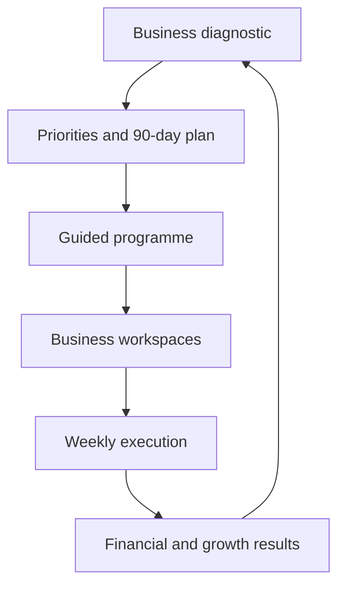

# ONEVYRT Platform Specification

**Status:** North-star specification, recorded 2026-09-03. This is an
implementation specification, not an audit list — it describes what the
finished product should be. See `docs/IMPLEMENTATION_ROADMAP.md` for current
status against this spec and sequencing. Nothing in this document is
implemented by being written down here; each section is a design target.

The intended finished product is **a closed-loop operating system** where
users diagnose the business, choose priorities, complete structured work,
execute actions, measure financial and operational results, receive
coaching, and reassess progress — not "a website containing several
worksheets."



---

## 1. One canonical programme

Remove the competing programme experiences and build one authoritative
journey containing: one programme dashboard, one curriculum structure, one
lesson renderer, one progress calculation, one source of business data, one
action-plan system, one reporting system.

Each module follows the same flow:
1. Learn the concept
2. Complete the exercise
3. Save structured answers
4. Generate a usable business asset
5. Select actions
6. Set owner and deadline
7. Review results
8. Feed results into the final transformation report

The existing 25-module journey is the best foundation. `ProgramCentre`,
`ProgrammeCentre`, `ProgrammeJourney`, and Business OS should be
consolidated — not exposed as separate interpretations of the product.

## 2. Business diagnostic and 7 Forces wheel

A real baseline assessment, not just an action list. Covers: owner
psychology, purpose and vision, business planning, sales and marketing,
people and culture, operations and systems, finance and measurement,
customer experience.

For each force, capture: current score (0–100), target score, confidence in
the score, evidence supporting the score, biggest constraint, recommended
actions, coach score or review, previous scores, reassessment date.

Required outputs: radar/wheel chart, current-vs-target comparison, gap
ranking, top three priorities, historical trend, coach-vs-owner comparison,
generated 90-day plan. This assessment becomes the programme's entry point
and determines which modules are most urgent.

## 3. Business foundation workspace

A structured source of truth for the business: name and description,
founder and ownership, industry and market, customer segments, customer
problems, products and services, revenue model, pricing, differentiation,
current business stage, team structure, current constraints, strategic
goals.

Deeper reflection (from the supplied business-creation material): why was
the business started; why does it exist now; what business is it really in;
why must the vision happen; what would success change; what previous
breakthrough proves change is possible; what is the founder uniquely good
at; what should the founder stop doing; which capabilities are missing from
the team; what is the eventual exit or succession intention; where are the
founder, business and industry in their lifecycles.

Outputs: business definition, founder role statement, strategic positioning
summary, three-year vision, one-year goals, 90-day milestones, one immediate
large action, one immediate small action. **All other tools read this shared
information instead of storing competing copies** (see the audited
duplication in the roadmap doc — this is the fix for it).

## 4. Beautiful State system

A personal-performance workspace. Capture: current emotional state, current
physical state, repeating internal story, trigger, meaning assigned to the
trigger, resulting behaviour, cost of the pattern, desired state, alternative
meaning, physical reset, language reset, focus reset, immediate action.

Guided exercises: best experience, difficult experience, lessons from each,
emotional turnaround, personal standards, morning ritual, pre-work ritual,
recovery ritual, end-of-day reflection.

Daily check-in records: energy, focus, emotional quality, stress, physical
condition, dominant story, chosen state, one intentional action. Display
state trends and the relationship between state, completed actions, and
business performance.

## 5. Thinking Time and decision journal

A repeatable executive-thinking workflow: select a business question → start
an uninterrupted timer → record assumptions → explore possible answers →
identify missing evidence → make a decision → define the next action →
assign owner and deadline → schedule a review.

Store: question, context, assumptions, alternatives considered, evidence,
risks, decision, expected result, owner, deadline, review date, actual
result, what was learned, whether the decision should continue/change/stop.

Question libraries for: strategy, money, customers, sales, team, operations,
risk, founder effectiveness. The existing assumption/experiment features can
feed this system but do not replace the decision journal.

## 6. Offer and one-liner builder

Extend the existing one-liner work into a complete positioning workflow:
ideal customer, core problem, emotional consequence, desired outcome,
product/service, delivery method, unique mechanism, proof, objections, risk
reversal, call to action.

Generate and save: problem–solution–result one-liner, short pitch, website
headline, social bio, networking introduction, sales-call opening, email
introduction, multiple testable variations.

Versioning and testing: version, channel, date used, leads, responses,
conversions, notes, winning version.

## 7. 10×10×10 growth calculator

Core model: `Revenue = Customers × Average Transaction Value × Purchase Frequency`.

Inputs: current customers, average transaction value, purchase frequency,
gross margin, growth target for each driver, timeframe, reason the target
matters, initiatives supporting each target.

Outputs: current revenue, projected revenue, absolute/percentage increase,
gross-profit effect, scenario comparison. Preset scenarios: 10×10×10 = 33.1%
growth; 20×20×20 = 72.8%; 33×25×50 ≈ 149.4%. Each driver creates a linked
execution plan (initiatives, owner, deadline, metric, weekly result).

## 8. Five profit drivers

Leads, conversion rate, transactions per customer, average sale, profit
margin. For each: baseline, target, actual, measurement period, data
source, planned experiments, accountable owner, review frequency.

Outputs: baseline/target/actual revenue and profit, driver contribution,
sensitivity analysis, largest opportunity, weekly trend, recommended next
experiment. **The app must prevent double-counting** when 10×10×10 and the
five-driver model use overlapping measures.

## 9. Customer and Raving Fans system

Extend the current score into an evidence-based system: customer promises,
service standards, customer journey stages, expected vs. actual experience,
failure points, recovery actions, responsible owner, customer feedback,
retention, referrals, complaints, response times, satisfaction/NPS.

Outputs: customer journey map, promise-delivery score, experience-gap
report, retention/referral trends, top pain points, improvement actions. The
composite "Raving Fans" score must transparently show its component
measures.

## 10. Complete financial operating system

The largest missing functional area.

**13-week cash-flow forecast** — weekly columns: opening cash, receipts by
category, total receipts, payroll, suppliers, rent, marketing, taxes, debt
payments, capex, owner distributions, other payments, total payments, net
movement, financing, closing cash. Behaviour: rolling 13 weeks,
actual-vs-forecast, minimum cash threshold, negative-cash warnings, scenario
versions, category customization, notes/assumptions, CSV/XLSX import/export.

**12-month forecast** — monthly revenue, cost of sales, gross profit, opex,
EBITDA/operating profit, tax, debt service, capex, cash movement, closing
cash, actual-vs-budget.

**Financial statements** — P&L, balance sheet, cash-flow statement,
supporting schedules. Must link together: closing cash on the cash-flow
statement must reconcile to the balance sheet.

**Working capital** — AR, AP, inventory, collection/payment/inventory days,
working-capital requirement, cash-conversion cycle.

**Assets and funding** — fixed assets, depreciation, loans, interest,
principal repayments, owner equity, retained earnings, funding requirements.

**Financial dashboard** — revenue growth, gross/net margin, cash runway,
break-even point, current/quick ratio, debt-service coverage,
receivable/payable/inventory days, forecast accuracy — plus plain-language
explanations of why profitable businesses can still run out of cash.

## 11. Money Machine

Keep the fund-allocation concept, integrate with cash flow: Freedom Fund,
Security Fund, Growth Fund, Dream Fund, configurable allocation percentages,
deposit/withdrawal rules, targets, transactions, forecast balances, goal
dates. **Transfers must either reconcile with the cash forecast or be
clearly labelled planning-only** — never pretend the same cash exists both
in operating cash and allocated funds.

## 12. Execution and accountability

Every programme output should be convertible into an action. An action
needs: title, business area, source module, strategic objective, owner,
start/due date, priority, status, success metric, baseline, target, actual
result, evidence, dependencies, blockers, review notes.

Implement: weekly commitments, daily priorities, 90-day plan, scorecard,
overdue alerts, blocker escalation, coach comments, weekly review,
quarter-end review. Actions must not disappear when a lesson is marked
complete.

## 13. Experiments and evidence

One experiment system shared by growth, pricing, offers, operations, and
customer experience. Each experiment: hypothesis, assumption being tested,
metric, baseline, target, test design, audience, start/end dates, budget,
owner, result, confidence, decision, learning, follow-up experiment.
Decisions: adopt, iterate, retest, stop, insufficient evidence.

## 14. Reports

Generated outcomes, not static screens.

- **Baseline report** — diagnostic results, business overview, financial
  baseline, top constraints, priority recommendations.
- **Weekly report** — commitments, completed/missed actions, KPI movement,
  decisions, blockers, next-week priorities.
- **Monthly management report** — P&L, cash position, forecast,
  growth-driver performance, customer performance, team/operational issues.
- **Transformation report** — starting position, current position,
  force-score change, financial change, growth outcomes, completed
  milestones, important decisions, validated learning, remaining risks,
  next 90-day plan.

Support PDF export, original ONEVYRT design and language throughout.

## 15. Coach and administrator functionality

**Coach:** assigned client portfolio, client progress, diagnostic
comparison, upcoming reviews, overdue actions, comments, feedback requests,
approval/sign-off, private coaching notes, session notes, action assignment.

**Administrator:** user/organization management, coach assignment,
programme configuration, feature flags, content publishing, audit logs,
system health, email/notification templates, data export and deletion,
billing and entitlement management.

**Permissions must be enforced server-side, not just hidden in the UI.**

## 16. Notifications

Upcoming/overdue actions, weekly review, Thinking Time session, forecast
update, low-cash warning, coach feedback, reassessment, programme
inactivity, report readiness. Users need channel preferences, frequency
controls, and unsubscribe support.

## 17. Technical foundation

Before adding much more content, make the existing application reliable.

**Build and type safety:** a successful production build, zero production
TypeScript errors, a functioning lint configuration, working CI checks,
stable unit/integration tests, fresh-database migration tests. Resolve the
Next.js build mismatch by either migrating the custom webpack behaviour to
Turbopack or explicitly standardizing production builds on webpack until
migration is complete.

**Security:** CSRF validation on every cookie-authenticated write request,
central authorization middleware, organization isolation tests, request
validation, rate limiting, secure webhook signature verification, secret
rotation support, secure cookies, production CSP enforcement, audit logging,
safe error responses, dependency/vulnerability scanning. Existing CSRF
helpers are insufficient until routes actually call them.

**Configuration:** a complete `.env.example` documenting every required
variable (database, auth, email, AI services, Stripe, webhooks, scheduled
jobs, encryption, sharing, monitoring, proxy/deployment). Validate
configuration at startup and fail with clear messages.

**Database migrations:** every migration gets a unique ordered identifier;
test fresh install, upgrade from production schema, rollback where
supported, multiple concurrent app starts, migration failure recovery.

**Observability:** real error monitoring, structured logs, request
correlation IDs, performance monitoring, web-vitals capture, job
monitoring, health checks, alerting, data redaction. Replace placeholder
monitoring integrations with supported production packages.

## 18. Recommended implementation order

```
Phase 1 — Make it dependable
  Fix production build; fix production TypeScript errors; repair linting;
  wire CSRF and authorization; validate environment configuration;
  normalize and test migrations; establish CI.

Phase 2 — Establish one product model
  Select the canonical 25-module programme; consolidate programme
  interfaces; define the shared business schema; centralize progress,
  actions and outcomes; remove or redirect overlapping experiences.

Phase 3 — Build the core assessment loop
  7 Forces diagnostic; radar chart; gap analysis; priority recommendations;
  90-day planning; reassessment and score history.

Phase 4 — Complete the missing workspaces
  Beautiful State; Thinking Time; Business foundation; 10×10×10; Customer
  experience; Experiments.

Phase 5 — Build the financial system
  Thirteen-week cash flow; twelve-month budget; P&L; balance sheet;
  cash-flow statement; working capital; ratios and alerts; Money Machine
  reconciliation.

Phase 6 — Close the execution loop
  Unified actions; weekly reviews; coach workflow; notifications; baseline,
  monthly and transformation reports.

Phase 7 — Commercial readiness
  Full security review; accessibility; performance testing; backup and
  recovery testing; billing and entitlement testing; privacy and deletion
  workflows; original-content and trademark review.
```

See `docs/IMPLEMENTATION_ROADMAP.md` for current status against this order.
